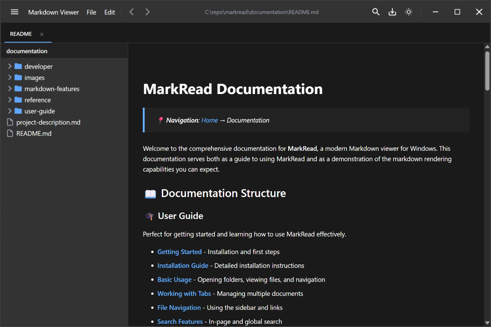

# MarkRead - Modern Markdown Viewer for Windows

[](https://dotnet.microsoft.com/apps/maui)
[](https://www.microsoft.com/windows)
[](LICENSE)

**MarkRead** is a fast, modern, stand-alone desktop application for viewing and navigating Markdown files on Windows. Designed for developers and technical writers who work with documentation in local project folders, MarkRead provides a clean, professional interface with powerful navigation and rendering capabilities.



## ✨ Key Features

- 📄 **Powerful Markdown Rendering** - Full GitHub Flavored Markdown support with syntax highlighting, tables, task lists, and more
- 🎨 **Beautiful UI** - Modern Fluent Design with light, dark, and high contrast themes
- 🗂️ **Smart Navigation** - File tree sidebar with permission error handling, tabbed interface with drag-to-reorder, intelligent link resolution
- 🔍 **Advanced Search** - In-page search with keyboard navigation, global cross-file search capabilities, live file tree filtering
- 📊 **Mermaid Diagrams** - Native support for flowcharts, sequence diagrams, and more
- ⚡ **Fast & Offline** - Instant startup, no internet required, fully local operation with debounced file watching
- 🎯 **Developer-Focused** - Perfect for documentation in Git repositories and project folders
- ♿ **Accessible** - Full screen reader support, keyboard navigation, semantic properties, high contrast mode
- 🔐 **Secure** - HTML sanitization, safe link handling, permission error recovery

## � Installation

### Via MSIX Package (Recommended)

1. Download the latest MSIX package for your architecture from [GitHub Releases](https://github.com/schalkje/markread/releases/latest)
   - **x64**: For most modern Windows PCs
   - **arm64**: For ARM-based devices (Surface Pro X, etc.)

2. **First-time installation**: Trust the certificate
   - Right-click the MSIX file → Properties → Digital Signatures
   - Select certificate → Details → View Certificate → Install Certificate
   - Choose "Local Machine" → "Trusted People" store

3. **Install**: Double-click the MSIX file and click "Install"

The MSIX package provides:
- 📁 Automatic `.md` and `.markdown` file associations
- 🖥️ Start Menu and search integration  
- ⌨️ Command-line access via `markread` command
- 🔄 Clean uninstall through Settings > Apps

### System Requirements

- **OS:** Windows 10 (version 1809+) or Windows 11
- **Runtime:** Self-contained (includes .NET 10 MAUI runtime)
- **Disk Space:** ~100 MB
- **Memory:** 100-200 MB typical usage
- **Architecture:** x64 or arm64

## �🚀 Quick Start

```powershell
# Launch MarkRead from command line (after MSIX installation)
markread "C:\path\to\your\docs"

# Or open a specific file
markread README.md

# Open current directory
markread .

# After installation, you can also:
# - Double-click any .md file
# - Search for "MarkRead" in Start Menu
# - Use from any command prompt or PowerShell
```

For detailed usage instructions, see the [Getting Started Guide](documentation/user-guide/getting-started.md).

## 📚 Documentation

Comprehensive documentation is available in the [`documentation`](documentation/) folder:

- **[User Guide](documentation/user-guide/)** - Installation, basic usage, and features
- **[Markdown Features](documentation/markdown-features/)** - Complete showcase of supported markdown syntax
- **[Developer Guide](documentation/developer/)** - Architecture, contribution guidelines, and development setup
- **[Reference](documentation/reference/)** - API documentation, keyboard shortcuts, and configuration

> 💡 **Tip**: The documentation folder itself is an excellent example of the kind of structured markdown documentation that MarkRead is designed to view!

## 🎯 Use Cases

MarkRead is perfect for:

- **Documentation Browsing** - Navigate technical documentation in Git repositories
- **Project README Viewing** - Quick, beautiful rendering of project documentation
- **Knowledge Bases** - Browse personal or team markdown-based wikis
- **Technical Writing** - Preview markdown content as you write
- **Learning Resources** - View educational content with code examples and diagrams

## ⌨️ Essential Keyboard Shortcuts

| Shortcut | Action |
|----------|--------|
| `Ctrl+O` | Open folder |
| `Ctrl+T` | New tab |
| `Ctrl+W` | Close active tab |
| `Ctrl+Shift+W` | Close all tabs (with confirmation) |
| `Ctrl+K Ctrl+W` | Close other tabs (chord shortcut) |
| `Ctrl+Tab` / `Ctrl+Shift+Tab` | Switch between tabs |
| `Ctrl+F` | Find in document |
| `F3` / `Shift+F3` | Next/Previous search match |
| `Ctrl+G` | Go to heading |
| `Ctrl+Shift+C` | Copy file path |
| `Ctrl+Shift+H` | Copy as HTML |
| `Ctrl+Shift+P` | Copy as plain text |
| `Ctrl+P` | Show keyboard shortcuts |
| `F11` | Toggle fullscreen |
| `Alt+Left/Right` | Navigate back/forward |
| `F5` | Refresh current document |
| `F1` | Show help |

> 💡 **Tip**: Press `Ctrl+P` or `F1` to see the complete keyboard shortcuts reference with accessibility hints!

See the [complete shortcuts reference](documentation/reference/keyboard-shortcuts.md) for more.

## 🛠️ Technology Stack

MarkRead is built with modern, cross-platform technologies:

- **.NET MAUI 10** - Modern UI framework for Windows (with future cross-platform support)
- **C# 12** - Latest C# language features
- **WebView2** - Chromium-based rendering engine (Edge WebView2)
- **Markdig 0.44.0** - Fast, extensible Markdown processor
- **Prism/Highlight.js** - Syntax highlighting for 180+ languages
- **Mermaid** - Diagram and flowchart rendering
- **CommunityToolkit.Mvvm** - Modern MVVM architecture with source generators
- **Fluent Design System** - Microsoft's design language for Windows apps

## 🤝 Contributing

We welcome contributions! Please see our [Contributing Guide](documentation/developer/contributing.md) for details on:

- Code of conduct
- Development setup
- Coding standards
- Pull request process

## � Building from Source

For developers who want to build MarkRead:

```powershell
# Clone the repository
git clone https://github.com/schalkje/markread.git
cd markread

# Restore dependencies
dotnet restore

# Build the application
dotnet build --configuration Release

# Build the MSI installer (requires WiX Toolset v4)
dotnet tool install --global wix --version 4.0.5
dotnet build src\Installer\MarkRead.Installer.wixproj --configuration Release

# Run from source
.\src\App\bin\Release\net8.0-windows\MarkRead.App.exe
```

See the [Developer Guide](documentation/developer/getting-started.md) for detailed setup instructions.

## 📄 License

This project is licensed under the MIT License - see the [LICENSE](LICENSE) file for details.

## 🙏 Acknowledgments

- [Markdig](https://github.com/xoofx/markdig) - Excellent Markdown processor
- [Highlight.js](https://highlightjs.org/) - Code syntax highlighting
- [Mermaid](https://mermaid.js.org/) - Diagram rendering
- All our [contributors](CONTRIBUTORS.md)

## 🔗 Links

- [Documentation](documentation/README.md)
- [User Guide](documentation/user-guide/getting-started.md)
- [Issue Tracker](https://github.com/schalkje/markread/issues)
- [Release Notes](CHANGELOG.md)

---

**Made with ❤️ for the developer community**
