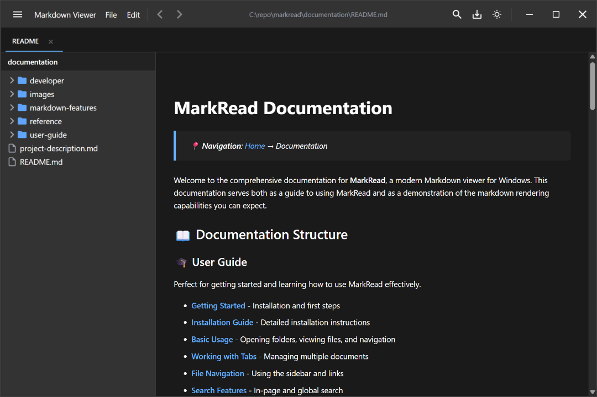

# MarkRead - Markdown Viewer

[](https://www.electronjs.org/)
[](https://www.typescriptlang.org/)
[](https://reactjs.org/)
[](https://www.microsoft.com/windows)
[](LICENSE)

**MarkRead** is a fast, modern, cross-platform desktop application for viewing and navigating Markdown files. Designed for developers and technical writers who work with documentation in local project folders, MarkRead provides a clean, professional interface with powerful navigation and rendering capabilities.



## ✨ Key Features

- 📄 **Powerful Markdown Rendering** - Full GitHub Flavored Markdown support with syntax highlighting, tables, task lists, and more
- 🎨 **Beautiful UI** - Modern, professional interface with light and dark themes
- 🗂️ **Smart Navigation** - File tree sidebar, tabbed interface, and intelligent link resolution
- ⭐ **Recents & Favorites** - Quick access to recently opened items and bookmark important files, folders, and repositories
- 🔍 **Advanced Search** - In-page search and global cross-file search capabilities
- 📊 **Mermaid Diagrams** - Native support for flowcharts, sequence diagrams, and more
- ⚡ **Fast & Offline** - Instant startup, no internet required, fully local operation
- 🎯 **Developer-Focused** - Perfect for documentation in Git repositories and project folders

## Installation

### Via MSI Installer (Recommended)

1. Download the latest MSI installer from [GitHub Releases](https://github.com/schalkje/markread/releases/latest)
2. Run the installer
3. Follow the installation wizard

The installer will:
- Install MarkRead to `C:\Program Files\MarkRead`
- Create Start Menu and Desktop shortcuts
- Associate `.md` and `.markdown` files with MarkRead
- Add MarkRead to Windows Programs & Features for easy uninstallation

### System Requirements

- **OS:** Windows 10 (1809+) or Windows 11
- **Runtime:** None required (bundled with Electron)
- **Disk Space:** ~150 MB
- **Memory:** ~100-200 MB (Electron + Chromium)

## 🚀 Quick Start

```powershell
# Launch MarkRead and open a folder
MarkRead.exe "C:\path\to\your\docs"

# Or open a specific file
MarkRead.exe "C:\path\to\your\docs\README.md"

# After installation, you can also:
# - Double-click any .md file
# - Right-click a folder and "Open with MarkRead"
# - Launch from Start Menu
```

For detailed usage instructions, see the [Getting Started Guide](documentation/user-guide/getting-started.md).

## ⭐ Recents & Favorites

MarkRead makes it easy to access your frequently used files, folders, and repositories with the Recents and Favorites feature:

### Recent Items

- **Automatic Tracking** - MarkRead automatically remembers the last 10 files, folders, and repositories you opened
- **Quick Access** - Click any recent item on the Home page to instantly reopen it
- **Smart Organization** - Recent items are organized by type (Files, Folders, Repos & Branches) and sorted by most recent first
- **Manual Removal** - Remove items from recents with the × button if they're no longer relevant

### Favorites

- **Bookmark Important Items** - Click the ☆ button on any recent item to add it to your favorites
- **Persistent Quick Access** - Favorites remain available even after you restart MarkRead
- **Organized Display** - Favorites appear above recents, sorted alphabetically for easy scanning
- **Limited Collection** - Keep up to 10 favorites per category to maintain a focused workspace

### Features

- **Duplicate Prevention** - Items in favorites don't appear in recents, keeping your lists clean
- **Error Handling** - Unavailable items (deleted or moved files) are automatically removed when you try to access them
- **Tooltips** - Hover over any item to see its full path and timestamp
- **Fast Performance** - Home page loads in under 500ms for instant access to your workspace

The Recents & Favorites feature is perfect for:
- Quickly accessing documentation you're currently working on
- Bookmarking important reference files
- Switching between multiple project repositories
- Maintaining a curated list of frequently used resources

## 📚 Documentation

Comprehensive documentation is available in the [`documentation`](documentation/) folder:

- **[User Guide](documentation/user-guide/)** - Installation, basic usage, and features
- **[Markdown Features](documentation/markdown-features/)** - Complete showcase of supported markdown syntax
- **[Developer Guide](documentation/developer/)** - Architecture, contribution guidelines, and development setup
- **[Reference](documentation/reference/)** - API documentation, keyboard shortcuts, and configuration

> 💡 **Tip**: The documentation folder itself is an excellent example of the kind of structured markdown documentation that MarkRead is designed to view!

## 🎯 Use Cases

MarkRead is perfect for:

- **Documentation Browsing** - Navigate technical documentation in Git repositories
- **Project README Viewing** - Quick, beautiful rendering of project documentation
- **Knowledge Bases** - Browse personal or team markdown-based wikis
- **Technical Writing** - Preview markdown content as you write
- **Learning Resources** - View educational content with code examples and diagrams

## ⌨️ Essential Keyboard Shortcuts

| Shortcut | Action |
|----------|--------|
| `Ctrl+O` | Open folder |
| `Ctrl+T` | New tab |
| `Ctrl+W` | Close tab |
| `Ctrl+F` | Find in document |
| `Alt+Left/Right` | Navigate back/forward |
| `F5` | Refresh current document |

See the [complete shortcuts reference](documentation/reference/keyboard-shortcuts.md) for more.

## 🛠️ Technology Stack

MarkRead is built with modern, reliable technologies:

- **Electron 33.4** - Cross-platform desktop framework
- **React 18.3** - UI component library with hooks
- **TypeScript 5.7** - Type-safe JavaScript development
- **Zustand 4.5** - Lightweight state management
- **markdown-it 14.1** - Fast, extensible Markdown processor
- **Highlight.js 11.11** - Syntax highlighting for code blocks
- **Mermaid 11.12** - Diagram and flowchart rendering
- **Chokidar 5.0** - File system watching

## 🤝 Contributing

We welcome contributions! Please see our [Contributing Guide](documentation/developer/contributing.md) for details on:

- Code of conduct
- Development setup
- Coding standards
- Pull request process

## 🔧 Building from Source

For developers who want to build MarkRead:

```bash
# Clone the repository
git clone https://github.com/schalkje/markread.git
cd markread

# Install dependencies
npm install

# Run in development mode
npm run dev

# Build the application
npm run build

# Build installer packages (Windows)
npm run build:win

# Run tests
npm test

# Run linter
npm run lint
```

See the [Developer Guide](documentation/developer/getting-started.md) for detailed setup instructions.

## 📄 License

This project is licensed under the MIT License - see the [LICENSE](LICENSE) file for details.

## 🙏 Acknowledgments

- [Electron](https://www.electronjs.org/) - Cross-platform desktop framework
- [React](https://reactjs.org/) - UI component library
- [markdown-it](https://github.com/markdown-it/markdown-it) - Excellent Markdown processor
- [Highlight.js](https://highlightjs.org/) - Code syntax highlighting
- [Mermaid](https://mermaid.js.org/) - Diagram rendering
- All our [contributors](CONTRIBUTORS.md)

## 🔗 Links

- [Documentation](documentation/README.md)
- [User Guide](documentation/user-guide/getting-started.md)
- [Issue Tracker](https://github.com/schalkje/markread/issues)
- [Release Notes](CHANGELOG.md)

---

**Made with ❤️ for the developer community**

Jeroen