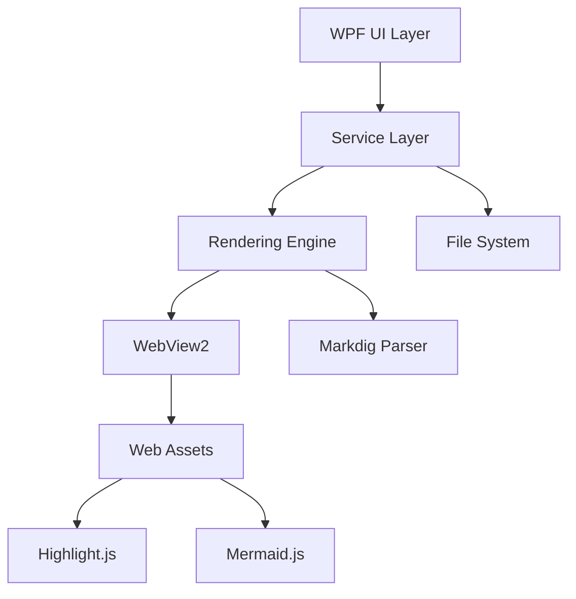
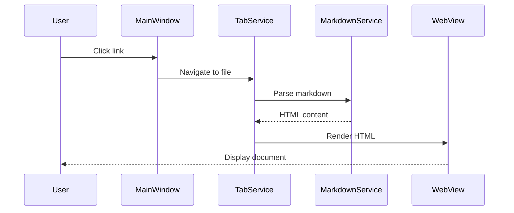

# Architecture Overview

> 📍 **Navigation**: [Home](../../../README.md) → [Documentation](../../README.md) → [Developer](../) → [Architecture](./) → Overview

High-level architecture of the MarkRead application.

## System Architecture

## Layers

### UI Layer (WPF)
- **MainWindow** - Application shell
- **TabControl** - Tab management
- **Sidebar** - File tree view
- **Search Panels** - In-page and global search
- **Settings Dialog** - Configuration UI

### Service Layer
- **FolderService** - Folder navigation and file listing
- **MarkdownService** - Markdown processing pipeline
- **TabService** - Tab state management
- **NavigationService** - History and navigation
- **SearchService** - Content indexing and search
- **SettingsService** - Configuration persistence
- **ThemeManager** - Theme application

### Rendering Layer
- **WebViewHost** - WebView2 integration
- **Renderer** - HTML template generation
- **LinkResolver** - Relative link resolution
- **HtmlSanitizer** - Security filtering

### Data Layer
- **FileWatcherService** - File change detection
- **UIStateService** - Session state persistence
- **HistoryService** - Navigation history

## Component Interaction

## Technology Stack

- **.NET 8** - Framework
- **WPF** - UI framework
- **WebView2** - Rendering engine (Chromium)
- **Markdig** - Markdown parser
- **Highlight.js** - Syntax highlighting
- **Mermaid.js** - Diagram rendering

## Design Principles

1. **Separation of Concerns** - Clear layer boundaries
2. **Dependency Injection** - Loose coupling between components
3. **Async/Await** - Non-blocking file operations
4. **MVVM Pattern** - Clean UI/logic separation
5. **Testability** - Services are unit-testable

## See Also

- [Component Diagram](components.md)
- [Data Flow](data-flow.md)
- [Rendering Pipeline](rendering-pipeline.md)
- [Service Layer](service-layer.md)
