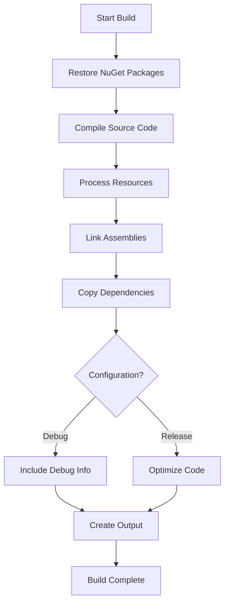
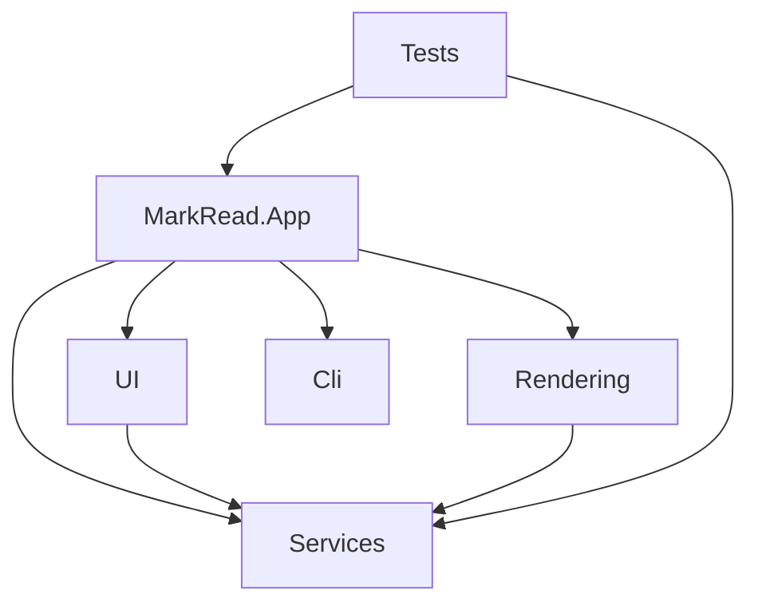

# Build Process

> 📍 **Navigation**: [Home](../../../README.md) → [Documentation](../../README.md) → [Developer](../) → Build Process

Understanding the MarkRead build process.

## Build Configuration

MarkRead uses **.csproj** files for build configuration:

```xml
<Project Sdk="Microsoft.NET.Sdk">
  <PropertyGroup>
    <OutputType>WinExe</OutputType>
    <TargetFramework>net8.0-windows</TargetFramework>
    <UseWPF>true</UseWPF>
    <Nullable>enable</Nullable>
  </PropertyGroup>

  <ItemGroup>
    <PackageReference Include="Markdig" Version="0.33.0" />
    <PackageReference Include="Microsoft.Web.WebView2" Version="1.0.2210.55" />
  </ItemGroup>
</Project>
```

## Build Targets

### Debug Build

```bash
dotnet build
```

**Characteristics:**
- No optimizations
- Debug symbols included
- Assertions enabled
- Detailed logging

### Release Build

```bash
dotnet build --configuration Release
```

**Characteristics:**
- Full optimizations
- No debug symbols
- Minimal logging
- Smaller binary size

## Build Process Flow



## Project Dependencies



## Output Structure

```
bin/
└── Debug/
    └── net8.0-windows/
        ├── MarkRead.App.exe          # Main executable
        ├── MarkRead.App.dll          # Application assembly
        ├── MarkRead.App.pdb          # Debug symbols
        ├── Markdig.dll               # Markdown parser
        ├── Microsoft.Web.WebView2.*.dll  # WebView2
        └── runtimes/                 # Native dependencies
```

## Custom Build Tasks

### Pre-Build

```xml
<Target Name="PreBuild" BeforeTargets="PreBuildEvent">
  <Message Text="Starting MarkRead build..." Importance="high" />
</Target>
```

### Post-Build

```xml
<Target Name="PostBuild" AfterTargets="PostBuildEvent">
  <Message Text="Build completed successfully!" Importance="high" />
  <Exec Command="echo Build time: $(BuildTime)" />
</Target>
```

## Building from Command Line

### Basic Build

```powershell
# Clean previous build
dotnet clean

# Restore packages
dotnet restore

# Build solution
dotnet build markread.sln
```

### Advanced Options

```powershell
# Specific configuration
dotnet build --configuration Release

# Specific project
dotnet build src/App/MarkRead.App.csproj

# Verbose output
dotnet build --verbosity detailed

# No restore (faster if already restored)
dotnet build --no-restore

# Multi-core build
dotnet build --property:MaxCpuCount=8
```

## Building in Visual Studio

### Via Menu

1. **Build** → **Build Solution** (`Ctrl+Shift+B`)
2. **Build** → **Rebuild Solution**
3. **Build** → **Clean Solution**

### Build Output Window

View: **View** → **Output** → Show output from: **Build**

```
1>------ Build started: Project: MarkRead.App, Configuration: Debug ------
1>  MarkRead.App -> C:\repo\markread\bin\Debug\net8.0-windows\MarkRead.App.dll
========== Build: 1 succeeded, 0 failed, 0 up-to-date ==========
```

## Continuous Integration

### GitHub Actions Example

```yaml
name: Build

on:
  push:
    branches: [main]
  pull_request:
    branches: [main]

jobs:
  build:
    runs-on: windows-latest
    
    steps:
      - uses: actions/checkout@v3
      
      - name: Setup .NET
        uses: actions/setup-dotnet@v3
        with:
          dotnet-version: 8.0.x
      
      - name: Restore
        run: dotnet restore
      
      - name: Build
        run: dotnet build --no-restore --configuration Release
      
      - name: Test
        run: dotnet test --no-build --verbosity normal
```

## Build Performance

### Optimization Tips

**Use build cache:**
```powershell
dotnet build --no-restore
```

**Parallel builds:**
```powershell
dotnet build -m
```

**Skip analyzers in dev builds:**
```xml
<PropertyGroup Condition="'$(Configuration)' == 'Debug'">
  <RunAnalyzersDuringBuild>false</RunAnalyzersDuringBuild>
</PropertyGroup>
```

### Typical Build Times

- **Clean build**: 10-20 seconds
- **Incremental build**: 2-5 seconds
- **No changes**: < 1 second

## Troubleshooting

### Common Issues

#### NuGet Restore Fails

```powershell
# Clear NuGet cache
dotnet nuget locals all --clear

# Restore again
dotnet restore
```

#### Build Errors After Pull

```powershell
# Clean everything
dotnet clean
git clean -fdx bin obj

# Rebuild
dotnet restore
dotnet build
```

#### WebView2 Not Found

Ensure WebView2 runtime installed or use:

```xml
<PackageReference Include="Microsoft.Web.WebView2" Version="1.0.*" />
```

## Build Scripts

### PowerShell Build Script

```powershell
# build.ps1
param(
    [string]$Configuration = "Debug"
)

Write-Host "Building MarkRead ($Configuration)..." -ForegroundColor Green

dotnet clean
if ($LASTEXITCODE -ne 0) { exit $LASTEXITCODE }

dotnet restore
if ($LASTEXITCODE -ne 0) { exit $LASTEXITCODE }

dotnet build --configuration $Configuration --no-restore
if ($LASTEXITCODE -ne 0) { exit $LASTEXITCODE }

Write-Host "Build completed successfully!" -ForegroundColor Green
```

Usage:
```powershell
.\build.ps1 -Configuration Release
```

## See Also

- [Getting Started](getting-started.md)
- [Testing](testing.md)
- [Deployment](deployment.md)
