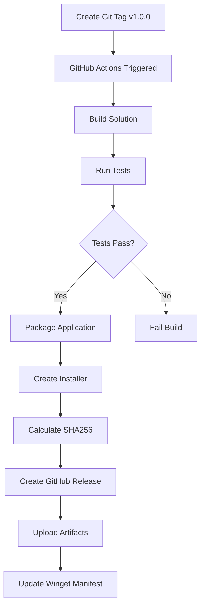

# Distribution Plan for MarkRead

## Overview

This document outlines the complete plan to implement automated distribution for MarkRead, including:
- Automated GitHub Actions release pipeline
- Winget package support for easy installation
- Versioning strategy
- Build and packaging configuration

## Current State

**Technology Stack:**
- .NET 8 (WPF + WebView2)
- Single project: `MarkRead.csproj`
- Dependencies: Markdig, WebView2, HtmlSanitizer
- Target: Windows 10/11 (net8.0-windows)

**Current Gaps:**
- No GitHub Actions workflows
- No version metadata in csproj
- No installer/packaging configuration
- No winget manifest

## Goals

1. **Automated Releases**: Push a git tag → automated build → GitHub release with artifacts
2. **Winget Distribution**: Users can install via `winget install schalkje.MarkRead`
3. **Professional Packaging**: MSI or MSIX installer with proper metadata
4. **Versioning**: Semantic versioning with automatic version propagation

## Distribution Architecture

### Release Pipeline Flow



### Components

1. **GitHub Actions Workflow** - `.github/workflows/release.yml`
2. **Project Configuration** - Enhanced `MarkRead.csproj`
3. **Packaging** - MSI installer or MSIX package
4. **Winget Manifest** - Published to `microsoft/winget-pkgs`

## Implementation Plan

### Phase 1: Project Configuration

#### 1.1 Update MarkRead.csproj

Add comprehensive metadata for packaging:

```xml
<PropertyGroup>
  <!-- Existing properties -->
  <OutputType>WinExe</OutputType>
  <TargetFramework>net8.0-windows</TargetFramework>
  <Nullable>enable</Nullable>
  <ImplicitUsings>enable</ImplicitUsings>
  <UseWPF>true</UseWPF>
  <UseWindowsForms>true</UseWindowsForms>

  <!-- Version and Assembly Info -->
  <Version>1.0.0</Version>
  <AssemblyVersion>1.0.0.0</AssemblyVersion>
  <FileVersion>1.0.0.0</FileVersion>
  
  <!-- Application Metadata -->
  <Product>MarkRead</Product>
  <Title>MarkRead - Markdown Viewer</Title>
  <Description>Fast, modern desktop application for viewing and navigating Markdown files on Windows</Description>
  <Authors>schalkje</Authors>
  <Company>MarkRead Project</Company>
  <Copyright>Copyright © 2025 MarkRead Project</Copyright>
  
  <!-- Package Metadata -->
  <PackageId>MarkRead</PackageId>
  <PackageProjectUrl>https://github.com/schalkje/markread</PackageProjectUrl>
  <RepositoryUrl>https://github.com/schalkje/markread</RepositoryUrl>
  <RepositoryType>git</RepositoryType>
  <PackageLicenseExpression>MIT</PackageLicenseExpression>
  <PackageReadmeFile>README.md</PackageReadmeFile>
  <PackageIcon>icon.png</PackageIcon>
  <PackageTags>markdown;viewer;documentation;windows;wpf</PackageTags>
  
  <!-- Publishing Options -->
  <PublishSingleFile>true</PublishSingleFile>
  <SelfContained>true</SelfContained>
  <RuntimeIdentifier>win-x64</RuntimeIdentifier>
  <PublishReadyToRun>true</PublishReadyToRun>
  <PublishTrimmed>false</PublishTrimmed>
  <IncludeNativeLibrariesForSelfExtract>true</IncludeNativeLibrariesForSelfExtract>
  
  <!-- Application Identity for MSIX (optional) -->
  <ApplicationIcon>icon.ico</ApplicationIcon>
  <ApplicationManifest>app.manifest</ApplicationManifest>
</PropertyGroup>

<ItemGroup>
  <None Include="..\..\README.md" Pack="true" PackagePath="\" />
  <None Include="..\..\assets\icon.png" Pack="true" PackagePath="\" />
</ItemGroup>
```

**Key Decisions:**
- **Single File Deployment**: Easier distribution, one executable
- **Self-Contained**: Includes .NET runtime, no prerequisites
- **win-x64**: Target 64-bit Windows (add win-arm64 later if needed)
- **Ready-to-Run**: Faster startup via pre-compiled code

#### 1.2 Create Version Management Strategy

**Approach: Git Tags Drive Versions**

- Developer creates tag: `v1.0.0`
- GitHub Actions extracts version from tag
- Injects version into build via MSBuild properties

**Benefits:**
- Single source of truth (git tags)
- No manual csproj edits for versions
- Supports semantic versioning

### Phase 2: GitHub Actions Release Workflow

#### 2.1 Create `.github/workflows/release.yml`

```yaml
name: Release

on:
  push:
    tags:
      - 'v*.*.*'  # Triggers on tags like v1.0.0, v2.1.3-beta

permissions:
  contents: write  # Required for creating releases

jobs:
  build-and-release:
    runs-on: windows-latest
    
    steps:
    - name: Checkout code
      uses: actions/checkout@v4
      with:
        fetch-depth: 0  # Full history for version info

    - name: Extract version from tag
      id: version
      shell: pwsh
      run: |
        $tag = "${{ github.ref_name }}"
        $version = $tag -replace '^v', ''
        echo "VERSION=$version" >> $env:GITHUB_OUTPUT
        echo "Version: $version"

    - name: Setup .NET
      uses: actions/setup-dotnet@v4
      with:
        dotnet-version: '8.0.x'

    - name: Restore dependencies
      run: dotnet restore

    - name: Run tests
      run: dotnet test --configuration Release --no-restore --verbosity normal

    - name: Publish application (win-x64)
      run: |
        dotnet publish src/App/MarkRead.csproj `
          --configuration Release `
          --runtime win-x64 `
          --self-contained true `
          --output ./publish/win-x64 `
          -p:Version=${{ steps.version.outputs.VERSION }} `
          -p:PublishSingleFile=true `
          -p:PublishReadyToRun=true `
          -p:IncludeNativeLibrariesForSelfExtract=true

    - name: Create ZIP archive
      shell: pwsh
      run: |
        $version = "${{ steps.version.outputs.VERSION }}"
        Compress-Archive -Path ./publish/win-x64/* -DestinationPath "./MarkRead-$version-win-x64.zip"

    - name: Calculate SHA256
      id: hash
      shell: pwsh
      run: |
        $version = "${{ steps.version.outputs.VERSION }}"
        $hash = (Get-FileHash -Path "./MarkRead-$version-win-x64.zip" -Algorithm SHA256).Hash
        echo "SHA256=$hash" >> $env:GITHUB_OUTPUT
        echo "SHA256: $hash"
        
        # Save to file for release notes
        "SHA256: $hash" | Out-File -FilePath "SHA256SUMS.txt"

    - name: Generate release notes
      id: notes
      shell: pwsh
      run: |
        $version = "${{ steps.version.outputs.VERSION }}"
        $notes = @"
        ## MarkRead v$version
        
        ### Installation
        
        **Via Winget:**
        ``````
        winget install schalkje.MarkRead
        ``````
        
        **Manual Download:**
        1. Download ``MarkRead-$version-win-x64.zip``
        2. Extract to a folder of your choice
        3. Run ``MarkRead.App.exe``
        
        ### Requirements
        - Windows 10 (1809+) or Windows 11
        - No additional runtime required (self-contained)
        
        ### What's New
        See [CHANGELOG.md](https://github.com/schalkje/markread/blob/main/CHANGELOG.md) for details.
        
        ### Verification
        ``````
        SHA256: ${{ steps.hash.outputs.SHA256 }}
        ``````
        "@
        
        # Save to file
        $notes | Out-File -FilePath "release-notes.md"

    - name: Create GitHub Release
      uses: softprops/action-gh-release@v1
      with:
        files: |
          MarkRead-${{ steps.version.outputs.VERSION }}-win-x64.zip
          SHA256SUMS.txt
        body_path: release-notes.md
        draft: false
        prerelease: ${{ contains(github.ref_name, 'alpha') || contains(github.ref_name, 'beta') || contains(github.ref_name, 'rc') }}
        token: ${{ secrets.GITHUB_TOKEN }}
```

**Workflow Features:**
- Triggered by version tags (`v1.0.0`, `v2.1.3-beta`)
- Runs tests before building
- Publishes self-contained executable
- Creates ZIP archive for distribution
- Generates SHA256 checksums
- Auto-generates release notes
- Marks pre-releases (alpha/beta/rc) appropriately

#### 2.2 Add Build Validation Workflow

Create `.github/workflows/build.yml` for PR validation:

```yaml
name: Build

on:
  push:
    branches: [ main, develop, feature/* ]
  pull_request:
    branches: [ main, develop ]

jobs:
  build:
    runs-on: windows-latest
    
    steps:
    - uses: actions/checkout@v4
    
    - name: Setup .NET
      uses: actions/setup-dotnet@v4
      with:
        dotnet-version: '8.0.x'
    
    - name: Restore dependencies
      run: dotnet restore
    
    - name: Build
      run: dotnet build --configuration Release --no-restore
    
    - name: Test
      run: dotnet test --configuration Release --no-build --verbosity normal
```

### Phase 3: Winget Package

#### 3.1 Create Initial Winget Manifest

Winget packages are hosted in the `microsoft/winget-pkgs` repository.

**Directory structure:**
```
manifests/
  s/
    schalkje/
      MarkRead/
        1.0.0/
          schalkje.MarkRead.installer.yaml
          schalkje.MarkRead.locale.en-US.yaml
          schalkje.MarkRead.yaml
```

**File: `schalkje.MarkRead.yaml`** (version manifest)
```yaml
PackageIdentifier: schalkje.MarkRead
PackageVersion: 1.0.0
DefaultLocale: en-US
ManifestType: version
ManifestVersion: 1.6.0
```

**File: `schalkje.MarkRead.installer.yaml`**
```yaml
PackageIdentifier: schalkje.MarkRead
PackageVersion: 1.0.0
MinimumOSVersion: 10.0.17763.0  # Windows 10 1809
InstallerType: zip
ReleaseDate: 2025-11-05
Installers:
  - Architecture: x64
    InstallerUrl: https://github.com/schalkje/markread/releases/download/v1.0.0/MarkRead-1.0.0-win-x64.zip
    InstallerSha256: <SHA256_HASH_HERE>
    NestedInstallerType: portable
    NestedInstallerFiles:
      - RelativeFilePath: MarkRead.App.exe
        PortableCommandAlias: markread
ManifestType: installer
ManifestVersion: 1.6.0
```

**File: `schalkje.MarkRead.locale.en-US.yaml`**
```yaml
PackageIdentifier: schalkje.MarkRead
PackageVersion: 1.0.0
PackageLocale: en-US
Publisher: schalkje
PublisherUrl: https://github.com/schalkje/markread
PublisherSupportUrl: https://github.com/schalkje/markread/issues
PackageName: MarkRead
PackageUrl: https://github.com/schalkje/markread
License: MIT
LicenseUrl: https://github.com/schalkje/markread/blob/main/LICENSE
Copyright: Copyright (c) 2025 MarkRead Project
ShortDescription: Markdown viewer for Windows
Description: |-
  MarkRead is a fast, modern, stand-alone desktop application for viewing and 
  navigating Markdown files on Windows. Designed for developers and technical 
  writers who work with documentation in local project folders, MarkRead provides 
  a clean, professional interface with powerful navigation and rendering capabilities.
  
  Features:
  - Powerful Markdown Rendering with syntax highlighting
  - Beautiful UI with light and dark themes
  - Smart Navigation with file tree sidebar
  - Advanced in-page search
  - Mermaid diagram support
  - Fast & Offline operation
Moniker: markread
Tags:
  - markdown
  - viewer
  - documentation
  - wpf
  - mermaid
  - syntax-highlighting
ManifestType: defaultLocale
ManifestVersion: 1.6.0
```

#### 3.2 Submission Process

**Initial Submission (Manual):**
1. Create GitHub release with v1.0.0
2. Get SHA256 from release artifacts
3. Create manifest files locally
4. Fork `microsoft/winget-pkgs`
5. Add manifests to fork
6. Submit PR to `microsoft/winget-pkgs`
7. Wait for automated validation
8. Microsoft team reviews and merges

**Automated Updates (Future):**
- Use `winget-pkgs-automation` bot
- Submit via PR from GitHub Action
- Requires approval from Microsoft

#### 3.3 Alternative: MSI Installer (Recommended for Production)

For better Windows integration, create an MSI using **WiX Toolset v4**:

**Benefits:**
- Proper Windows installer experience
- Add to Programs & Features
- Easier winget integration
- File associations possible
- Start menu shortcuts

**Implementation:**
1. Add WiX NuGet package to project
2. Create `MarkRead.wixproj` for installer configuration
3. Update GitHub Actions to build MSI
4. Update winget manifest for MSI installer type

**Example WiX configuration** (simplified):
```xml
<Wix xmlns="http://wixtoolset.org/schemas/v4/wxs">
  <Package Name="MarkRead"
           Version="!(bind.FileVersion.MarkRead.App.exe)"
           Manufacturer="schalkje"
           UpgradeCode="YOUR-GUID-HERE">
    
    <MajorUpgrade DowngradeErrorMessage="A newer version is already installed." />
    
    <Feature Id="MainFeature">
      <ComponentGroup Id="ProductComponents">
        <Component Directory="INSTALLFOLDER">
          <File Source="$(var.MarkRead.App.TargetPath)" />
        </Component>
      </ComponentGroup>
    </Feature>
    
    <StandardDirectory Id="ProgramFiles64Folder">
      <Directory Id="INSTALLFOLDER" Name="MarkRead" />
    </StandardDirectory>
  </Package>
</Wix>
```

### Phase 4: Documentation and Assets

#### 4.1 Create Application Icon

Required files:
- `assets/icon.ico` - Windows application icon (256x256, 128x128, 64x64, 48x48, 32x32, 16x16)
- `assets/icon.png` - Package icon (256x256 PNG)

#### 4.2 Create CHANGELOG.md

Maintain version history for release notes:

```markdown
# Changelog

All notable changes to MarkRead will be documented in this file.

The format is based on [Keep a Changelog](https://keepachangelog.com/en/1.0.0/),
and this project adheres to [Semantic Versioning](https://semver.org/spec/v2.0.0.html).

## [Unreleased]

## [1.0.0] - 2025-11-05

### Added
- Initial release
- Markdown rendering with GitHub Flavored Markdown support
- File tree navigation
- Multiple tabs
- Back/forward navigation
- Light and dark themes
- Mermaid diagram support
- Syntax highlighting for Python, SQL, YAML
- In-page search (Ctrl+F)

### Known Issues
- None at this time

[Unreleased]: https://github.com/schalkje/markread/compare/v1.0.0...HEAD
[1.0.0]: https://github.com/schalkje/markread/releases/tag/v1.0.0
```

#### 4.3 Update README.md

Add installation section:

```markdown
## Installation

### Via Winget (Recommended)

```powershell
winget install schalkje.MarkRead
```

### Manual Installation

1. Download the latest release from [GitHub Releases](https://github.com/schalkje/markread/releases)
2. Extract the ZIP file to a folder of your choice
3. Run `MarkRead.App.exe`

### System Requirements

- Windows 10 (1809+) or Windows 11
- No additional runtime installation required (self-contained)
```

#### 4.4 Create LICENSE file

If not already present, add MIT license.

## Testing Strategy

### Pre-Release Testing Checklist

Before creating a release tag:

1. **Build Verification**
   - [ ] `dotnet build` succeeds
   - [ ] No warnings in Release configuration
   - [ ] All tests pass

2. **Manual Testing**
   - [ ] Application launches successfully
   - [ ] Can open folders and files
   - [ ] Navigation works (back/forward, tabs)
   - [ ] Rendering displays correctly (code blocks, mermaid, images)
   - [ ] Theme switching works
   - [ ] File tree functions properly
   - [ ] Search works (Ctrl+F)

3. **Packaging Testing**
   - [ ] Publish command creates executable
   - [ ] Published app runs on clean Windows install
   - [ ] Single file deployment works
   - [ ] File size is reasonable (<50MB)

4. **Release Process**
   - [ ] Version number follows semantic versioning
   - [ ] CHANGELOG.md is updated
   - [ ] Tag format is `v{major}.{minor}.{patch}`
   - [ ] Git tag matches version in CHANGELOG

### Automated Testing

The GitHub Actions workflow will verify:
- ✅ Unit tests pass
- ✅ Build succeeds
- ✅ No compilation errors
- ✅ Publish creates artifacts

## Versioning Strategy

**Semantic Versioning:** `MAJOR.MINOR.PATCH[-PRERELEASE]`

### Version Incrementing Rules

- **MAJOR** (1.x.x): Breaking changes, major feature additions
- **MINOR** (x.1.x): New features, backwards compatible
- **PATCH** (x.x.1): Bug fixes, minor improvements

### Pre-release Versions

- `v1.0.0-alpha.1` - Early testing
- `v1.0.0-beta.1` - Feature complete, testing
- `v1.0.0-rc.1` - Release candidate

### Example Version Timeline

```
v0.1.0-alpha.1  → Initial development build
v0.1.0-alpha.2  → Bug fixes
v0.1.0-beta.1   → Feature freeze
v0.1.0-beta.2   → Testing fixes
v0.1.0-rc.1     → Release candidate
v0.1.0          → Initial release
v0.1.1          → Hotfix
v0.2.0          → New feature
v1.0.0          → Stable, production-ready
```

## Rollout Plan

### Phase 1: Setup (Week 1)
- [ ] Update `MarkRead.csproj` with metadata
- [ ] Create application icons
- [ ] Create `CHANGELOG.md`
- [ ] Create `LICENSE` if missing
- [ ] Update `README.md` with installation instructions

### Phase 2: GitHub Actions (Week 1)
- [ ] Create `.github/workflows/build.yml`
- [ ] Create `.github/workflows/release.yml`
- [ ] Test with a pre-release tag (v0.1.0-alpha.1)
- [ ] Verify artifacts are created
- [ ] Validate release process

### Phase 3: First Release (Week 2)
- [ ] Create v0.1.0 tag
- [ ] Verify GitHub release
- [ ] Download and test artifact
- [ ] Document any issues

### Phase 4: Winget Submission (Week 2)
- [ ] Create winget manifest files
- [ ] Fork `microsoft/winget-pkgs`
- [ ] Submit PR
- [ ] Work with reviewers
- [ ] Merge approved

### Phase 5: Production (Week 3+)
- [ ] Release v1.0.0
- [ ] Update winget package
- [ ] Announce release
- [ ] Monitor for issues

## Maintenance Process

### Regular Releases

1. **Development**
   - Work on features in feature branches
   - Merge to `develop` or `main` branch
   - Keep CHANGELOG.md updated

2. **Pre-Release**
   - Decide on version number
   - Update CHANGELOG.md with date
   - Create and push tag: `git tag v1.1.0 && git push origin v1.1.0`

3. **Automated Build**
   - GitHub Actions runs automatically
   - Monitor workflow progress
   - Verify release artifacts

4. **Winget Update**
   - For major/minor versions: Submit PR to winget-pkgs
   - Update manifest with new version and SHA256
   - Wait for approval and merge

5. **Announcement**
   - Update project README
   - Share on relevant channels
   - Monitor feedback

### Hotfix Process

1. Create hotfix branch from main
2. Fix critical issue
3. Increment PATCH version
4. Create tag (e.g., v1.0.1)
5. Automated release
6. Fast-track winget update if needed

## Future Enhancements

### Short Term
- [ ] Add ARM64 build (`win-arm64`)
- [ ] Create proper MSI installer with WiX
- [ ] Add digital signature to executable
- [ ] Implement auto-update mechanism

### Medium Term
- [ ] Automate winget submissions via bot
- [ ] Add Chocolatey package
- [ ] Create Microsoft Store listing (MSIX)
- [ ] Implement crash reporting (with user consent)

### Long Term
- [ ] Multi-platform support (macOS, Linux)
- [ ] Portable/no-install version
- [ ] Enterprise deployment options

## Security Considerations

### Code Signing

**Current:** No code signing (users will see "Unknown publisher")

**Recommendation:** Acquire code signing certificate for production releases
- **Options:** Certum, Sectigo, DigiCert, SignPath (free for OSS)
- **Process:** Sign executable as part of build
- **Benefits:** Windows SmartScreen trust, professional appearance

### Supply Chain Security

- [ ] Enable GitHub Actions security features
- [ ] Use dependency scanning (Dependabot)
- [ ] Pin action versions to specific commits
- [ ] Review dependencies regularly
- [ ] Enable 2FA on GitHub account

## Cost Considerations

### Free Tier
- ✅ GitHub Actions (2000 minutes/month for public repos)
- ✅ GitHub Releases (unlimited storage)
- ✅ Winget submission (free, Microsoft hosted)

### Potential Costs
- ❌ Code signing certificate (~$100-400/year)
- ❌ Microsoft Store developer account ($19 one-time) - optional

## Troubleshooting

### Common Issues

**Build fails on GitHub Actions but works locally:**
- Check .NET SDK version matches
- Verify all files are committed
- Check file path case sensitivity

**Winget submission rejected:**
- Validate manifest with `winget validate --manifest <path>`
- Check hash matches exactly
- Ensure version increments correctly

**Users can't run application:**
- Verify self-contained build includes runtime
- Check Windows Defender isn't blocking
- Consider code signing

## References

### Documentation
- [GitHub Actions Documentation](https://docs.github.com/en/actions)
- [Winget Package Submission](https://github.com/microsoft/winget-pkgs/blob/master/CONTRIBUTING.md)
- [.NET Publishing](https://learn.microsoft.com/en-us/dotnet/core/deploying/)
- [WiX Toolset](https://wixtoolset.org/)

### Tools
- [Winget Create](https://github.com/microsoft/winget-create) - Helper tool for manifests
- [SignPath](https://about.signpath.io/) - Free code signing for OSS
- [Advanced Installer](https://www.advancedinstaller.com/) - Alternative to WiX

## Conclusion

This plan provides a complete path from current state to production-ready distribution with:
- ✅ Automated CI/CD with GitHub Actions
- ✅ Professional packaging and versioning
- ✅ Easy installation via winget
- ✅ Comprehensive testing and quality gates
- ✅ Clear maintenance procedures

The implementation can be completed in 2-3 weeks, with the first release ready for testing within one week of starting.
