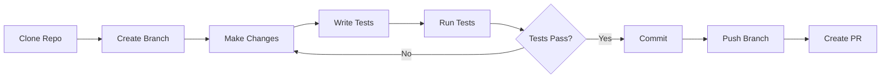

# Getting Started (Developer)

> 📍 **Navigation**: [Home](../../../README.md) → [Documentation](../../README.md) → [Developer](../) → Getting Started

Get your development environment ready for MarkRead contributions.

## Prerequisites

### Required Software

- **.NET 8 SDK** - [Download](https://dotnet.microsoft.com/download/dotnet/8.0)
- **Visual Studio 2022** or **VS Code**
- **Git** - [Download](https://git-scm.com/)

### Optional Tools

- **WebView2 Runtime** (usually pre-installed on Windows 11)
- **PowerShell 7+** for build scripts
- **Windows Terminal** for better terminal experience

## Clone Repository

```bash
git clone https://github.com/yourusername/markread.git
cd markread
```

## Project Structure

```
markread/
├── src/
│   ├── App/              # WPF application shell
│   ├── Rendering/        # WebView2 and HTML rendering
│   ├── Services/         # Business logic services
│   ├── UI/              # Views and ViewModels
│   └── Cli/             # Command-line argument parsing
├── tests/
│   ├── unit/            # Unit tests
│   └── integration/     # Integration tests
├── documentation/       # Project documentation
└── specs/              # Feature specifications
```

## Build Steps

### 1. Restore Dependencies

```bash
dotnet restore
```

### 2. Build Solution

```bash
# Debug build
dotnet build

# Release build
dotnet build --configuration Release
```

### 3. Run Application

```bash
# Run from source
dotnet run --project src/App/MarkRead.App.csproj

# Run with file argument
dotnet run --project src/App/MarkRead.App.csproj -- README.md

# Run with folder argument
dotnet run --project src/App/MarkRead.App.csproj -- ./documentation
```

## Development Workflow



## Running Tests

### Unit Tests

```bash
dotnet test tests/unit/MarkRead.UnitTests.csproj
```

### Integration Tests

```bash
dotnet test tests/integration/MarkRead.IntegrationTests.csproj
```

### All Tests

```bash
dotnet test
```

### With Coverage

```bash
dotnet test --collect:"XPlat Code Coverage"
```

## IDE Setup

### Visual Studio 2022

1. Open `markread.sln`
2. Set `MarkRead.App` as startup project
3. Press `F5` to run with debugging

**Recommended Extensions:**
- ReSharper (optional)
- Code Cleanup on Save
- Markdown Editor

### VS Code

1. Open workspace folder
2. Install recommended extensions (prompt will appear)
3. Press `F5` to run with debugging

**Recommended Extensions:**
- C# Dev Kit
- .NET Install Tool
- Markdown All in One
- EditorConfig

## Configuration

### Launch Settings

Create `src/App/Properties/launchSettings.json`:

```json
{
  "profiles": {
    "MarkRead": {
      "commandName": "Project",
      "commandLineArgs": ""
    },
    "MarkRead (with file)": {
      "commandName": "Project",
      "commandLineArgs": "README.md"
    },
    "MarkRead (with folder)": {
      "commandName": "Project",
      "commandLineArgs": "./documentation"
    }
  }
}
```

### Editor Config

The project includes `.editorconfig` for consistent formatting:
- 4 spaces indentation
- UTF-8 encoding
- LF line endings
- Trim trailing whitespace

## Debugging

### Debug WPF UI

1. Set breakpoints in XAML code-behind or ViewModels
2. Press `F5` in Visual Studio
3. Interact with UI to trigger breakpoints

### Debug WebView2 Content

1. Run application
2. Right-click in markdown view
3. Select "Inspect" (if dev tools enabled)
4. Or use `Ctrl+Shift+I`

### Debug Services

Add breakpoints in service classes:
- `MarkdownService.ParseMarkdown()`
- `NavigationService.Navigate()`
- `TabService.CreateTab()`

## Common Issues

### WebView2 Not Found

Install [WebView2 Runtime](https://developer.microsoft.com/microsoft-edge/webview2/)

### Build Errors

```bash
# Clean and rebuild
dotnet clean
dotnet restore
dotnet build
```

### Tests Failing

```bash
# Clear test cache
dotnet test --no-build --no-restore
```

## Next Steps

- Read [Architecture Overview](architecture/overview.md)
- Review [Coding Standards](coding-standards.md)
- Check [Contributing Guide](contributing.md)
- See [Testing Guide](testing.md)

## See Also

- [Build Process](build-process.md)
- [Debugging Guide](debugging.md)
- [Deployment](deployment.md)
