# Class Diagrams

> 📍 **Navigation**: [Home](../../../README.md) → [Documentation](../../README.md) → [Markdown Features](../) → [Diagrams](./) → Class Diagrams

Class diagrams show object-oriented structure and relationships.

## Basic Class Diagram

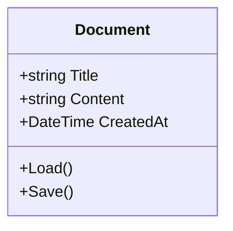

## MarkRead Service Architecture

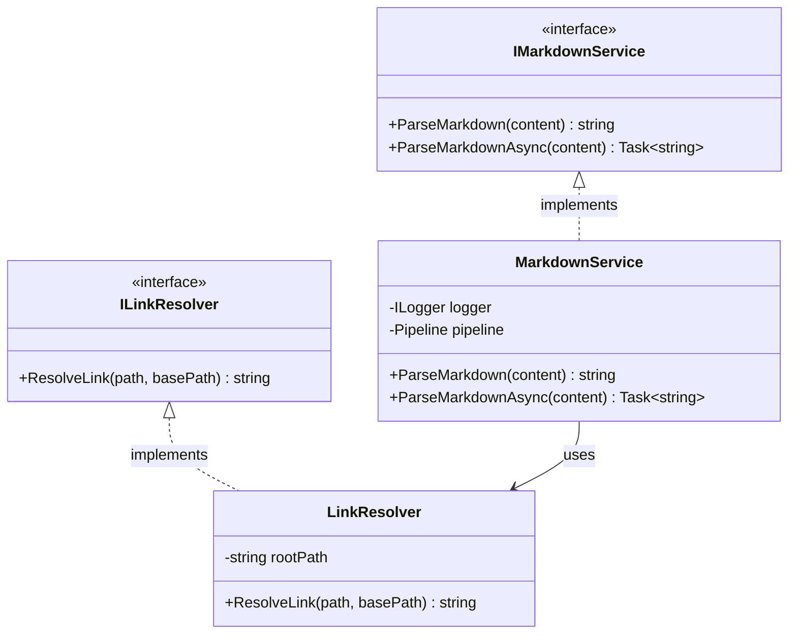

## Tab Management

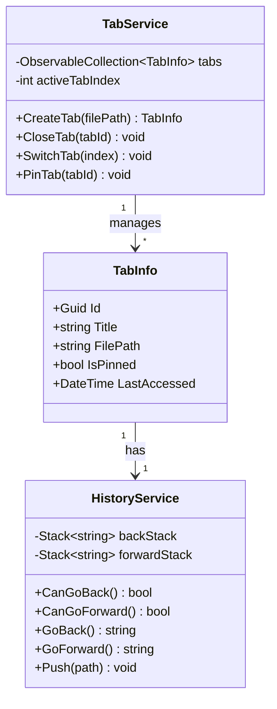

## Relationships

### Inheritance

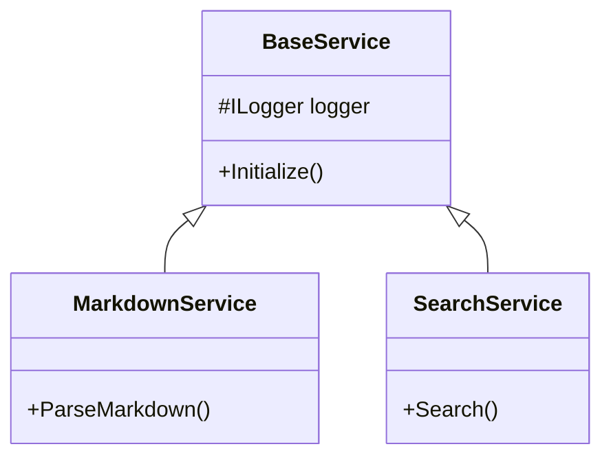

### Composition

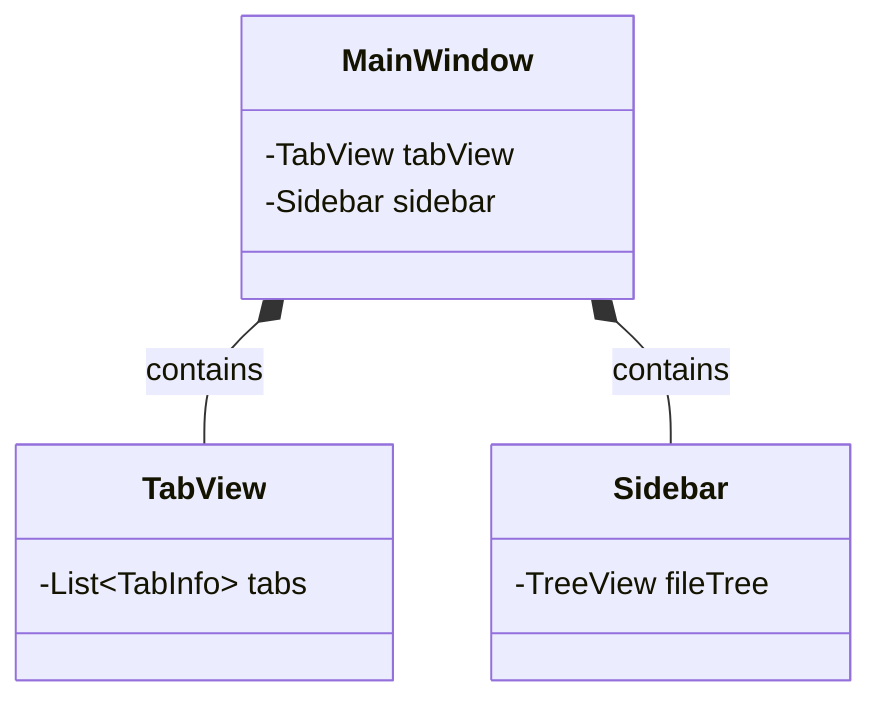

### Aggregation

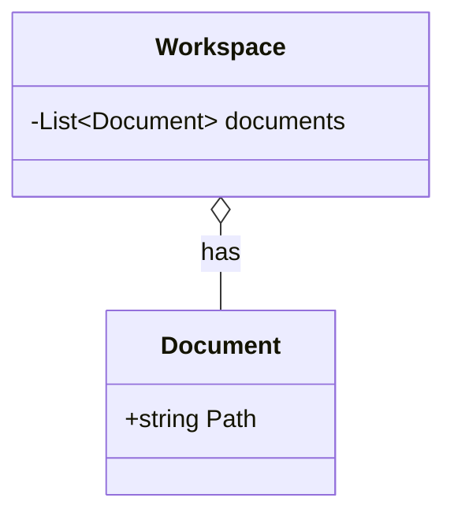

### Association

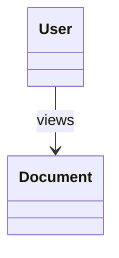

## Visibility Modifiers

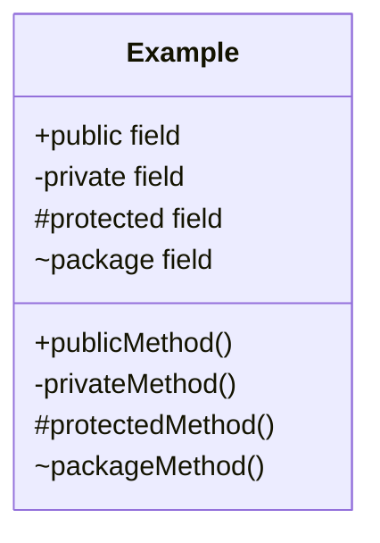

## Abstract Classes and Methods

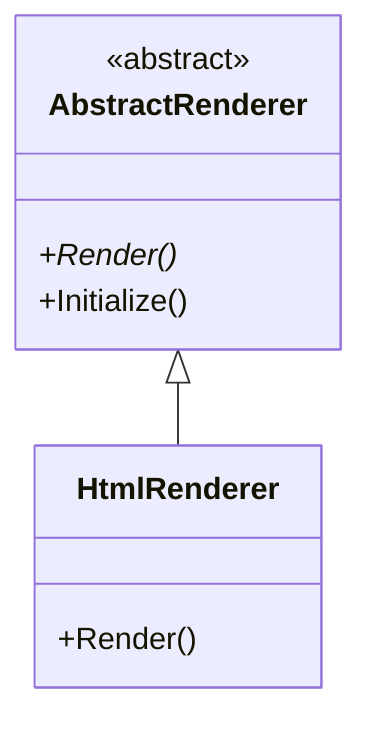

## Generic Classes

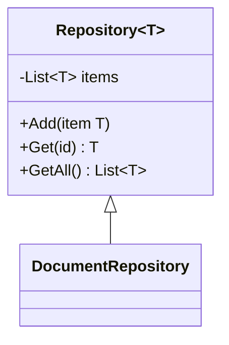

## Complete Example

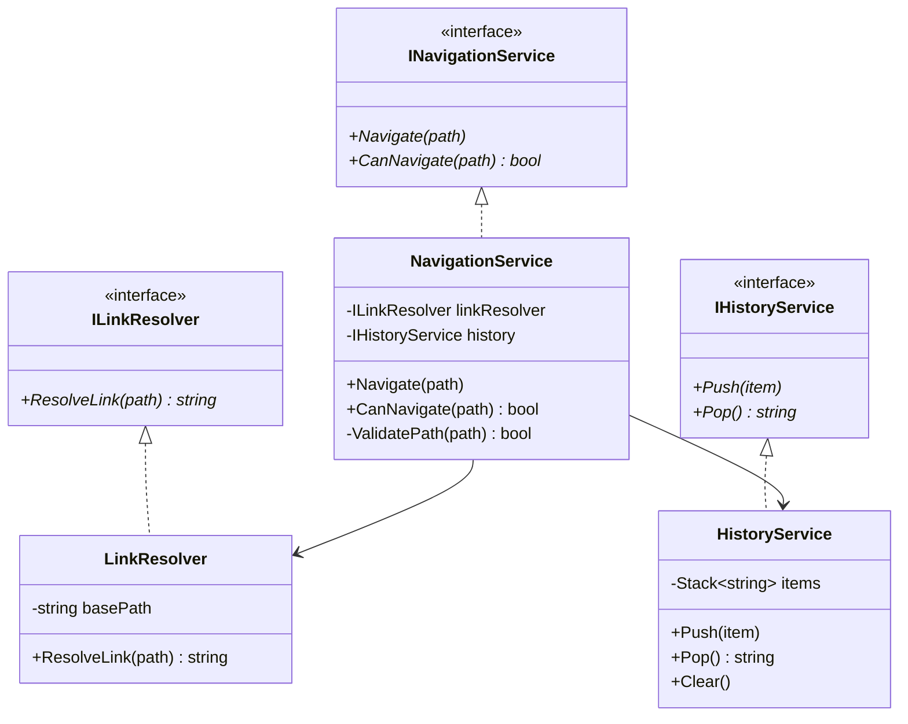

## See Also

- [Sequence Diagrams](sequence-diagrams.md)
- [Flowcharts](flowcharts.md)
- [Architecture Overview](../../developer/architecture/overview.md)
