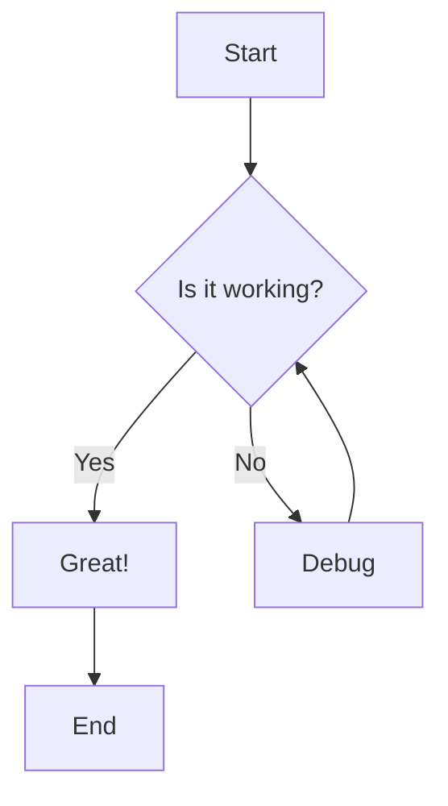
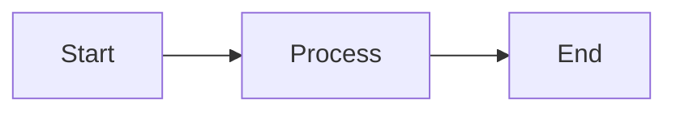
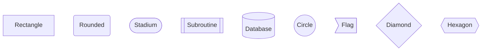
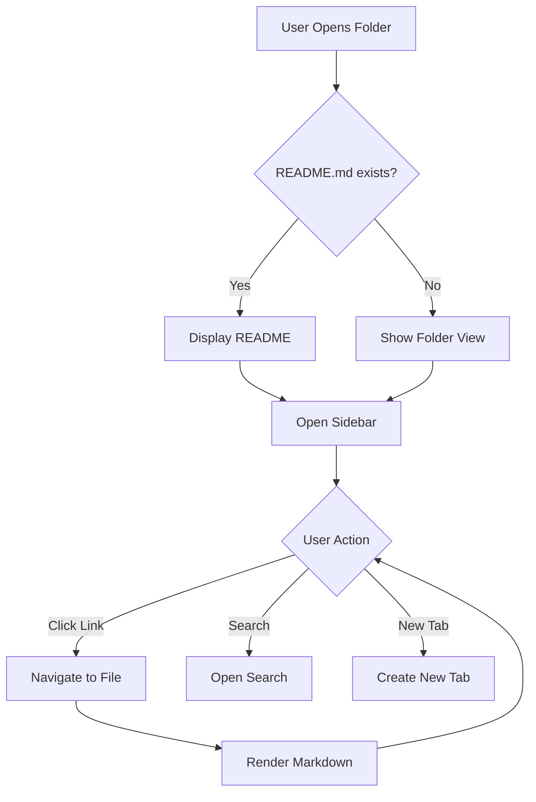

# Flowcharts

> 📍 **Navigation**: [Home](../../../README.md) → [Documentation](../../README.md) → [Markdown Features](../) → [Diagrams](./) → Flowcharts

Flowcharts visualize processes, decisions, and workflows using Mermaid.

## Basic Flowchart

````markdown

````


## Flow Directions

- `TD` or `TB` - Top to bottom
- `BT` - Bottom to top
- `LR` - Left to right
- `RL` - Right to left



## Node Shapes



## Real-World Example

````markdown

````


## See Also

- [Sequence Diagrams](sequence-diagrams.md)
- [Class Diagrams](class-diagrams.md)
- [Mermaid Overview](mermaid-overview.md)
