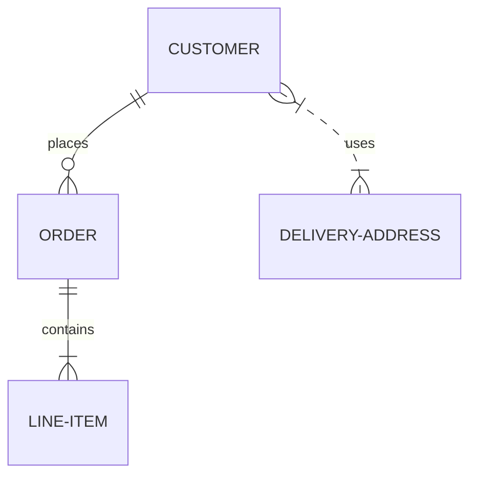
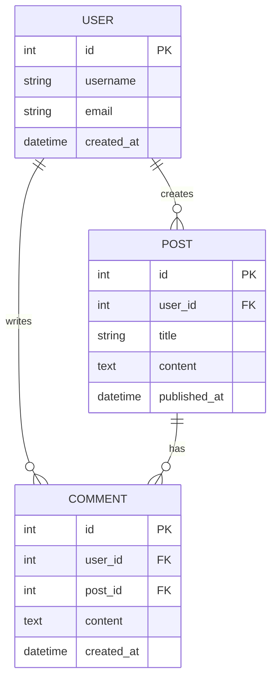
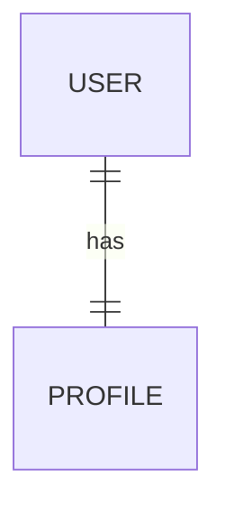
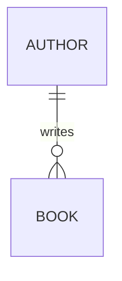
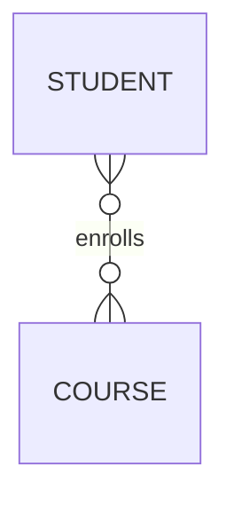
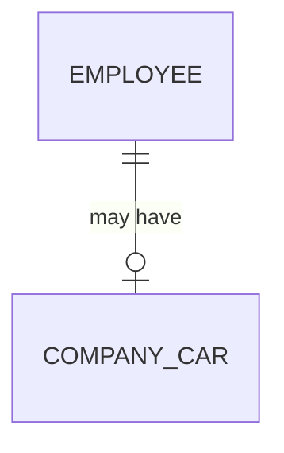
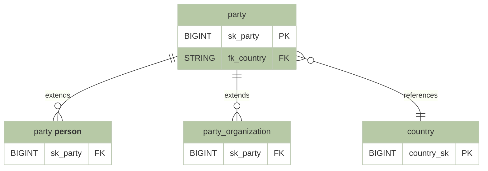
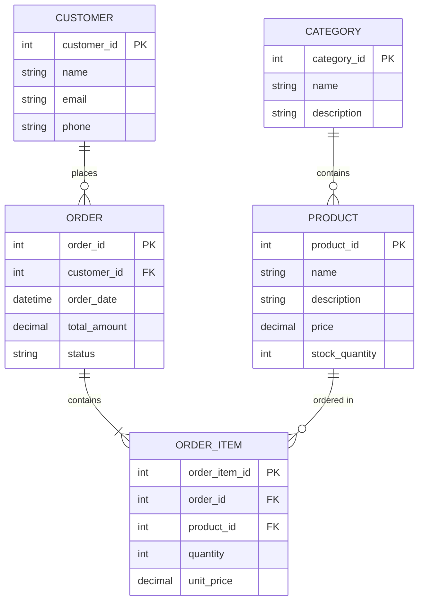
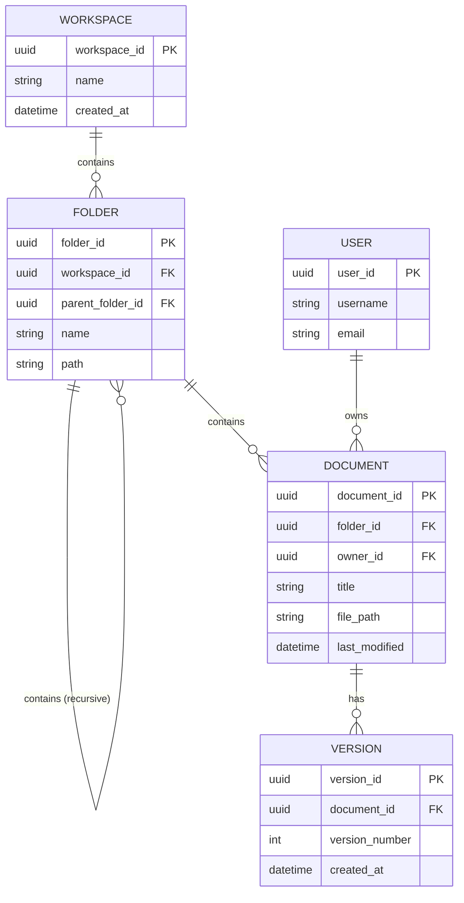

# Entity-Relationship Diagrams (ERD)

> 📍 **Navigation**: [Home](../../../README.md) → [Documentation](../../README.md) → [Markdown Features](../) → [Diagrams](./) → ERD2

Entity-Relationship Diagrams show database structure, relationships between entities, and cardinality.

## Basic ERD

## Simple Database Schema

## Relationship Types

### One-to-One

### One-to-Many

### Many-to-Many

### Optional Relationships

## Colorized Data Warehouse Schema

A dimensional model showing party entities with custom styling:

This example demonstrates:
- **Inheritance patterns**: Party entity extends to person and organization
- **Foreign key relationships**: Party references country
- **Custom styling**: Dimension tables in green, with defined color classes
- **Entity aliasing**: Using quotes to display formatted names

## E-Commerce Database

## File Storage System

## Cardinality Symbols

| Symbol | Meaning |
|--------|---------|
| `\|o`  | Zero or one |
| `\|\|` | Exactly one |
| `}o`   | Zero or more |
| `}\|`  | One or more |

## See Also

- [Class Diagrams](class-diagrams.md)
- [Sequence Diagrams](sequence-diagrams.md)
- [Flowcharts](flowcharts.md)
- [Mermaid Overview](mermaid-overview.md)
