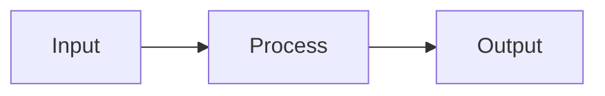
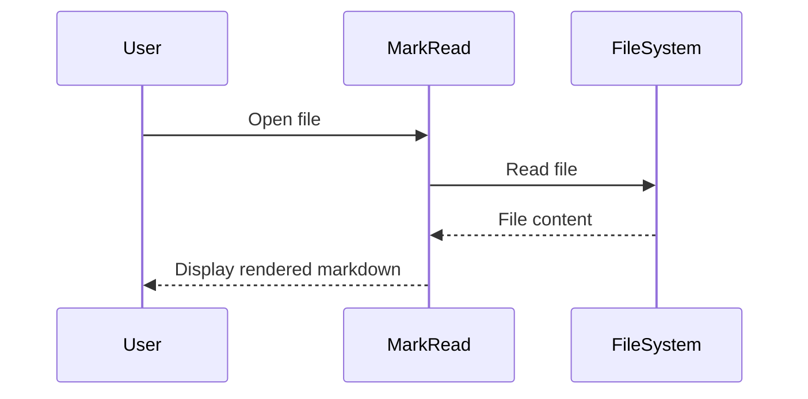
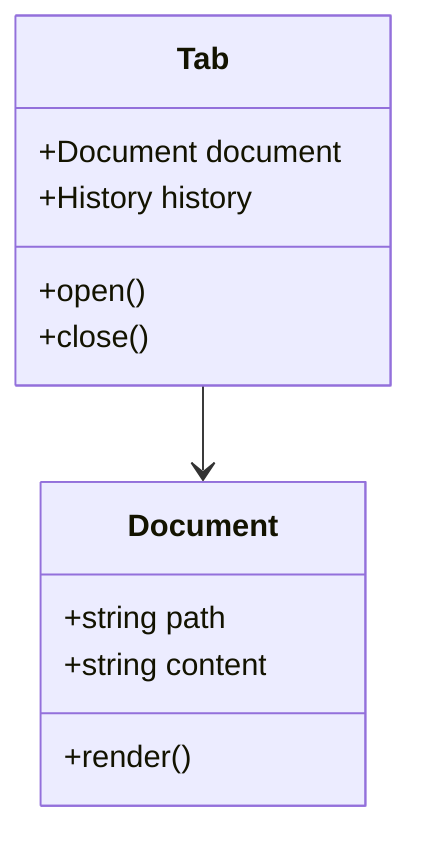
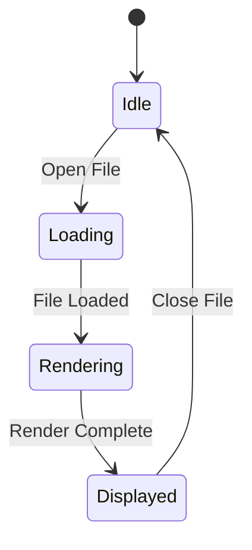
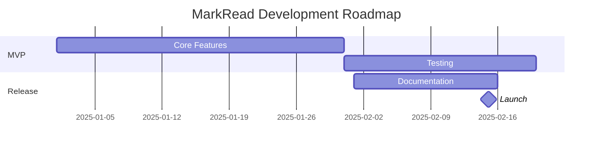
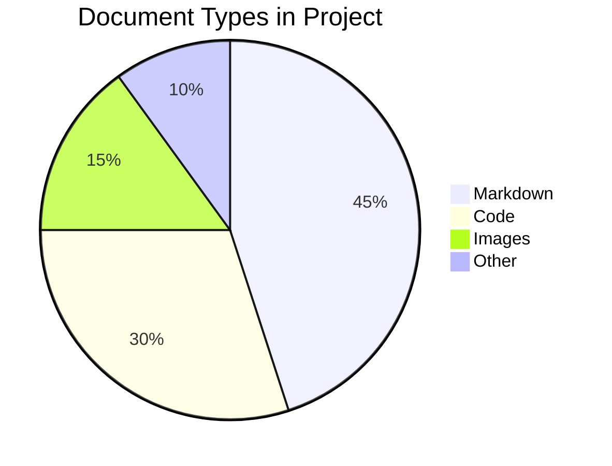
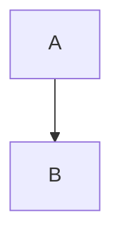

# Mermaid Overview

> 📍 **Navigation**: [Home](../../../README.md) → [Documentation](../../README.md) → [Markdown Features](../) → [Diagrams](./) → Mermaid Overview

Mermaid creates diagrams and visualizations using text-based syntax.

## What is Mermaid?

Mermaid is a diagram and chart generation tool that uses markdown-inspired syntax. It renders diagrams directly in MarkRead without external tools.

## Supported Diagram Types

### Flowcharts
Process flows and decision trees.



[Learn more →](flowcharts.md)

### Sequence Diagrams
Interactions between objects over time.



[Learn more →](sequence-diagrams.md)

### Class Diagrams
UML class structures and relationships.



[Learn more →](class-diagrams.md)

### State Diagrams
State machines and transitions.



[Learn more →](state-diagrams.md)

### Gantt Charts
Project timelines and schedules.



[Learn more →](gantt-charts.md)

### Pie Charts
Data proportions and percentages.



[Learn more →](pie-charts.md)

## Basic Syntax

All Mermaid diagrams use fenced code blocks with `mermaid` language:

````markdown

````

## Why Use Mermaid?

✅ **Version Control** - Diagrams are text, so they diff well in Git
✅ **No External Tools** - No need for Visio, Draw.io, etc.
✅ **Always Up-to-Date** - Edit diagrams as easily as text
✅ **Consistent Style** - Automatic professional styling
✅ **Fast** - Quick to create and modify

## Tips for Great Diagrams

1. **Keep it Simple** - Don't overcomplicate
2. **Use Meaningful Names** - Clear node labels
3. **Logical Flow** - Top-to-bottom or left-to-right
4. **Add Comments** - Explain complex diagrams
5. **Test Syntax** - Use [mermaid.live](https://mermaid.live) to validate

## See Also

- [Flowcharts](flowcharts.md)
- [Sequence Diagrams](sequence-diagrams.md)
- [Class Diagrams](class-diagrams.md)
- [State Diagrams](state-diagrams.md)
- [Gantt Charts](gantt-charts.md)
- [Pie Charts](pie-charts.md)
