# Sequence Diagrams

> 📍 **Navigation**: [Home](../../../README.md) → [Documentation](../../README.md) → [Markdown Features](../) → [Diagrams](./) → Sequence Diagrams

Sequence diagrams show interactions between components over time.

## Basic Sequence Diagram

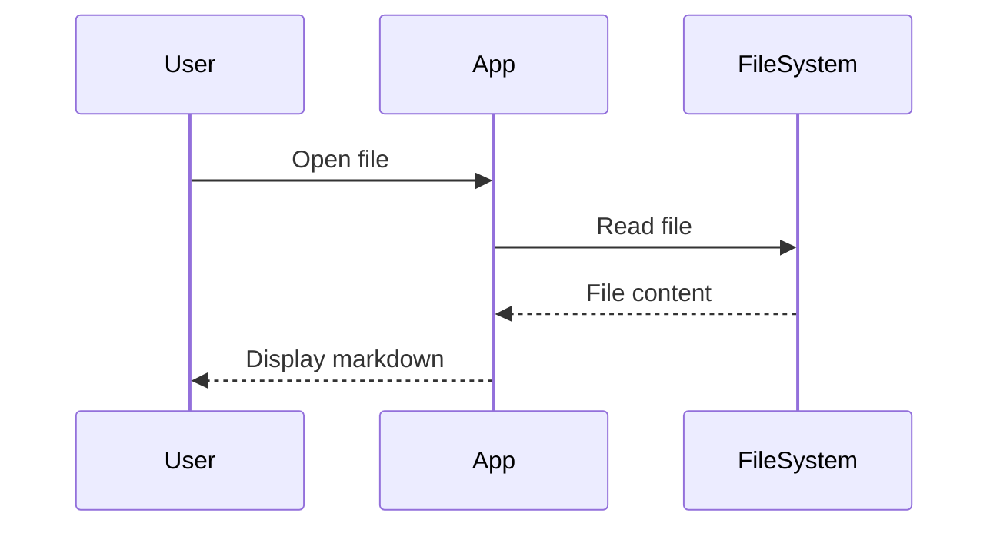

## Document Loading Flow

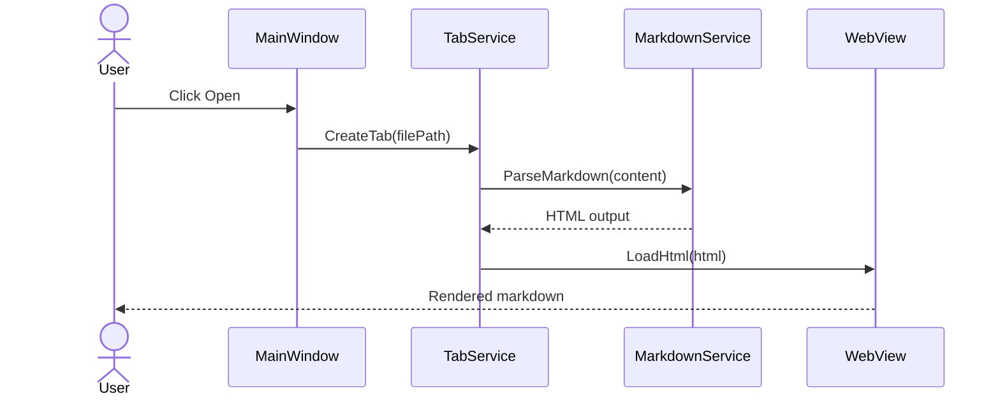

## Search Operation

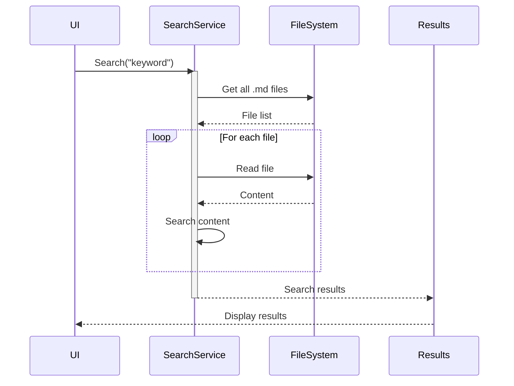

## Theme Switching

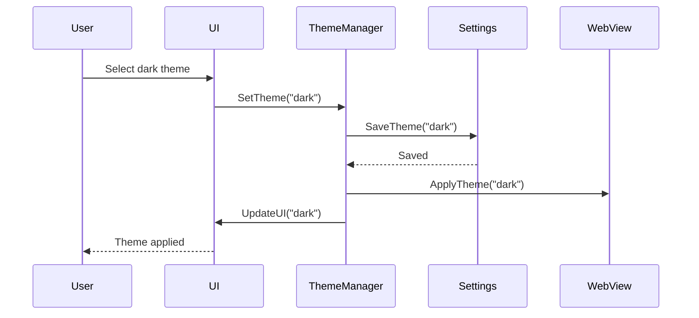

## Error Handling

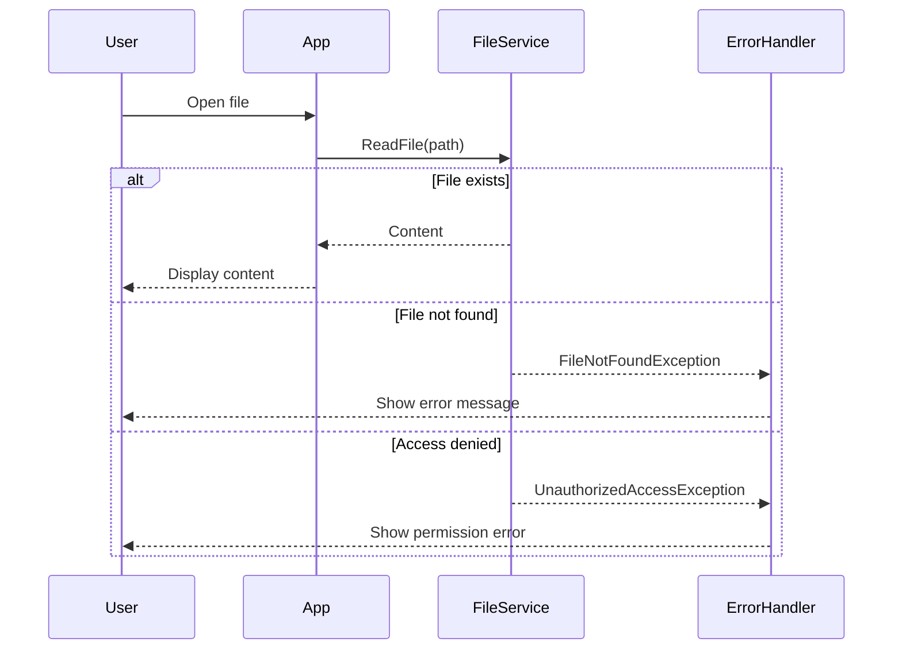

## Navigation History

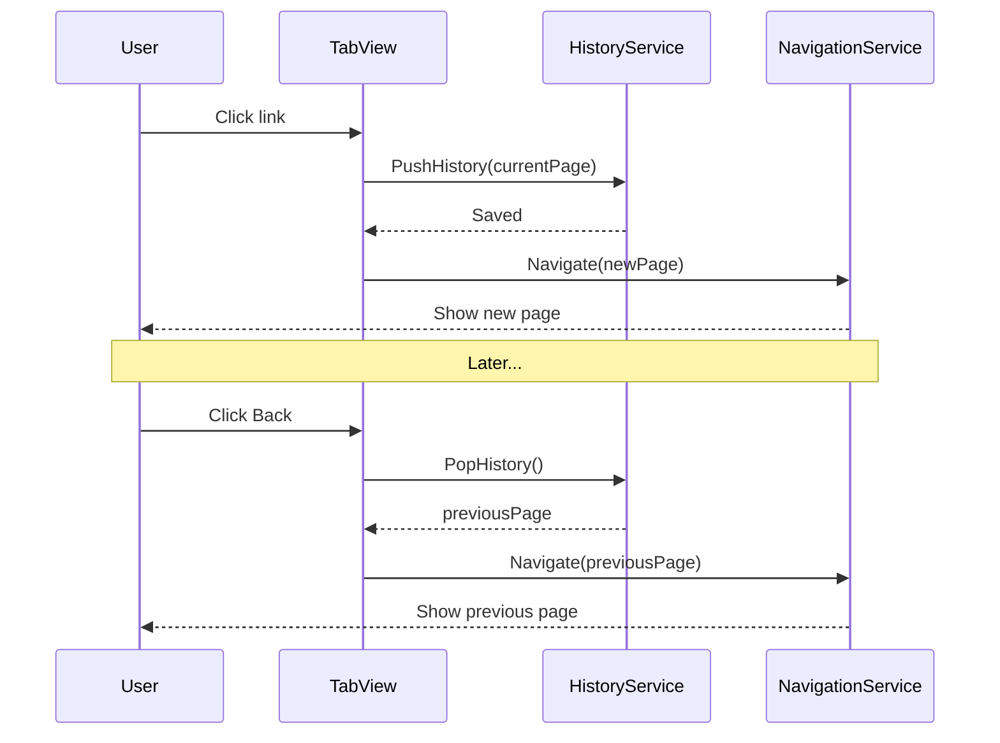

## Syntax Elements

### Participants

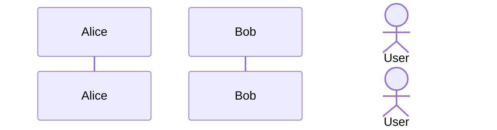

### Message Types

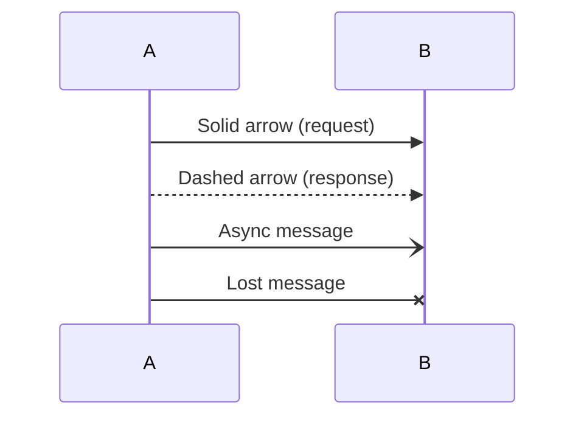

### Activation/Deactivation

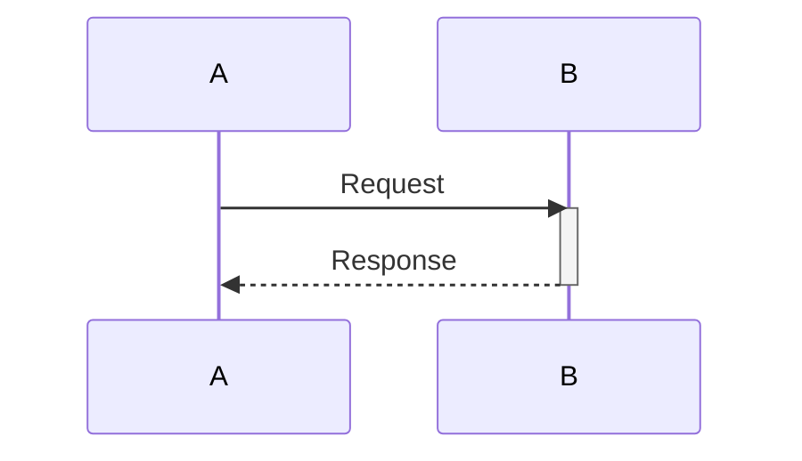

### Notes

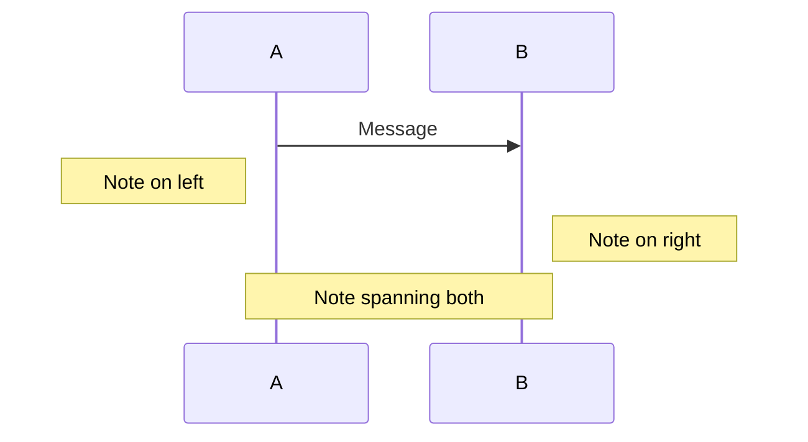

### Loops and Conditionals

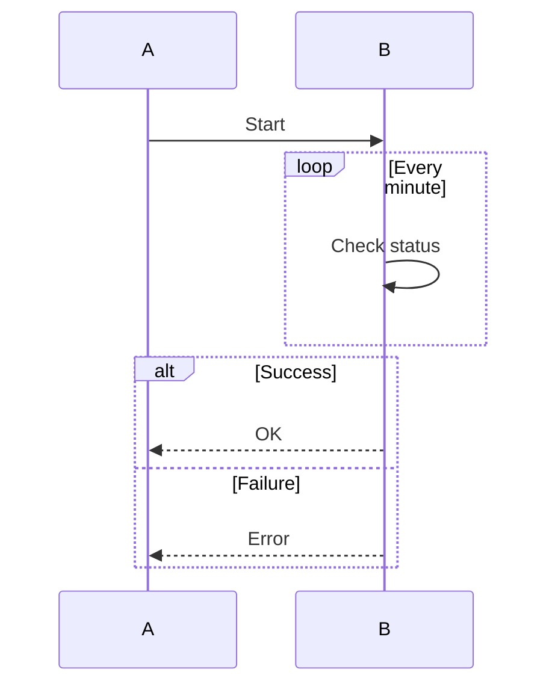

## See Also

- [Flowcharts](flowcharts.md)
- [Class Diagrams](class-diagrams.md)
- [Mermaid Overview](mermaid-overview.md)
- [Architecture Overview](../../developer/architecture/overview.md)
