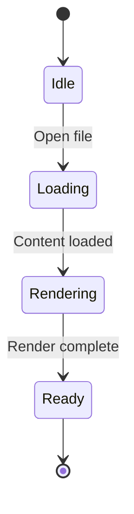
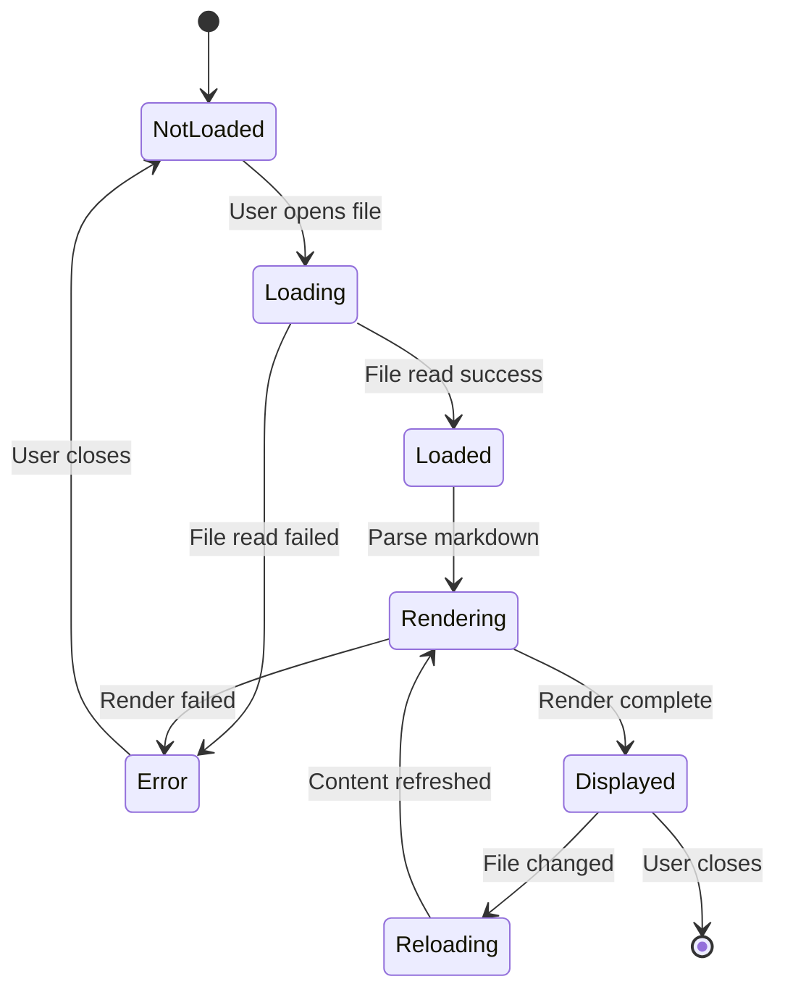
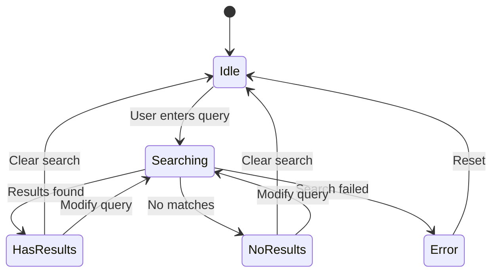
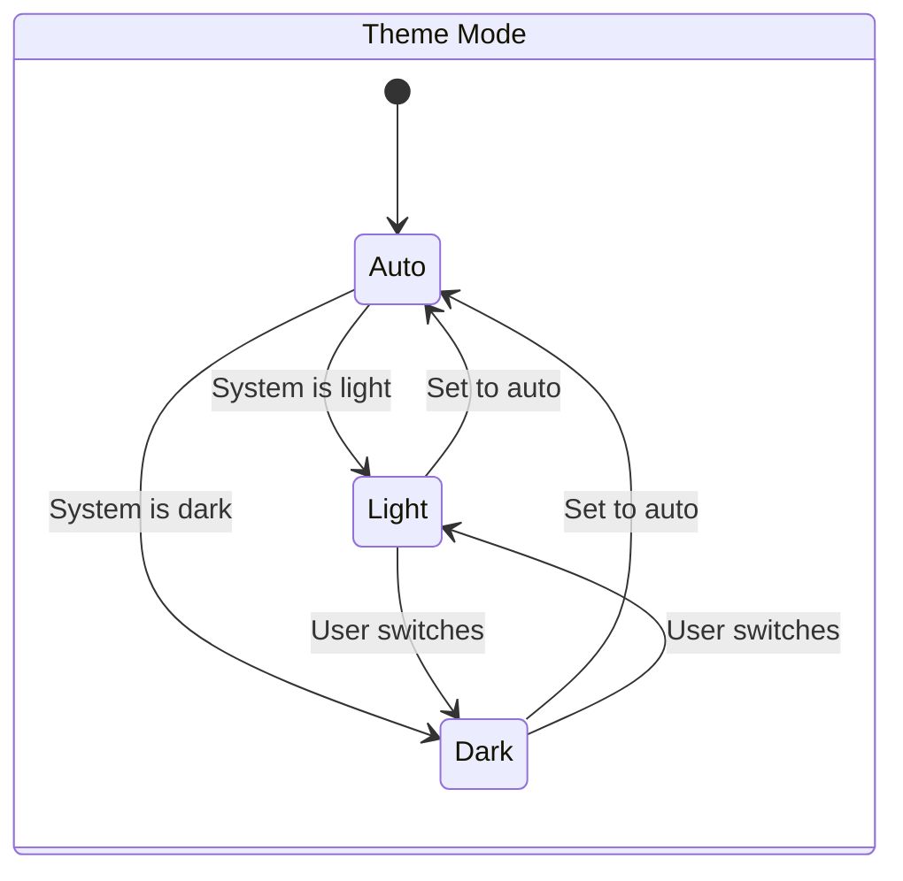
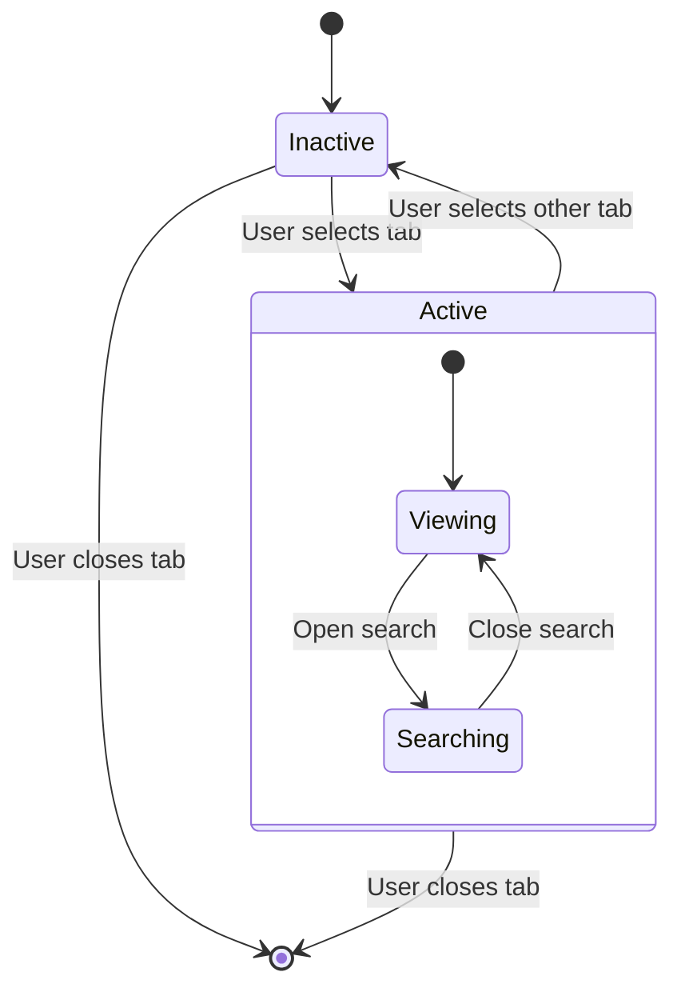
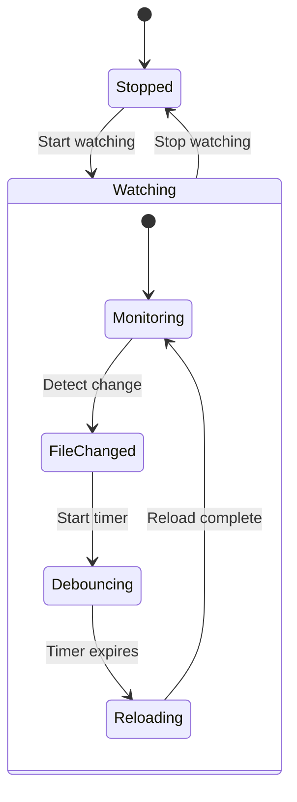
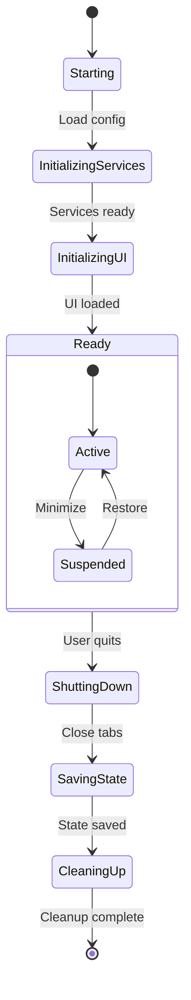
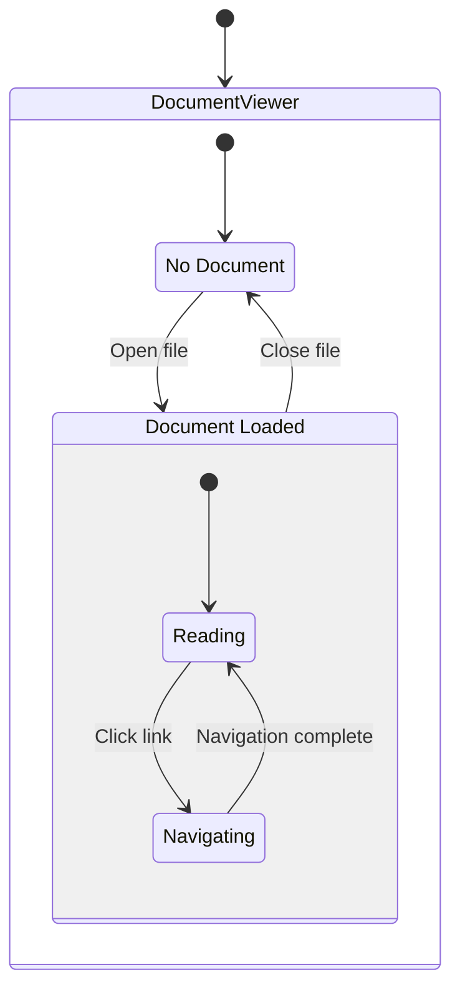
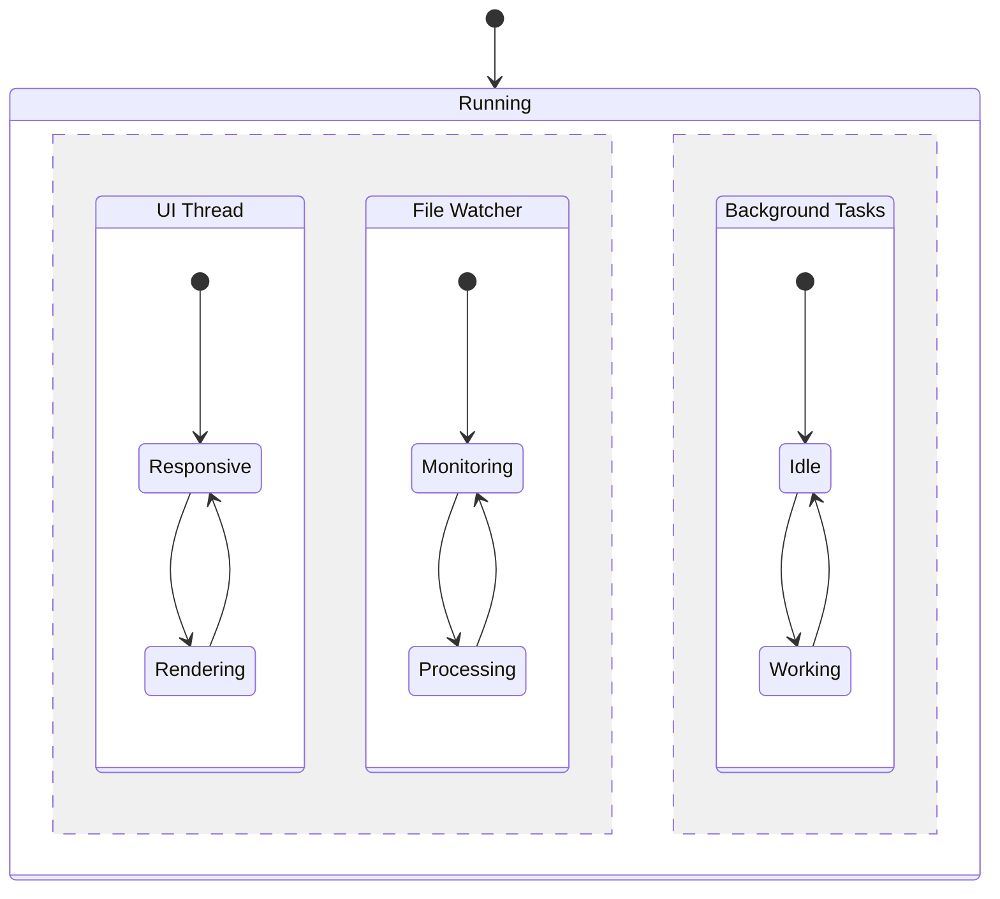
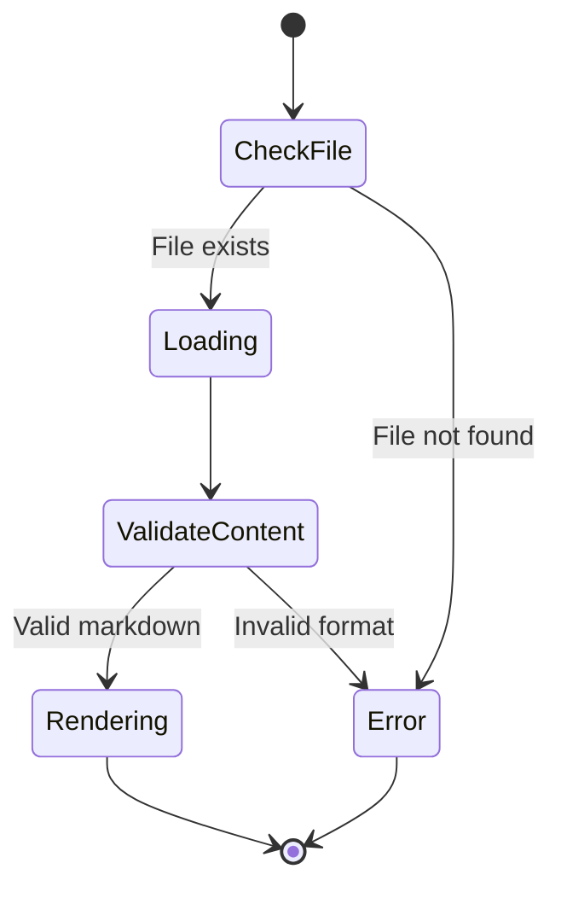

# State Diagrams

> 📍 **Navigation**: [Home](../../../README.md) → [Documentation](../../README.md) → [Markdown Features](../) → [Diagrams](./) → State Diagrams

State diagrams show state transitions in a system.

## Basic State Diagram

## Document Lifecycle

## Search States

## Theme State

## Tab States

## File Watcher States

## Application Lifecycle

## Composite States

## Parallel States

## Choice States

## See Also

- [Flowcharts](flowcharts.md)
- [Sequence Diagrams](sequence-diagrams.md)
- [Class Diagrams](class-diagrams.md)
- [Mermaid Overview](mermaid-overview.md)
