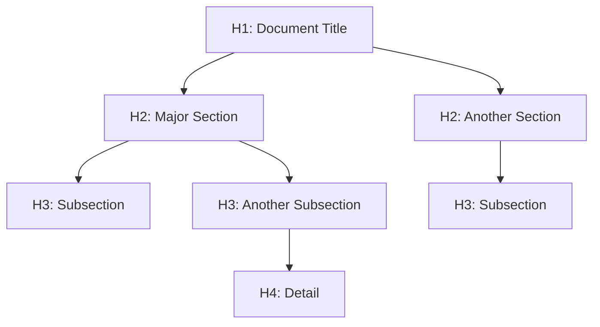

# Headings and Document Structure

> 📍 **Navigation**: [Home](../../../README.md) → [Documentation](../../README.md) → [Markdown Features](../) → [Text Formatting](./) → Headings

Headings create the structural hierarchy of your document and enable navigation through the table of contents.

## Heading Levels

Markdown supports six levels of headings using `#` symbols:

# Heading 1 (H1)
## Heading 2 (H2)
### Heading 3 (H3)
#### Heading 4 (H4)
##### Heading 5 (H5)
###### Heading 6 (H6)

## Syntax

```markdown
# Heading 1
## Heading 2
### Heading 3
#### Heading 4
##### Heading 5
###### Heading 6
```

**Important**: Always include a space after the `#` symbols.

## Alternative Syntax

H1 and H2 can also use underline style:

```markdown
Heading 1
=========

Heading 2
---------
```

Results in:

Heading 1
=========

Heading 2
---------

## Best Practices

### One H1 Per Document

Use only one H1 (# Heading) per document - typically the title:

```markdown
# My Document Title

## Section 1
## Section 2
```

### Logical Hierarchy

Don't skip levels. Follow a logical structure:

```markdown
✓ Correct:
# Title
## Section
### Subsection

✗ Incorrect:
# Title
### Subsection (skipped H2)
```

### Descriptive Headings

Make headings descriptive and scannable:

```markdown
✓ Good:
## Installing on Windows
## Troubleshooting Connection Errors

✗ Less good:
## Installation
## Problems
```

## Heading Navigation

In MarkRead, headings provide:
- **Table of Contents** - Auto-generated from headings
- **Anchor Links** - Each heading gets a URL anchor
- **Quick Navigation** - `Ctrl+Up/Down` to jump between headings

### Creating Anchor Links

Link to headings in the same document:

```markdown
[Jump to Installation](#installation)
[See Best Practices](#best-practices)
```

Link to headings in other documents:

```markdown
[Setup Guide](setup.md#installation)
[API Authentication](api.md#authentication-methods)
```

### Anchor Link Rules

Anchors are generated from headings:
- Lowercase all letters
- Replace spaces with hyphens
- Remove special characters
- Remove emojis

Examples:

| Heading | Anchor |
|---------|--------|
| `## Installation Guide` | `#installation-guide` |
| `### Getting Started!` | `#getting-started` |
| `## API (v2.0)` | `#api-v20` |
| `### 🚀 Quick Start` | `#quick-start` |

## Document Structure Example

```markdown
# Project Name

Brief introduction to the project.

## Installation

How to install the project.

### Prerequisites

What you need before installing.

### Steps

1. Step one
2. Step two

## Usage

How to use the project.

### Basic Usage

Simple examples.

### Advanced Usage

Complex examples.

## Contributing

How to contribute.

## License

License information.
```

## Visual Hierarchy

Headings create visual hierarchy:



## Styling in MarkRead

MarkRead renders headings with:
- **Size gradation**: H1 largest, H6 smallest
- **Weight**: Bold or semi-bold
- **Spacing**: Vertical margins for clarity
- **Color**: Subtle color variations (theme-dependent)

Light theme example:
- H1: 2em, bold, dark gray
- H2: 1.5em, semi-bold, medium gray
- H3-H6: Progressively smaller

## Accessibility

Headings are critical for accessibility:
- **Screen readers** use headings for navigation
- **Outline view** shows document structure
- **SEO** (if exported to web) uses heading hierarchy

Always use semantic headings, not just styled text:

```markdown
✓ Correct:
## Section Title

✗ Incorrect:
**Section Title** (just bold text)
```

## See Also

- [Links](links.md) - Creating links to headings
- [Blockquotes](blockquotes.md) - Quoting content
- [Horizontal Rules](horizontal-rules.md) - Section dividers
