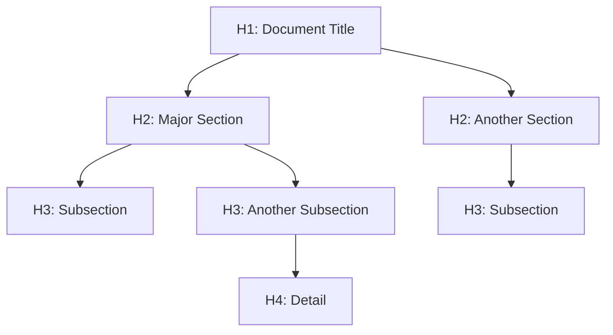

# Headings and Document Structure

> 📍 **Navigation**: [Home](../../../README.md) → [Documentation](../../README.md) → [Markdown Features](../) → [Text Formatting](./) → Headings

Headings create the structural hierarchy of your document and drive the Outline panel used to navigate it.

## Heading Levels

Markdown supports six levels of headings using `#` symbols:

# Heading 1 (H1)
## Heading 2 (H2)
### Heading 3 (H3)
#### Heading 4 (H4)
##### Heading 5 (H5)
###### Heading 6 (H6)

## Syntax

```markdown
# Heading 1
## Heading 2
### Heading 3
#### Heading 4
##### Heading 5
###### Heading 6
```

**Important**: Always include a space after the `#` symbols.

## Alternative Syntax

H1 and H2 can also use underline style:

```markdown
Heading 1
=========

Heading 2
---------
```

Results in:

Heading 1
=========

Heading 2
---------

## Best Practices

### One H1 Per Document

Use only one H1 (# Heading) per document - typically the title:

```markdown
# My Document Title

## Section 1
## Section 2
```

### Logical Hierarchy

Don't skip levels. Follow a logical structure:

```markdown
✓ Correct:
# Title
## Section
### Subsection

✗ Incorrect:
# Title
### Subsection (skipped H2)
```

### Descriptive Headings

Make headings descriptive and scannable:

```markdown
✓ Good:
## Installing on Windows
## Troubleshooting Connection Errors

✗ Less good:
## Installation
## Problems
```

## Heading Navigation

In MarkRead, headings provide:
- **Outline panel** - A docked, always-in-sync outline of the current document
- **Anchor Links** - Each heading gets a stable URL anchor (`#section-name`)

### The Outline Panel

Open the outline with `Ctrl+Alt+O`, **View → Toggle Outline**, or the "Toggle Outline" command. It docks on the
right of the content by default and can be moved into the sidebar below the file tree (**View → Move Outline to
Left**, the panel's move button, or the *Outline Position* setting). Its visibility, width and follow-scroll toggle are
remembered between sessions.

The panel shows:

- **Heading tree** - Every heading up to the configured *Outline Depth* (Settings → Appearance), nested by relative
  level. A document that skips levels (h1 → h3) still nests cleanly with no empty indent gaps. The header shows the
  heading count.
- **Reading position** - The heading at the top of the viewport is highlighted (accent bar + bold). At the very
  bottom of the document the last heading stays active.
- **Click to jump** - Clicking an entry scrolls the heading to the top of the content area (smooth or instant per
  the *Scroll Behavior* setting). `Alt+Left` returns to where you were.
- **Follow scroll** - The ⇅ button keeps the active entry visible while you read; switch it off if you prefer the
  outline to stay put while you browse it.
- **Collapse / expand** - Use the chevrons, `←` / `→`, or *Collapse all* / *Expand all* in the header. Collapse state
  is kept per tab for the session.
- **Filter** - `Ctrl+G` (Go to Heading) focuses the filter box. Matching entries and their ancestors stay visible;
  `Esc` clears the filter.
- **Keyboard** - With an entry focused: `↑` / `↓` move, `Home` / `End` jump to the first / last entry, `Enter`
  navigates.

Documents without headings show "No headings in this document".

### Creating Anchor Links

Link to headings in the same document:

```markdown
[Jump to Installation](#installation)
[See Best Practices](#best-practices)
```

Link to headings in other documents:

```markdown
[Setup Guide](setup.md#installation)
[API Authentication](api.md#authentication-methods)
```

### Anchor Link Rules

Anchors are generated from the heading's plain text (inline formatting, code and links are stripped):
- Lowercase all letters
- Replace spaces with hyphens
- Remove special characters (letters, numbers, `-` and `_` are kept, including accented letters)
- Remove emojis
- Duplicate headings get a numeric suffix so every anchor is unique

Examples:

| Heading | Anchor |
|---------|--------|
| `## Installation Guide` | `#installation-guide` |
| `### Getting Started!` | `#getting-started` |
| `## API (v2.0)` | `#api-v20` |
| `### 🚀 Quick Start` | `#quick-start` |
| `## Notes` (second occurrence) | `#notes-1` |

The outline panel links to exactly these ids, so an entry always scrolls to its own heading, even when two headings
share the same text.

## Document Structure Example

```markdown
# Project Name

Brief introduction to the project.

## Installation

How to install the project.

### Prerequisites

What you need before installing.

### Steps

1. Step one
2. Step two

## Usage

How to use the project.

### Basic Usage

Simple examples.

### Advanced Usage

Complex examples.

## Contributing

How to contribute.

## License

License information.
```

## Visual Hierarchy

Headings create visual hierarchy:


```mermaid
graph TD
    A[H1: Document Title] --> B[H2: Major Section]
    A --> C[H2: Another Section]
    B --> D[H3: Subsection]
    B --> E[H3: Another Subsection]
    E --> F[H4: Detail]
    C --> G[H3: Subsection]
```

## Styling in MarkRead

MarkRead renders headings with:
- **Size gradation**: H1 largest, H6 smallest
- **Weight**: Bold or semi-bold
- **Spacing**: Vertical margins for clarity
- **Color**: Subtle color variations (theme-dependent)

Light theme example:
- H1: 2em, bold, dark gray
- H2: 1.5em, semi-bold, medium gray
- H3-H6: Progressively smaller

## Accessibility

Headings are critical for accessibility:
- **Screen readers** use headings for navigation
- **Outline panel** exposes the structure as an ARIA tree (`Document outline`) with the current section marked
  `aria-current="location"`
- **SEO** (if exported to web) uses heading hierarchy

Always use semantic headings, not just styled text:

```markdown
✓ Correct:
## Section Title

✗ Incorrect:
**Section Title** (just bold text)
```

## See Also

- [Links](links.md) - Creating links to headings
- [Blockquotes](blockquotes.md) - Quoting content
- [Horizontal Rules](horizontal-rules.md) - Section dividers
