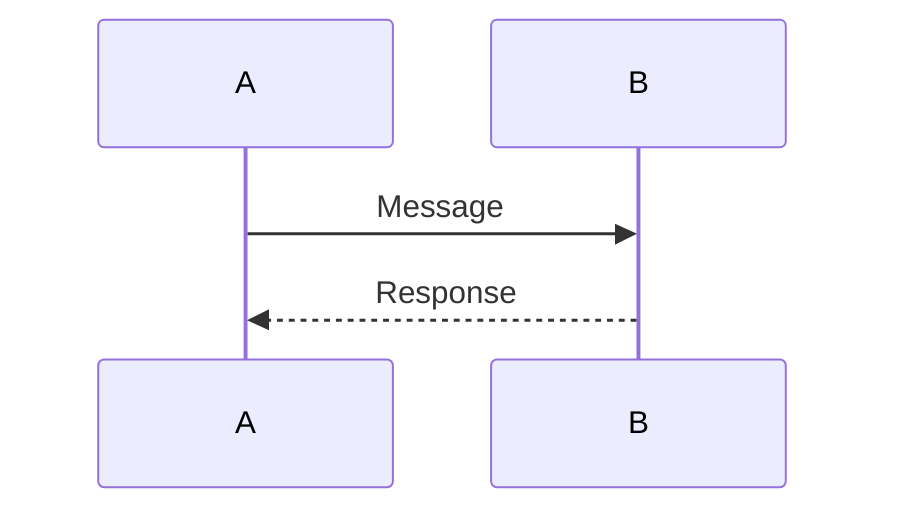
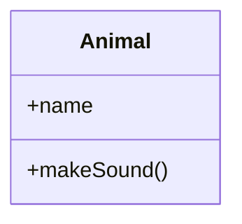

# Markdown Syntax Quick Reference

> 📍 **Navigation**: [Home](../../README.md) → [Documentation](../) → [Reference](./) → Markdown Syntax

Quick reference guide for Markdown syntax.

## Headers

```markdown
# H1
## H2
### H3
#### H4
##### H5
###### H6
```

## Emphasis

```markdown
*italic* or _italic_
**bold** or __bold__
***bold italic*** or ___bold italic___
~~strikethrough~~
```

## Lists

### Unordered

```markdown
- Item 1
- Item 2
  - Nested item
  - Another nested
```

### Ordered

```markdown
1. First item
2. Second item
   1. Nested item
   2. Another nested
```

### Task Lists

```markdown
- [ ] Unchecked
- [x] Checked
```

## Links

```markdown
[Link text](https://example.com)
[Link with title](https://example.com "Title")
[Relative link](../other-page.md)
[Anchor link](#section)
<https://autolink.com>
```

## Images

```markdown


[](full.png)
```

## Code

### Inline

```markdown
Use `code` inline
```

### Block

````markdown
```language
code block
```
````

### With Language

````markdown
```python
def hello():
    print("Hello, World!")
```

```csharp
public void Hello()
{
    Console.WriteLine("Hello, World!");
}
```
````

## Blockquotes

```markdown
> Quote
> Multiple lines

> Nested
>> Level 2
>>> Level 3
```

## Horizontal Rule

```markdown
---
***
___
```

## Tables

```markdown
| Header 1 | Header 2 | Header 3 |
|----------|:---------|----------:|
| Left     | Center   | Right    |
| Cell     | Cell     | Cell     |
```

Alignment:
- `:---` = Left
- `:--:` = Center
- `---:` = Right

## Footnotes

```markdown
Text with footnote[^1]

[^1]: Footnote content
```

## Definition Lists

```markdown
Term
: Definition
: Another definition
```

## HTML

```markdown
<div style="color: red;">
HTML content
</div>


```

## Escaping

```markdown
\* Not italic \*
\# Not a heading
\[Not a link\]
```

## Line Breaks

```markdown
Two spaces at end  
creates line break

Or use <br> tag
```

## Comments

```markdown
<!-- This is a comment -->

<!--
Multi-line
comment
-->
```

## Emoji

```markdown
:smile: :heart: :rocket:
Or use Unicode: 😄 ❤️ 🚀
```

## Mermaid Diagrams

### Flowchart

````markdown

````

### Sequence

````markdown

````

### Class Diagram

````markdown

````

## Advanced Features

### Highlighting

```markdown
==highlighted text==
```

### Subscript/Superscript

```markdown
H~2~O (subscript)
X^2^ (superscript)
```

### Abbreviations

```markdown
*[HTML]: Hyper Text Markup Language

HTML is great
```

### Math (KaTeX)

```markdown
Inline: $E = mc^2$

Block:
$$
\frac{-b \pm \sqrt{b^2 - 4ac}}{2a}
$$
```

## Common Patterns

### Warning Box

```markdown
> **⚠️ Warning**
> 
> Important information here
```

### Info Box

```markdown
> **ℹ️ Note**
> 
> Helpful information here
```

### Tip Box

```markdown
> **💡 Tip**
> 
> Pro tip here
```

### Code with Output

````markdown
```bash
$ ls -la
total 24
drwxr-xr-x  3 user  staff   96 Jan 15 10:00 .
drwxr-xr-x  8 user  staff  256 Jan 15 09:30 ..
```
````

### File Reference

```markdown
See [`config.json`](./config.json) for configuration.
```

### Keyboard Keys

```markdown
Press `Ctrl+C` to copy
Press `Ctrl+Shift+P` for command palette
```

## Compatibility Notes

### GitHub Flavored Markdown (GFM)

- ✅ Task lists
- ✅ Tables
- ✅ Strikethrough
- ✅ Autolinks
- ✅ Emoji shortcodes

### CommonMark

- ✅ Standard syntax
- ❌ Task lists (extension)
- ❌ Tables (extension)
- ❌ Emoji (extension)

### Markdig (MarkRead)

- ✅ All GFM features
- ✅ Extended syntax
- ✅ Mermaid diagrams
- ✅ Footnotes
- ✅ Definition lists
- ✅ Abbreviations
- ✅ Math (KaTeX)

## Quick Tips

1. **Preview often**: Use MarkRead to see rendered output
2. **Blank lines**: Add blank lines between elements
3. **Indentation**: Use consistent indentation (2 or 4 spaces)
4. **Line length**: Keep lines under 80-100 characters
5. **Special characters**: Escape with backslash `\`

## See Also

- [Text Formatting](../markdown-features/text-formatting/emphasis.md)
- [Code Blocks](../markdown-features/code/code-blocks.md)
- [Tables](../markdown-features/advanced/tables.md)
- [Diagrams](../markdown-features/diagrams/mermaid-overview.md)
