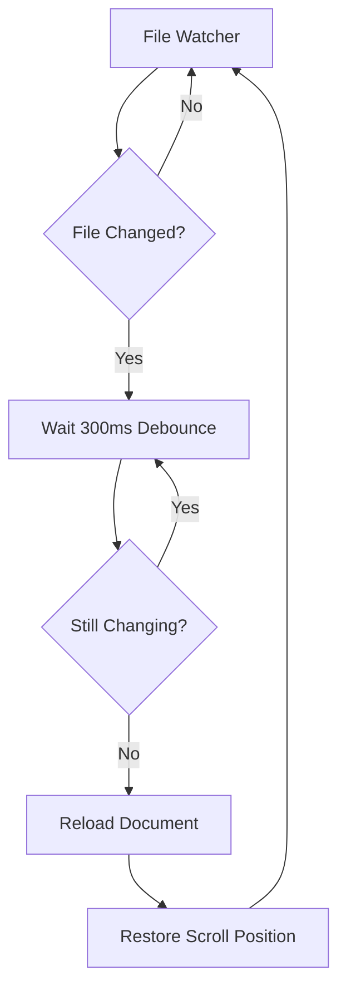

# Advanced Features

> 📍 **Navigation**: [Home](../../README.md) → [Documentation](../README.md) → [User Guide](.) → Advanced Features

Unlock the full power of MarkRead with these advanced features and techniques.

## Auto-Reload

### How Auto-Reload Works

MarkRead watches your files and automatically reloads when they change:



**Benefits**:
- See changes immediately
- No manual refresh needed
- Preserves scroll position
- Smooth updates

### Enabling/Disabling Auto-Reload

**Toggle in Settings**
```
Settings → Behavior → Auto-reload on file change
```

**When to Disable**:
- Viewing build output that changes frequently
- Large files that are slow to reload
- Working with generated files
- Battery saving on laptop

**Manual Reload**:
```
F5 or Ctrl+R - Refresh current document
```

### Auto-Reload Performance

**Debounce Delay**: 300ms
- Waits for changes to stop
- Prevents excessive reloads
- Configurable in settings (100ms - 2000ms)

**Memory Management**:
- Only active tab reloads automatically
- Inactive tabs reload on activation
- Reduces resource usage

## Command-Line Usage

### Basic Commands

```powershell
# Open folder
markread "C:\MyDocs"

# Open specific file
markread "C:\MyDocs\README.md"

# Open current directory
markread .

# Multiple files (opens in tabs)
markread file1.md file2.md file3.md
```

### Command-Line Options

```powershell
# Specify theme
markread --theme dark myfile.md

# Disable sidebar
markread --no-sidebar myfile.md

# Start maximized
markread --maximized myproject

# Verbose logging
markread --verbose --log debug.log myfile.md

# Show version
markread --version

# Show help
markread --help
```

### Integration with Other Tools

**VS Code Terminal**
```powershell
# Add to VS Code task
{
  "label": "Preview in MarkRead",
  "type": "shell",
  "command": "markread ${file}"
}
```

**PowerShell Function**
```powershell
# Add to $PROFILE
function mdread {
    param([string]$path = ".")
    & "C:\Program Files\MarkRead\MarkRead.exe" $path
}

# Usage: mdread docs\guide.md
```

**Git Hook**
```bash
# .git/hooks/post-commit
#!/bin/sh
markread --refresh README.md
```

## URL Handlers

### Custom Protocol

MarkRead registers `markread://` protocol:

```markdown
[Open in MarkRead](markread://open?file=README.md)
[Search docs](markread://search?q=installation)
```

**Protocol Actions**:
- `markread://open?file=PATH` - Open file
- `markread://search?q=QUERY` - Global search
- `markread://navigate?back` - Navigate back
- `markread://theme?mode=dark` - Change theme

### Web Integration

Link from web pages to local docs:

```html
<a href="markread://open?file=C:\Docs\API.md">
  Open API Docs
</a>
```

## Keyboard Maestro

### Complete Shortcut Reference

See [Keyboard Shortcuts Guide](keyboard-shortcuts.md) for full list.

### Custom Shortcuts

Settings → Keyboard → Customize Shortcuts

**Add Custom Bindings**:
```json
{
  "Ctrl+Shift+R": "reloadAllTabs",
  "Ctrl+Shift+N": "newWindow",
  "F11": "toggleFullscreen"
}
```

### Chord Shortcuts

Multi-key combinations:

```
Ctrl+K, Ctrl+T - Change theme
Ctrl+K, Ctrl+S - Open settings
Ctrl+K, Ctrl+B - Toggle sidebar
```

## Advanced Navigation

### Navigation History Management

**Clear History**
```
Right-click ← or → button → Clear History
```

**Export History**
```
Settings → Advanced → Export Navigation History
```

**History Limits**:
- Default: 50 steps per tab
- Configurable: 10-500 steps
- Older entries auto-pruned

### Breadcrumb Navigation (Future)

```
Home / docs / user-guide / advanced.md
  ↑      ↑         ↑            ↑
  Click any segment to navigate
```

## Performance Tuning

### Large File Handling

**Optimizations**:
- Lazy rendering for 1000+ elements
- Virtual scrolling for long documents
- Progressive image loading
- Syntax highlighting limits

**Settings**:
```
Settings → Performance → Large File Threshold: 1 MB
Settings → Performance → Max Rendered Elements: 10000
```

**Warnings**:
```
⚠️ Large file detected (5.2 MB)
Some features may be limited for performance.
[Load Anyway] [View Raw]
```

### Memory Management

**Aggressive Mode**:
```
Settings → Performance → Aggressive Memory Saving
```

**Effects**:
- Unloads inactive tabs after 5 minutes
- Reduces cache size
- Disables some animations
- Saves ~70% memory

**Memory Stats**:
```
Settings → Advanced → Show Memory Usage
```

### Startup Performance

**Fast Startup Mode**:
- Skip last session restore
- Disable startup animations
- Reduce initial indexing

Settings → Performance → Fast Startup Mode

## Export and Print

### Copy as HTML

Right-click document → Copy as HTML

```html
<h1>My Document</h1>
<p>Formatted <strong>content</strong></p>
```

**Use Cases**:
- Paste into email
- Import to Word
- Share formatted content

### Print to PDF

```
Ctrl+P - Print current document
```

**Print Options**:
- Include code syntax highlighting
- Include diagrams
- Header/footer options
- Page breaks at headings

**PDF Settings**:
- Paper size
- Margins
- Theme (light/dark/print-optimized)

### Export Entire Folder

Settings → Export → Export Folder as...

**Formats**:
- **PDF** - Single file or per-document
- **HTML** - Self-contained website
- **DOCX** - Microsoft Word (future)
- **EPUB** - E-book format (future)

## Plugins and Extensions

### Extension System (Future)

```
Settings → Extensions → Browse Extensions
```

**Planned Extensions**:
- Math rendering (KaTeX)
- PlantUML diagrams
- Custom syntax highlighters
- Export templates
- Custom themes

### Creating Extensions

See [Extension Development Guide](../developer/extension-development.md)

## Multi-Window Support

### Opening New Windows

```powershell
# New window
markread --new-window docs\

# Or from running instance
File → New Window
```

**Independent Windows**:
- Separate window settings
- Independent zoom levels
- Different folders
- Shared theme preference

### Window Management

**Snap to Grid**:
- Drag to edges for snap layouts
- Windows 11 snap layouts supported

**Multi-Monitor**:
- Remember window positions per monitor
- Drag tabs between windows

## Collaboration Features

### Sharing Views

**Copy Link to Current Location**:
```
Ctrl+Shift+C - Copy deep link
```

Result:
```
markread://open?file=docs\api.md&line=42&search=authentication
```

Send to colleague → They open same location.

### Review Mode (Future)

Planned features:
- Inline comments
- Annotations
- Comparison view
- Change tracking

## Advanced Search

### Search Scope Management

Create saved search scopes:

```json
{
  "name": "API Docs Only",
  "include": ["docs/api/**/*.md"],
  "exclude": ["**/drafts/**"]
}
```

### Search Macros

Save frequent searches:

```
Settings → Search → Save Search
Name: "Find TODOs"
Pattern: TODO|FIXME|HACK
```

Access with `Ctrl+Shift+F` → Saved Searches

## Integration with IDEs

### VS Code Integration

**Open in VS Code**:
```
Right-click file → Edit in VS Code
```

**VS Code Extension** (Future):
```
ext install markread.vscode-markread
```

Features:
- Preview button in editor
- Live preview panel
- Sync scroll positions

### JetBrains Integration

Similar workflow for IntelliJ IDEA, PyCharm, etc.

## Accessibility Features

### Screen Reader Support

- Full keyboard navigation
- ARIA labels on all controls
- Semantic HTML structure
- Heading navigation

**Shortcuts**:
```
H - Next heading
Shift+H - Previous heading
T - Next table
L - Next list
```

### Keyboard-Only Mode

Settings → Accessibility → Keyboard-Only Mode

- Enhanced focus indicators
- Skip to content links
- Keyboard command palette

### Voice Control (Windows)

Compatible with Windows Voice Access:
```
"Click menu button"
"Press Control F"
"Scroll down"
```

## Tips for Power Users

💡 **Use Command Palette**: `Ctrl+Shift+P` for quick access to all commands

💡 **Learn Regex Search**: Powerful for finding complex patterns

💡 **Customize Everything**: Export settings to share with team

💡 **Use CLI**: Automate workflows with command-line options

💡 **Multi-Window**: View different docs side-by-side

## Next Steps

- **[Settings Reference](settings.md)** - All configuration options
- **[Keyboard Shortcuts](keyboard-shortcuts.md)** - Complete shortcut list
- **[Troubleshooting](troubleshooting.md)** - Solve issues
- **[Developer Docs](../developer/)** - Extend MarkRead

---

**Complete configuration reference** → [Settings and Preferences](settings.md)
