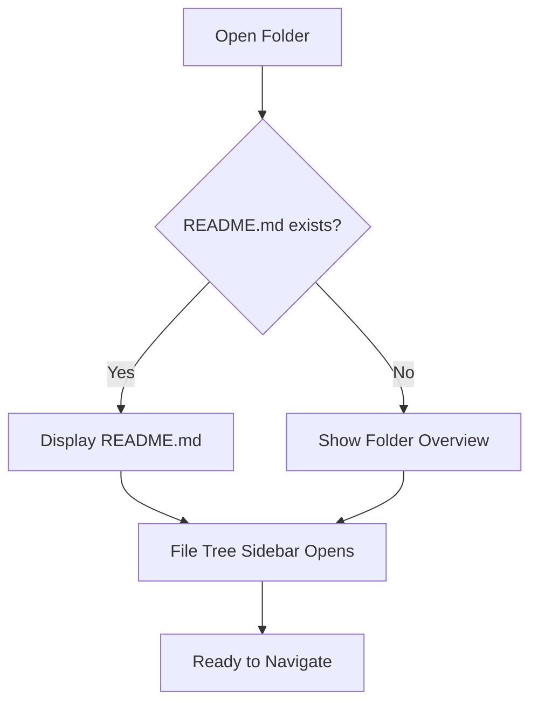
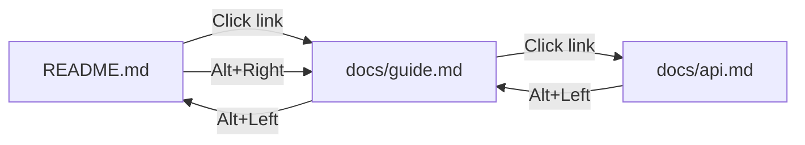
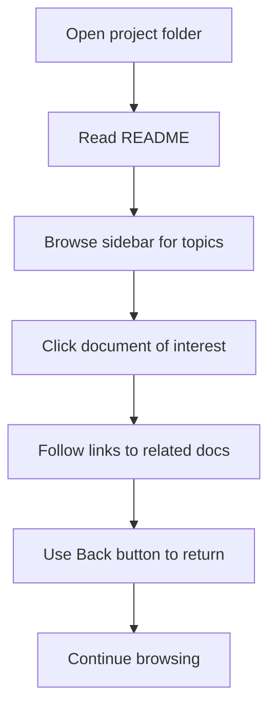

# Basic Usage

> 📍 **Navigation**: [Home](../../README.md) → [Documentation](../README.md) → [User Guide](.) → Basic Usage

This guide covers the everyday operations you'll use in MarkRead.

## Opening and Viewing Documents

### Opening a Folder

There are multiple ways to open a folder in MarkRead:

**Method 1: Keyboard Shortcut**
```
Press Ctrl+O → Select folder → Click "Select Folder"
```

**Method 2: Menu Button**
1. Click the menu button (☰) in the top-left
2. Select "Open Folder"
3. Browse to your folder
4. Click "Select Folder"

**Method 3: Command Line**
```powershell
# From terminal
markread "C:\path\to\your\documentation"

# Or drag and drop folder onto MarkRead.exe
```

**Method 4: Windows Explorer Context Menu**
- Right-click folder → "Open with MarkRead"

### What Happens After Opening?



MarkRead will:
1. Set the folder as your "root" for this session
2. Display `README.md` if it exists at the root
3. Show a folder overview if no README exists
4. Open the file tree sidebar
5. Load your theme preference

### Opening Individual Files

**From the Sidebar**
- Click any `.md` file to open in current tab
- `Ctrl+Click` to open in new tab

**From Links in Documents**
- Click internal links to navigate
- `Ctrl+Click` to open in new tab

**From Command Line**
```powershell
markread "C:\path\to\file.md"
```

## Understanding the Interface

### Main Window Layout

```
┌─────────────────────────────────────────────────────┐
│  ☰  MarkRead    ← →  path/to/file.md   🔍 ⚙️ 🌓 ⊡ │ ← Header
├──────────┬──────────────────────────────────────────┤
│          │  Tab 1  │  Tab 2  │  Tab 3+          ×   │ ← Tabs
├──────────┼──────────────────────────────────────────┤
│  File    │                                           │
│  Tree    │         Document Content Area            │
│          │                                           │
│  📁 docs │         (Rendered Markdown)              │
│   📄 a.md│                                           │
│   📄 b.md│                                           │
│          │                                           │
│  Sidebar │                                           │
└──────────┴──────────────────────────────────────────┘
```

### Header Controls

| Icon/Button | Function | Shortcut |
|-------------|----------|----------|
| ☰ Menu | Open folder, settings | - |
| ← → | Navigate back/forward | `Alt+Left/Right` |
| Path Display | Shows current file path | - |
| 🔍 Search | Global search | `Ctrl+Shift+F` |
| ⚙️ Settings | Open settings panel | `Ctrl+,` |
| 🌓 Theme | Toggle light/dark | - |
| ⊡ Window | Minimize/maximize/close | - |

### Sidebar (File Tree)

The sidebar shows all files in the opened folder:

- **Folders** - Click to expand/collapse
- **Markdown Files** - Click to open
- **Other Files** - Shown but not openable
- **Current File** - Highlighted in the tree

**Sidebar Controls:**
- Toggle visibility: Click menu button
- Resize: Drag the border between sidebar and content
- Navigate: Use arrow keys when sidebar is focused

### Content Area

The main area where your Markdown is rendered:

- **Scrollable** - Use mouse wheel or scrollbar
- **Clickable Links** - Navigate through documents
- **Selectable Text** - Copy content as needed
- **Responsive** - Adapts to window size

## Navigation Basics

### Following Links

MarkRead handles different link types intelligently:

**Internal Links (Same Folder)**
```markdown
[Go to API docs](api.md)
```
- Clicks navigate in current tab
- `Ctrl+Click` opens in new tab
- Updates navigation history

**Anchor Links**
```markdown
[Jump to installation](#installation)
```
- Scrolls to heading in same document
- Adds to navigation history
- Works across files: `[API Setup](api.md#setup)`

**External Links**
```markdown
[Visit GitHub](https://github.com)
```
- Opens in your default web browser
- MarkRead stays open and focused

**Relative Paths**
```markdown
[Nested doc](./guides/advanced.md)
[Parent doc](../README.md)
[Image](./images/logo.png)
```
- All resolve relative to current file
- Work exactly like in GitHub

### Using Navigation History

Every navigation action is tracked per tab:

**Go Back**
- `Alt+Left` or click ← button
- Returns to previous location
- Includes both file changes and anchor jumps

**Go Forward**
- `Alt+Right` or click → button
- Move forward after going back
- Disabled if at end of history

**History Scope**
- Each tab has independent history
- History persists until tab is closed
- No cross-tab history sharing



### Keyboard Navigation

Move efficiently without touching the mouse:

| Action | Shortcut |
|--------|----------|
| Focus sidebar | `Alt+1` |
| Focus document | `Alt+2` |
| Next heading | `Ctrl+Down` |
| Previous heading | `Ctrl+Up` |
| Page down | `Space` or `Page Down` |
| Page up | `Shift+Space` or `Page Up` |
| Top of document | `Home` or `Ctrl+Home` |
| Bottom of document | `End` or `Ctrl+End` |

## Working with Content

### Reading Documents

**Zoom Control**
```
Zoom In:  Ctrl++
Zoom Out: Ctrl+-
Reset:    Ctrl+0
```

**Text Selection**
- Click and drag to select text
- `Ctrl+A` to select all
- `Ctrl+C` to copy selection

**Code Blocks**
- Hover over code block → "Copy" button appears
- Click to copy entire code block
- Syntax highlighting shows language

### Refreshing Content

If you edit a file in another program while viewing in MarkRead:

**Auto-Reload (Default)**
- File changes detected automatically
- Document refreshes after short delay
- Scroll position is preserved

**Manual Reload**
```
Press F5 or Ctrl+R
```

**Disable Auto-Reload**
- Settings → Uncheck "Auto-reload on file change"
- Useful when watching build output

## Common Workflows

### Workflow 1: Browsing Project Documentation



### Workflow 2: Quick Reference Lookup

1. Open documentation folder
2. Press `Ctrl+Shift+F` for global search
3. Type search term
4. Click result to open
5. Use `Ctrl+F` for in-page search
6. Find exact information needed

### Workflow 3: Multi-Document Comparison

1. Open first document
2. `Ctrl+Click` related links to open in new tabs
3. Switch between tabs to compare
4. Use split view (if needed)
5. Close tabs with `Ctrl+W` when done

## Quick Tips

💡 **Set a Workspace** - Open your most-used docs folder, and enable "Restore last session" in settings

💡 **Use Breadcrumbs** - File path in header shows where you are in the folder structure

💡 **Bookmark Often-Used Docs** - Use browser-style favorites (coming in future version)

💡 **Learn the Shortcuts** - See [Keyboard Shortcuts](keyboard-shortcuts.md) to work faster

💡 **Customize Your View** - Adjust font size, theme, and sidebar width to your preference

## Next Steps

- **[Working with Tabs](working-with-tabs.md)** - Master multi-document workflows
- **[File Navigation](file-navigation.md)** - Advanced navigation techniques
- **[Search Features](search-features.md)** - Find anything quickly
- **[Settings](settings.md)** - Customize MarkRead

---

**Explore more features** → [Working with Tabs](working-with-tabs.md)
