# File Navigation

> 📍 **Navigation**: [Home](../../README.md) → [Documentation](../README.md) → [User Guide](.) → File Navigation

Master efficient navigation through your documentation with MarkRead's powerful file browsing and link resolution features.

## The File Tree Sidebar

### Sidebar Overview

The sidebar provides a hierarchical view of all files in your opened folder:

```
📁 my-project
├── 📄 README.md
├── 📁 docs
│   ├── 📄 getting-started.md
│   ├── 📄 api-reference.md
│   └── 📁 guides
│       ├── 📄 installation.md
│       └── 📄 configuration.md
├── 📁 examples
│   └── 📄 basic-example.md
└── 📄 LICENSE.md
```

### Toggling the Sidebar

**Show/Hide**
- Click menu button (☰) in header
- Or use keyboard: `Ctrl+B`

**Auto-Hide Behavior**
- Settings → "Auto-hide sidebar in narrow windows"
- Automatically hides when window width < 768px
- Swipe from left edge to reveal temporarily

### Navigating the File Tree

**Expand/Collapse Folders**
- Click folder icon or name
- Or use keyboard arrows when focused:
  - `→` - Expand folder
  - `←` - Collapse folder
  - `↓` - Next item
  - `↑` - Previous item

**Open Files**
- **Single click** - Opens in current tab (replaces content)
- **Ctrl+Click** - Opens in new tab (keeps current)
- **Middle-click** - Opens in new tab
- **Enter** (when selected) - Opens in current tab

**File Selection**
- Current file is highlighted
- Click to select without opening
- Use `Space` to open selected file

### Sidebar Features

**Search in Sidebar** (Future Feature)
- Type to filter visible files
- Fuzzy search through filenames
- Shows matching paths only

**Folder Operations**
- Right-click folder → Options:
  - Expand All
  - Collapse All
  - Reveal in Explorer

**File Operations**
- Right-click file → Options:
  - Open in New Tab
  - Copy Path
  - Reveal in Explorer
  - Copy Link Reference

## Link Navigation

### Internal Links

MarkRead intelligently resolves links within your documentation:

**Relative Links**
```markdown
[Basic Guide](basics.md)
[Nested Doc](./guides/advanced.md)
[Parent Doc](../README.md)
```

**Behavior**:
- Resolves relative to current file location
- Click → Opens in current tab
- Ctrl+Click → Opens in new tab
- Updates navigation history

**Anchor Links**
```markdown
[Installation Section](#installation)
[Other File Section](guide.md#configuration)
```

**Behavior**:
- Scrolls to heading
- Smooth scroll animation
- Highlights target heading briefly
- Adds to navigation history

### External Links

Links to websites open in your default browser:

```markdown
[GitHub](https://github.com)
[Documentation](https://example.com/docs)
```

**Behavior**:
- Click → Opens in system browser
- MarkRead remains open and focused
- Visual indicator (external link icon)
- Ctrl+Click → Same behavior (browser)

### Link Resolution

```mermaid
graph TD
    A[Click Link] --> B{Link Type?}
    B -->|Relative| C[Resolve from current file]
    B -->|Absolute /| D[Resolve from folder root]
    B -->|External http/https| E[Open in browser]
    B -->|Anchor #| F[Scroll to heading]
    C --> G{File exists?}
    D --> G
    G -->|Yes| H[Open document]
    G -->|No| I[Show error indicator]
    F --> J[Highlight heading]
```



**Root-Relative Links**
```markdown
[API Docs](/docs/api.md)
[Main README](/README.md)
```
- `/` refers to your opened folder root
- Works consistently from any subfolder

**Same-Folder Links**
```markdown
[Sibling](other.md)
[With anchor](other.md#setup)
```

**Parent/Nested Paths**
```markdown
[Parent](../README.md)
[Nested](./subfolder/doc.md)
[Deep](../../other/folder/file.md)
```

### Broken Link Handling

When a link points to a non-existent file:

```markdown
[Broken Link](missing.md)
```

**Visual Indicator**:
- Link shown in red/warning color
- Tooltip: "File not found: missing.md"
- Click → Error message with suggestions

**Error Message**:
```
Could not find: missing.md

Suggestions:
- Check if file exists in folder tree
- Verify the path is correct
- File may have been moved or deleted
```

## Navigation History

### How History Works

Every navigation creates a history entry:


**History Entries Created By**:
- ✅ Clicking links
- ✅ Opening files from sidebar
- ✅ Scrolling to anchors
- ✅ Using search results
- ❌ Refreshing current file
- ❌ Zooming in/out

### Using History

**Go Back**
```
Alt+Left or click ← button
```
- Returns to previous location
- Restores scroll position
- Can traverse many steps

**Go Forward**
```
Alt+Right or click → button
```
- Available after going back
- Moves forward through history
- Disabled at end of history

**History Per Tab**
- Each tab has independent history
- History lost when tab closes
- No global cross-tab history

### History Navigation Patterns

**Pattern 1: Deep Dive and Return**
```
Start → Article → Reference → Detail
                ↑
           (Back to Reference)
                ↑
           (Back to Article)
```

**Pattern 2: Compare and Return**
```
Main Doc → Ctrl+Click Reference (new tab)
   ↓
Still on Main Doc
Switch to Reference tab → Read → Close tab
   ↓
Back to Main Doc automatically
```

## Breadcrumb Navigation

MarkRead shows file path in the header:

```
docs / guides / installation.md
```

**Features**:
- Shows folder structure
- Each segment is clickable (future feature)
- Updates as you navigate
- Helps orient in deep structures

**Click Breadcrumb Segment** (Future):
- Click "docs" → See all docs
- Click "guides" → See all guides
- Quick access to parent folders

## Quick Navigation

### Jump to File

```
Ctrl+P - Quick file picker
```

**Usage**:
1. Press `Ctrl+P`
2. Type filename or path fragment
3. Use arrows to select
4. Press Enter to open

**Fuzzy Matching**:
```
Type: "instg"
Matches: installation-guide.md
```

### Recent Files

```
Ctrl+Shift+E - Recent files list
```

Shows last 20 opened files:
- In chronological order
- Across all tabs
- Click to reopen

### Bookmarks (Future Feature)

```
Ctrl+D - Bookmark current file
Ctrl+Shift+D - Show bookmarks
```

Save frequently-accessed docs for instant access.

## Navigation Keyboard Shortcuts

| Action | Shortcut |
|--------|----------|
| Toggle sidebar | `Ctrl+B` |
| Focus sidebar | `Alt+1` |
| Focus document | `Alt+2` |
| Go back | `Alt+Left` |
| Go forward | `Alt+Right` |
| Jump to file | `Ctrl+P` |
| Recent files | `Ctrl+Shift+E` |
| Next heading | `Ctrl+Down` |
| Previous heading | `Ctrl+Up` |

## Advanced Navigation Tips

### Tip 1: Use Keyboard for Speed

Navigate without mouse:
1. `Ctrl+P` to open file picker
2. Type filename
3. `Enter` to open
4. `Alt+1` to focus sidebar if needed
5. Arrows to browse tree
6. `Enter` to open selected

### Tip 2: Background Tab Reading

Build a reading queue:
1. Read main document
2. `Ctrl+Click` interesting links
3. Tabs open in background
4. Switch to tabs when ready

### Tip 3: Use Folder Structure

Organize docs in meaningful folders:
```
docs/
├── getting-started/    ← New users
├── guides/            ← How-to guides
├── reference/         ← API docs
└── examples/          ← Code samples
```

### Tip 4: Consistent Link Patterns

Use consistent link styles in your docs:
```markdown
<!-- Root-relative (clear, works anywhere) -->
[API](/docs/api.md)

<!-- Relative (simple for nearby files) -->
[Next page](./page2.md)
```

## Troubleshooting Navigation

### Issue: Links Not Working

**Check**:
1. Is the target file in the opened folder?
2. Is the path relative or absolute?
3. Are you using Windows backslashes `\`? (Use forward slashes `/`)

**Solution**:
```markdown
<!-- Wrong -->
[Doc](docs\file.md)

<!-- Correct -->
[Doc](docs/file.md)
```

### Issue: Lost in Documentation

**Solutions**:
- Click file path in header to see location
- Use `Ctrl+Shift+E` for recent files
- Use `Alt+Left` to retrace steps
- Check sidebar for context

### Issue: Sidebar Not Showing

**Solutions**:
- Press `Ctrl+B` to toggle
- Check window width (auto-hides < 768px)
- Settings → "Show sidebar by default"

## Next Steps

- **[Search Features](search-features.md)** - Find content quickly
- **[Working with Tabs](working-with-tabs.md)** - Multi-document workflows
- **[Keyboard Shortcuts](keyboard-shortcuts.md)** - Complete reference
- **[Advanced Features](advanced-features.md)** - Power user features

---

**Learn to search** → [Search Features](search-features.md)
