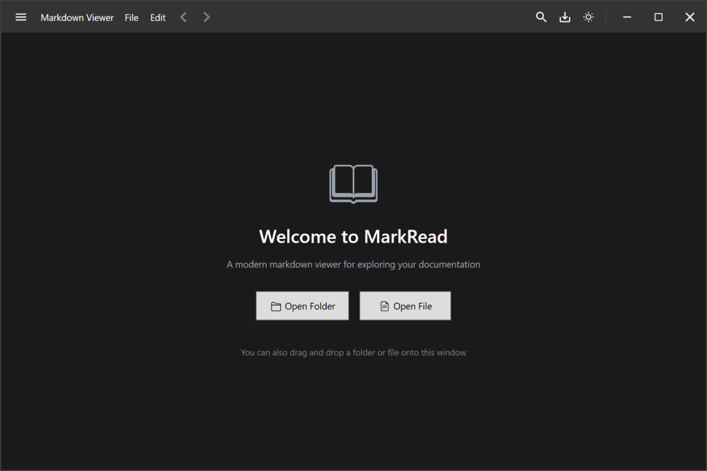
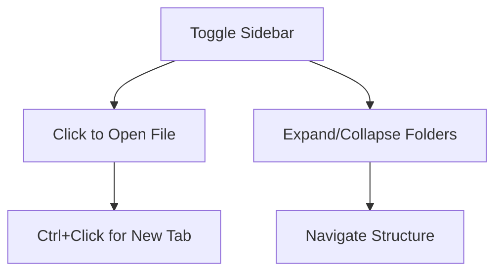
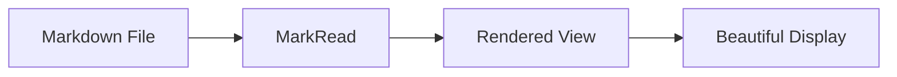

# Getting Started with MarkRead

> 📍 **Navigation**: [Home](../../README.md) → [Documentation](../README.md) → [User Guide](.) → Getting Started

Welcome to **MarkRead**! This guide will help you install and start using MarkRead in just a few minutes.

## What is MarkRead?

MarkRead is a fast, beautiful desktop application for viewing Markdown files on Windows. It's designed for developers, technical writers, and anyone who works with Markdown documentation in local folders or Git repositories.

### Why MarkRead?

- ✅ **Fast** - Instant startup and smooth navigation
- ✅ **Beautiful** - Modern UI with light and dark themes
- ✅ **Powerful** - Full Markdown rendering with diagrams and syntax highlighting
- ✅ **Offline** - Works completely offline once installed
- ✅ **Free** - Open source and free to use

## Quick Start

### 1. Installation

Download the latest installer from the [releases page](https://github.com/schalkje/markread/releases) and run it. The installer will:

- Install MarkRead to your system
- Add .NET 8 Runtime if needed
- Install WebView2 if not present
- Create desktop and start menu shortcuts

For detailed installation instructions, see the [Installation Guide](installation.md).

### 2. Launch MarkRead

You can launch MarkRead in several ways:

**From Desktop/Start Menu**
- Click the MarkRead icon

**From Command Line**
```powershell
# Open a folder
MarkRead.exe "C:\MyProject"

# Open a specific file
MarkRead.exe "C:\MyProject\docs\README.md"
```

**From Windows Explorer**
- Right-click a folder → "Open with MarkRead"
- Right-click a .md file → "Open with MarkRead"

### 3. Open Your First Document

When MarkRead starts:

1. **Press `Ctrl+O`** or click the folder icon
2. **Select a folder** containing Markdown files
3. MarkRead will open and display:
   - The README.md file (if present at the root)
   - OR a folder overview



### 4. Navigate Your Documentation

Now you can:

- **Click links** in the document to navigate
- **Use the sidebar** to browse files (toggle with menu button)
- **Open new tabs** with `Ctrl+T` or `Ctrl+Click` on links
- **Search** within documents with `Ctrl+F`
- **Go back/forward** with `Alt+Left` and `Alt+Right`


## Essential Features

### File Tree Sidebar

The sidebar shows all files in the opened folder:



**Tips:**
- Toggle visibility with the menu button
- Click a file to open in current tab
- `Ctrl+Click` to open in new tab
- Expand/collapse folders to navigate

### Tabbed Interface

Work with multiple documents simultaneously:

- **New Tab**: `Ctrl+T`
- **Close Tab**: `Ctrl+W`
- **Switch Tabs**: Click tab headers or `Ctrl+Tab`
- **Scroll Tabs**: Use arrow buttons when many tabs are open

### Themes

Switch between light and dark modes:

- Click the theme toggle button in the header
- Or go to Settings and choose:
  - **System** - Follows Windows theme
  - **Light** - Always light mode
  - **Dark** - Always dark mode

Your preference is saved automatically.

## Common Tasks

### Opening a Different Folder

1. Press `Ctrl+O`
2. Select a new folder
3. MarkRead switches to the new folder root

### Finding Text

1. Press `Ctrl+F` to open search
2. Type your search term
3. Use arrows to navigate matches
4. Press `Escape` to close search

### Viewing Diagrams

Mermaid diagrams are rendered automatically:



### Working with Code

Code blocks are syntax-highlighted automatically:

```python
def hello_world():
    print("Hello from MarkRead!")
    return True
```

See [Search Features](search-features.md) for more search options.

## Next Steps

Now that you're up and running, explore these topics:

- **[Basic Usage](basic-usage.md)** - Learn everyday operations
- **[Working with Tabs](working-with-tabs.md)** - Master multi-document workflows
- **[Search Features](search-features.md)** - Find what you need quickly
- **[Keyboard Shortcuts](keyboard-shortcuts.md)** - Work more efficiently
- **[Themes and Customization](themes.md)** - Make MarkRead your own

## Getting Help

- **[FAQ](faq.md)** - Answers to common questions
- **[Troubleshooting](troubleshooting.md)** - Solve common issues
- **[GitHub Issues](https://github.com/schalkje/markread/issues)** - Report bugs or request features

## Tips for Success

💡 **Use MarkRead for viewing your own documentation** - Point it at your project's `docs/` folder

💡 **Try the keyboard shortcuts** - They make navigation much faster

💡 **Enable auto-reload** - See changes as you edit files in your editor

💡 **Experiment with themes** - Find the mode that's comfortable for you

---

**Ready to dive deeper?** Continue to [Basic Usage](basic-usage.md) →
