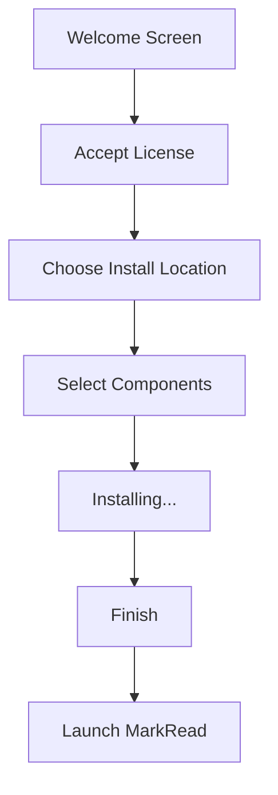

# Installation Guide

> 📍 **Navigation**: [Home](../../README.md) → [Documentation](../README.md) → [User Guide](.) → Installation

This guide provides detailed instructions for installing MarkRead on Windows 10 and Windows 11.

## System Requirements

### Minimum Requirements

- **Operating System**: Windows 10 version 1809 or later, or Windows 11
- **Processor**: 1 GHz or faster
- **RAM**: 512 MB (1 GB recommended)
- **Disk Space**: 200 MB for installation
- **Display**: 1024x768 resolution or higher

### Software Dependencies

MarkRead requires the following components, which are automatically installed if not present:

- **.NET 8 Desktop Runtime** - Included in installer
- **Microsoft Edge WebView2** - Automatically installed
- **Visual C++ Redistributable** - Typically already present

## Installation Methods

### Method 1: Installer (Recommended)

This is the easiest method for most users.

#### Step 1: Download

1. Visit the [MarkRead releases page](https://github.com/schalkje/markread/releases)
2. Download the latest `MarkRead-Setup-x.x.x.exe`
3. Save the file to your Downloads folder

#### Step 2: Run Installer

1. Double-click `MarkRead-Setup-x.x.x.exe`
2. **Windows SmartScreen / Security Warning**:
   
   The installer is digitally signed, but you may see warnings depending on your Windows configuration:
   
   **If you see "Unknown publisher" warning:**
   - This appears if the code signing certificate is not yet trusted
   - Click **"More info"**
   - Click **"Run anyway"**
   - **First-time setup**: You may need to install the certificate (see below)
   
   **If no warnings appear:**
   - The certificate is already trusted
   - Proceed directly to installation

3. **Installing the Certificate (First Time Only)**:
   
   If you frequently see "Unknown publisher" warnings:
   
   **Option A: Automatic (Recommended)**
   ```powershell
   # Download and run the certificate import script
   # (Requires PowerShell, downloads from latest release)
   irm https://raw.githubusercontent.com/schalkje/markread/main/scripts/import-certificate.ps1 | iex
   ```
   
   **Option B: Manual**
   1. Download `markread-cert.cer` from [releases page](https://github.com/schalkje/markread/releases/latest)
   2. Right-click the certificate file → **Install Certificate**
   3. Choose **Local Machine** (requires admin) or **Current User**
   4. Select **"Place all certificates in the following store"**
   5. Click **Browse** → Select **"Trusted Root Certification Authorities"**
   6. Click **Next** → **Finish**
   7. Repeat for **"Trusted Publishers"** store
   
   **Option C: Using Script**
   ```powershell
   # If you already have the certificate file
   .\import-certificate.ps1 -CertificatePath "markread-cert.cer"
   
   # Or download from latest release automatically
   .\import-certificate.ps1
   ```
   
   After installing the certificate, future installations will not show warnings.

4. Proceed to installation wizard

#### Step 3: Follow Installation Wizard



1. **Welcome Screen** - Click "Next"
2. **License Agreement** - Read and accept
3. **Installation Location** - Default: `C:\Program Files\MarkRead`
4. **Select Components**:
   - ✅ MarkRead Application (required)
   - ✅ Desktop Shortcut (recommended)
   - ✅ Start Menu Shortcut (recommended)
   - ⬜ Add to PATH (optional - enables `markread` command)
5. Click **"Install"**
6. Wait for installation to complete
7. Click **"Finish"** and optionally launch MarkRead

### Method 2: Portable Version

For users who prefer not to install software or need to run from USB.

#### Download and Extract

1. Download `MarkRead-Portable-x.x.x.zip`
2. Extract to your desired location (e.g., `C:\Tools\MarkRead`)
3. Run `MarkRead.exe` from the extracted folder

**Portable Version Notes:**
- ❌ No automatic updates
- ❌ No file associations
- ❌ Requires manual .NET 8 Runtime installation
- ✅ No admin rights needed
- ✅ Can run from USB drive
- ✅ Settings stored in application folder

### Method 3: Build from Source

For developers who want to build MarkRead themselves.

```powershell
# Clone repository
git clone https://github.com/schalkje/markread.git
cd markread

# Build
dotnet build src/App/MarkRead.App.csproj --configuration Release

# Run
dotnet run --project src/App/MarkRead.App.csproj
```

See the [Build Process](../developer/build-process.md) documentation for detailed build instructions.

## Post-Installation Setup

### Verify Installation

1. Launch MarkRead from Start Menu or Desktop
2. You should see the welcome screen
3. Press `Ctrl+O` to open a folder
4. Navigate to any folder with Markdown files
5. Verify the content renders correctly

### Configure File Associations (Optional)

To open `.md` files with MarkRead by default:

1. Right-click any `.md` file
2. Select **"Open with"** → **"Choose another app"**
3. Select **"MarkRead"**
4. ✅ Check **"Always use this app to open .md files"**
5. Click **"OK"**

### Set Up Command Line Access (Optional)

If you installed with "Add to PATH":

```powershell
# Test command line access
markread --version

# Open folder
markread C:\MyProject

# Open specific file
markread C:\MyProject\README.md
```

If not added to PATH during install, you can add manually:

1. Press `Win+X` → **System**
2. Click **"Advanced system settings"**
3. Click **"Environment Variables"**
4. Under "User variables", select **Path** → **Edit**
5. Click **New** and add: `C:\Program Files\MarkRead`
6. Click **OK** on all dialogs
7. Restart your terminal

## Troubleshooting Installation

### Issue: "Unknown publisher" or "Do you want to allow this app to make changes?"

**Cause**: Code signing certificate not trusted on your system

**Solution**:
Install the MarkRead certificate to trust the publisher:

**Quick Fix:**
```powershell
# Run as Administrator for system-wide trust
.\scripts\import-certificate.ps1
```

**Manual Steps:**
1. Download `markread-cert.cer` from [releases](https://github.com/schalkje/markread/releases/latest)
2. Right-click → **Install Certificate**
3. Choose **Local Machine** (admin) or **Current User**
4. Install to **Trusted Root Certification Authorities**
5. Also install to **Trusted Publishers**
6. Run installer again (no warnings)

**Check Certificate Status:**
```powershell
.\scripts\import-certificate.ps1 -CheckOnly
```

See [Certificate Installation](#installing-the-certificate-first-time-only) for details.

### Issue: "This app can't run on your PC"

**Cause**: Incompatible Windows version

**Solution**: 
- Ensure Windows 10 version 1809+ or Windows 11
- Check version: Press `Win+R`, type `winver`, press Enter
- Update Windows if necessary

### Issue: ".NET Runtime not found"

**Cause**: .NET 8 Desktop Runtime missing

**Solution**:
1. Download from [dotnet.microsoft.com](https://dotnet.microsoft.com/download/dotnet/8.0)
2. Install "Desktop Runtime x64"
3. Restart MarkRead

### Issue: "WebView2 initialization failed"

**Cause**: WebView2 runtime missing or corrupted

**Solution**:
1. Download WebView2 Runtime from [Microsoft](https://developer.microsoft.com/microsoft-edge/webview2/)
2. Install the "Evergreen Standalone Installer"
3. Restart your computer
4. Launch MarkRead again

### Issue: Installation hangs or fails

**Solutions**:
- Run installer as Administrator (right-click → "Run as administrator")
- Disable antivirus temporarily
- Check disk space (need 200MB free)
- Try portable version instead

## Updating MarkRead

### Automatic Updates (Installed Version)

MarkRead checks for updates on startup:

1. When update is available, notification appears
2. Click **"Download and Install"**
3. Installer downloads in background
4. Click **"Install Now"** when ready
5. MarkRead restarts with new version

### Manual Updates

1. Download latest installer
2. Run installer (existing version will be upgraded)
3. Your settings and preferences are preserved

### Portable Version Updates

1. Download new portable version
2. Extract to a new folder
3. Copy `settings.json` from old folder to new folder
4. Delete old folder

## Uninstalling MarkRead

### Using Windows Settings

1. Press `Win+I` to open Settings
2. Go to **Apps** → **Installed apps**
3. Search for **"MarkRead"**
4. Click **⋮** (three dots) → **Uninstall**
5. Confirm uninstallation

### Using Control Panel

1. Press `Win+R`, type `appwiz.cpl`, press Enter
2. Find **"MarkRead"** in the list
3. Click **"Uninstall"**
4. Follow prompts

### Clean Uninstall

To remove all traces including settings:

1. Uninstall MarkRead (method above)
2. Delete settings folder:
   ```powershell
   Remove-Item "$env:APPDATA\MarkRead" -Recurse
   ```
3. Delete desktop/start menu shortcuts if remaining

## Multiple Installations

You can have multiple versions installed:

**Option 1: Use Portable Versions**
- Extract different versions to different folders
- Each has independent settings

**Option 2: Custom Install Paths**
- Install with custom paths (e.g., `C:\MarkRead-v1`, `C:\MarkRead-v2`)
- Manually manage shortcuts to avoid conflicts

## Silent Installation

For IT administrators deploying to multiple machines:

```powershell
# Silent install with default options
MarkRead-Setup-1.0.0.exe /S

# Silent install with custom path
MarkRead-Setup-1.0.0.exe /S /D=C:\CustomPath\MarkRead

# Silent uninstall
"C:\Program Files\MarkRead\uninstall.exe" /S
```

## Network Installation

For organizations with network drives:

1. Extract portable version to network share
2. Create shortcuts on user desktops pointing to network path
3. Note: First launch may be slower over network
4. Consider caching on local machines for performance

## Next Steps

- **[Getting Started](getting-started.md)** - Launch and use MarkRead for the first time
- **[Basic Usage](basic-usage.md)** - Learn essential operations
- **[Settings](settings.md)** - Configure MarkRead to your preferences
- **[Troubleshooting](troubleshooting.md)** - Solve common issues

---

**Installation complete?** Head to [Getting Started](getting-started.md) →
