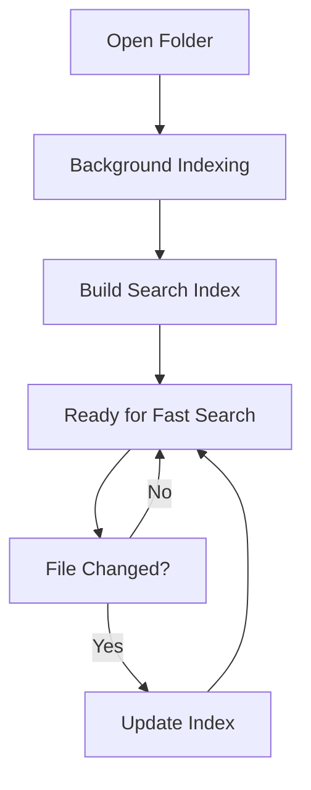

# Search Features

> 📍 **Navigation**: [Home](../../README.md) → [Documentation](../README.md) → [User Guide](.) → Search Features

MarkRead provides powerful search capabilities to help you find content quickly, both within a single document and across your entire documentation.

## In-Page Search

### Opening Search

**Keyboard Shortcut**
```
Ctrl+F - Open find in current document
```

**Menu**
- Menu (☰) → Find in Page

### Using In-Page Search

```
┌──────────────────────────────────────┐
│  Find: [installation___] ⬆ ⬇ × 2/5  │
└──────────────────────────────────────┘
```

**Search Interface**:
- **Input box** - Type your search term
- **⬆⬇ arrows** - Navigate between matches
- **Counter** - Shows current/total matches (e.g., "2/5")
- **× button** - Close search

**Features**:
- Real-time highlighting of all matches
- Case-insensitive by default
- Jumps to first match automatically
- Maintains scroll position when closed

### Search Options

**Case-Sensitive Search**
```
Ctrl+Shift+F - Case-sensitive toggle
```

**Whole Word Match**
- Click options (⚙) → "Match whole words"

**Regular Expression**
- Click options (⚙) → "Use regex"

**Examples**:
```regex
install.*guide     # Matches "installation guide", "install user guide"
\bAPI\b           # Matches "API" but not "CAPITAL"
(setup|config)     # Matches either "setup" or "config"
```

### Search Navigation

| Action | Shortcut |
|--------|----------|
| Next match | `Enter` or `F3` or ⬇ |
| Previous match | `Shift+Enter` or `Shift+F3` or ⬆ |
| Close search | `Escape` |

### Search Highlighting

```markdown
This is an **installation** guide for MarkRead.
           ^^^^^^^^^^^^^^
The installation process is simple...
    ^^^^^^^^^^^^

See the Installation section below.
        ^^^^^^^^^^^^
```

All matches are highlighted in the document:
- Current match: Bright highlight (yellow/orange)
- Other matches: Subtle highlight (light yellow)
- Scroll indicators: Marks in scrollbar show match positions

## Global Search

### Opening Global Search

**Keyboard Shortcut**
```
Ctrl+Shift+F - Open cross-file search
```

**Search Panel**:
- Opens in sidebar or new panel
- Shows search across all files in folder
- Results grouped by file

### Search Interface

```
┌─────────────────────────────────────────────┐
│  Search in files                             │
│  [search term____________] [🔍]              │
│                                               │
│  📄 README.md (3 matches)                    │
│    Line 5: ...install MarkRead on Windows... │
│    Line 12: ...installation process...       │
│    Line 45: ...see Installation Guide...     │
│                                               │
│  📄 docs/guide.md (1 match)                  │
│    Line 89: ...complete installation...      │
│                                               │
│  📄 docs/troubleshooting.md (2 matches)      │
│    Line 12: ...if installation fails...      │
│    Line 34: ...reinstall using...            │
└─────────────────────────────────────────────┘
```

### Using Global Search Results

**Click a Result**:
- Opens file at matching line
- Highlights search term in document
- Adds to navigation history

**Context Preview**:
- Shows surrounding text
- Search term highlighted in preview
- Line numbers displayed

### Global Search Options

**File Filters**
```
Include: *.md
Exclude: node_modules/*, **/draft/*
```

**Search Scope**
- Current folder and subfolders (default)
- Current folder only
- Selected folder in sidebar

**Advanced Options**:
- ☐ Case sensitive
- ☐ Whole word
- ☐ Regular expression
- ☐ Include hidden files

## Search Patterns

### Simple Text Search

```
Search: "configuration"
Finds: configuration, Configuration, CONFIGURATION
```

### Whole Word Search

```
Search: "read" (whole word enabled)
Finds: "read", "Read"
Ignores: "already", "MarkRead", "reading"
```

### Case-Sensitive Search

```
Search: "API" (case sensitive)
Finds: "API"
Ignores: "api", "Api"
```

### Regular Expression Search

**Pattern Examples**:

```regex
# Find all email addresses
[a-zA-Z0-9._%+-]+@[a-zA-Z0-9.-]+\.[a-zA-Z]{2,}

# Find TODO comments
TODO:.*$

# Find markdown links
\[.*?\]\(.*?\)

# Find code blocks
```.*?```

# Find headings level 1-3
^#{1,3}\s+.*$
```

## Search Performance

### Indexing



**How It Works**:
- Index built in background on folder open
- Incremental updates on file changes
- Cached for instant searches
- Optimized for large folders (1000+ files)

**Performance Stats**:
- Small projects (< 100 files): Instant results
- Medium projects (100-500 files): < 1 second
- Large projects (500-2000 files): 1-3 seconds
- Very large projects (> 2000 files): 3-10 seconds

### Search Tips for Performance

💡 **Be Specific** - More specific terms = faster results

💡 **Use File Filters** - Exclude large directories

💡 **Limit Scope** - Search specific folders when possible

💡 **Avoid Complex Regex** - Simple patterns search faster

## Advanced Search Techniques

### Search and Replace (View Only)

MarkRead is view-only, but you can:

1. Find text with `Ctrl+F`
2. Copy file path from header
3. Open in your editor
4. Make replacements there
5. MarkRead auto-refreshes to show changes

### Cross-Reference Finding

Find all references to a topic:

```
Global Search: "authentication"

Results show:
- API documentation
- Setup guides
- Troubleshooting
- Examples
```

Click through to see all mentions.

### Multi-Term Search

**Option 1: Search Multiple Times**
1. Search for "term1"
2. Note results
3. Search for "term2"
4. Compare

**Option 2: Regex OR Pattern**
```regex
(term1|term2|term3)
```

**Option 3: Open Multiple Tabs**
1. Search "term1"
2. Open result in new tab
3. Search "term2" in original tab
4. Compare side-by-side

## Search Keyboard Shortcuts

| Action | Shortcut |
|--------|----------|
| Find in page | `Ctrl+F` |
| Find next | `F3` or `Enter` |
| Find previous | `Shift+F3` |
| Global search | `Ctrl+Shift+F` |
| Close search | `Escape` |
| Toggle case sensitive | `Alt+C` |
| Toggle regex | `Alt+R` |
| Toggle whole word | `Alt+W` |

## Search Best Practices

### Writing Searchable Documentation

Make your docs easy to search:

```markdown
# Good: Clear terminology
## Installation Guide

# Less good: Vague headings  
## Getting It Working
```

**Use Consistent Terms**:
- Pick one: "setup" OR "configuration" (not both randomly)
- Use standard acronyms: "API" not "A.P.I."
- Include synonyms in text: "Install (setup) the application"

**Add Search Keywords**:
```markdown
<!-- keywords: troubleshooting, debugging, errors, problems -->
# Solving Issues
```

### Search Strategies

**Strategy 1: Narrow Down**
```
1. Search broad term: "configuration"
2. Too many results?
3. Refine: "database configuration"
4. Still too many?
5. Add context: "database configuration production"
```

**Strategy 2: Find by Example**
```
Search for code pattern:
```python
```

Finds all Python code blocks.

**Strategy 3: Anchor-Based**
```
Search: "#installation"
Finds all headings with "installation"
```

## Troubleshooting Search

### Issue: No Results Found

**Checks**:
- Is case-sensitive mode enabled accidentally?
- Are you in the right folder?
- Is the file type excluded?

**Solutions**:
- Try case-insensitive
- Check global search instead of in-page
- Verify file exists in sidebar

### Issue: Too Many Results

**Solutions**:
- Enable "Whole word" matching
- Add more specific terms
- Use file filters
- Search in specific subfolder

### Issue: Search Slow

**Solutions**:
- Let initial indexing complete
- Exclude large binary files in settings
- Limit search scope to specific folders
- Use more specific search terms

### Issue: Search Not Finding Updated Content

**Solution**:
- Press `F5` to refresh current document
- Check if auto-reload is enabled
- File might not be saved in editor

## Next Steps

- **[Keyboard Shortcuts](keyboard-shortcuts.md)** - All shortcuts reference
- **[Advanced Features](advanced-features.md)** - More power user features
- **[Settings](settings.md)** - Configure search behavior
- **[Basic Usage](basic-usage.md)** - Review core features

---

**Customize your experience** → [Themes and Customization](themes.md)
