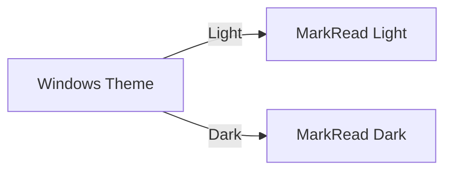
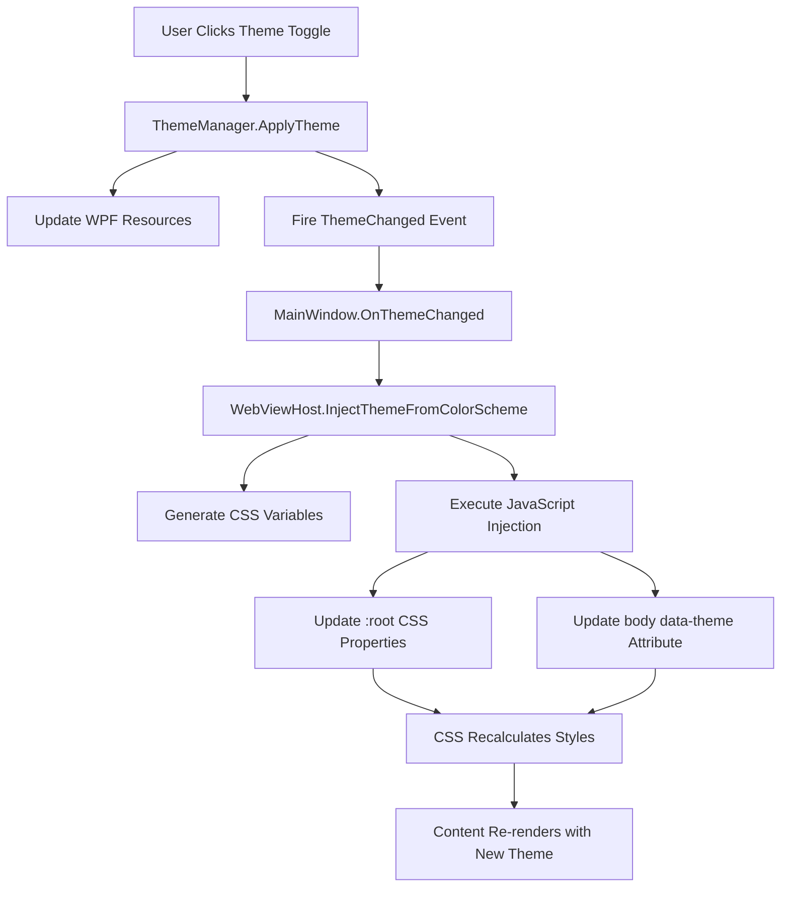

# Themes and Customization

> 📍 **Navigation**: [Home](../../README.md) → [Documentation](../README.md) → [User Guide](.) → Themes and Customization

Make MarkRead your own with themes, fonts, and visual customization options.

## Themes

### Available Themes

MarkRead includes three theme options:

**System (Default)**

- Automatically matches your Windows theme
- Changes when Windows theme changes
- Best for users who switch between modes

**Light Mode**
- Bright, clean interface
- High contrast text on white
- Best for daytime use or bright environments

**Dark Mode**
- Dark gray/black interface
- Reduced eye strain in low light
- Best for nighttime use or dark rooms

### Switching Themes

**Quick Toggle**
- Click the theme button (🌓) in header
- Cycles through: System → Light → Dark → System

**From Settings**
1. Click settings (⚙️) or press `Ctrl+,`
2. Appearance → Theme
3. Select: System / Light / Dark
4. Change applies immediately

**Keyboard Shortcut** (Future Feature)
```
Ctrl+Shift+T - Toggle theme
```

### Theme Preview

**Light Theme**
```
┌─────────────────────────────────────┐ ← White header
│  ☰  MarkRead    ← →    🔍  ⚙️  🌙  │
├─────────────────────────────────────┤
│ Tab 1 │ Tab 2 │ Tab 3            × │ ← Light gray tabs
├─────────────────────────────────────┤
│ #FFFFFF Background                  │ ← White content
│ #000000 Text                        │ ← Black text
│                                     │
│ Code blocks: #F6F8FA background     │
│ Links: #0969DA blue                 │
└─────────────────────────────────────┘
```

**Dark Theme**
```
┌─────────────────────────────────────┐ ← Dark gray header
│  ☰  MarkRead    ← →    🔍  ⚙️  ☀️  │
├─────────────────────────────────────┤
│ Tab 1 │ Tab 2 │ Tab 3            × │ ← Darker gray tabs
├─────────────────────────────────────┤
│ #0D1117 Background                  │ ← Very dark content
│ #C9D1D9 Text                        │ ← Light gray text
│                                     │
│ Code blocks: #161B22 background     │
│ Links: #58A6FF blue                 │
└─────────────────────────────────────┘
```

### Theme Components

Each theme includes:

**UI Colors**
- Header background and text
- Sidebar background and text
- Tab active/inactive states
- Button hover states
- Border and separator colors

**Content Colors**
- Document background
- Body text color
- Heading colors (h1-h6)
- Link colors (normal, visited, hover)
- Code block backgrounds
- Syntax highlighting colors

**Accent Colors**
- Primary accent (blue)
- Success (green)
- Warning (yellow)
- Error (red)
- Info (cyan)

## Font Customization

### Content Fonts

**Font Family**

Settings → Appearance → Content Font

Options:
- **System Default** - Uses your Windows font settings
- **Segoe UI** - Modern Windows font
- **Calibri** - Microsoft's readable font
- **Georgia** - Serif font for long reading
- **Custom** - Enter any installed font name

**Font Size**

```
Ctrl++  - Increase font size
Ctrl+-  - Decrease font size  
Ctrl+0  - Reset to default
```

Or Settings → Appearance → Font Size (8-24 pt)

**Line Height**

Settings → Appearance → Line Height
- Compact: 1.4
- Normal: 1.6 (default)
- Relaxed: 1.8
- Loose: 2.0

**Example**:
```markdown
Line height 1.4 (compact):
This is a paragraph with compact spacing.
Good for dense technical docs.

Line height 1.8 (relaxed):

This is a paragraph with relaxed spacing.

Better for long-form reading.
```

### Code Fonts

**Font Family**

Settings → Appearance → Code Font

Monospace options:
- **Consolas** - Default, excellent readability
- **Cascadia Code** - Modern with ligatures
- **Fira Code** - Programming ligatures
- **JetBrains Mono** - Designed for developers
- **Custom** - Any monospace font

**Font Size**

Settings → Appearance → Code Font Size (8-20 pt)
- Usually 1-2pt smaller than body text
- Default: 90% of body font size

**Example**:
```python
# Cascadia Code with ligatures
def hello() -> str:
    return "Hello" != "World"  # != becomes ≠

# Consolas (no ligatures)
def hello() -> str:
    return "Hello" != "World"  # != stays as !=
```

### UI Fonts

**Interface Font**

Settings → Appearance → UI Font
- Controls sidebar, tabs, buttons
- Usually same as content or slightly smaller
- Default: Segoe UI (Windows standard)

## Layout Customization

### Sidebar Width

**Resize Manually**
- Hover over sidebar edge → cursor changes
- Click and drag to resize
- Width saved per session

**Fixed Widths**

Settings → Appearance → Sidebar Width
- Narrow: 200px
- Normal: 250px (default)
- Wide: 300px
- Extra Wide: 400px

### Content Width

**Maximum Width**

Settings → Appearance → Max Content Width

Options:
- **Full Width** - Uses all available space
- **Comfortable** - 800px max (default)
- **Narrow** - 600px max (for reading)
- **Custom** - Specify in pixels

**Why Limit Width?**
- Improves readability
- Optimal line length: 50-75 characters
- Reduces eye movement

### Content Margins

Settings → Appearance → Content Padding
- None: 0px (edge-to-edge)
- Small: 20px
- Normal: 40px (default)
- Large: 60px

## Syntax Highlighting Themes

### Code Block Themes

Settings → Appearance → Syntax Theme

**Light Mode Themes**:
- GitHub Light (default)
- VS Code Light
- Solarized Light
- Atom One Light

**Dark Mode Themes**:
- GitHub Dark (default)
- VS Code Dark
- Dracula
- Monokai
- Nord
- One Dark

**Preview**:

GitHub Light:
```python
def calculate(x: int, y: int) -> int:
    # This is a comment
    result = x + y
    return result * 2
```

Dracula:
```python
def calculate(x: int, y: int) -> int:
    # This is a comment
    result = x + y
    return result * 2
```

### Language-Specific Colors

Most themes provide specific colors for:
- Keywords (`def`, `class`, `if`)
- Strings (`"hello"`)
- Numbers (`42`, `3.14`)
- Comments (`# comment`)
- Functions (`calculate()`)
- Types (`int`, `str`)

## Advanced Customization

### Custom CSS (Power Users)

Settings → Advanced → Enable Custom CSS

Create `custom.css` in settings folder:

```css
/* Custom content styles */
.markdown-body {
    font-family: 'Georgia', serif;
    line-height: 1.8;
}

/* Custom heading colors */
h1 { color: #2563eb; }
h2 { color: #7c3aed; }

/* Custom link style */
a {
    color: #0891b2;
    text-decoration: underline;
}

/* Code block styling */
pre {
    border-left: 3px solid #3b82f6;
    padding-left: 1em;
}
```

**Note**: Requires restart to apply changes.

### Custom Theme Creation

Create `themes/my-theme.json`:

```json
{
  "name": "My Custom Theme",
  "type": "dark",
  "colors": {
    "background": "#1a1a2e",
    "foreground": "#eee",
    "primary": "#0f3460",
    "accent": "#16213e",
    "link": "#e94560"
  },
  "syntax": {
    "keyword": "#c678dd",
    "string": "#98c379",
    "comment": "#5c6370",
    "function": "#61afef"
  }
}
```

See [Theme Schema Reference](../reference/theme-schema.md) for details.

## Accessibility

### High Contrast Mode

Settings → Accessibility → High Contrast

- Increases color contrast ratios
- Meets WCAG AAA standards
- Thicker borders and outlines
- Enhanced focus indicators

### Font Scaling

Settings → Accessibility → System Font Scaling

- Respects Windows text size settings
- Scales UI and content together
- Maintains proportions

### Reduced Motion

Settings → Accessibility → Reduce Motion

- Disables animations
- Instant transitions
- Better for motion sensitivity
- Improves performance

## Presets

### Reading Mode

Optimized for long-form reading:
- Serif font (Georgia)
- Larger text (16pt)
- Narrow content width (600px)
- Increased line height (1.8)
- Generous margins

### Code Review Mode

Optimized for code-heavy docs:
- Monospace UI font
- Larger code font (14pt)
- Full-width content
- Compact line height (1.4)
- Side-by-side layout

### Presentation Mode

For showing docs to others:
- Extra large fonts (20pt)
- High contrast
- Full-width content
- Minimal UI chrome

**Apply Preset**:
Settings → Presets → Select preset → Apply

## Export Visual Settings

Share your theme settings with team:

```powershell
# Export settings
Settings → Advanced → Export Settings → my-settings.json

# Import on another machine
Settings → Advanced → Import Settings → Select file
```

## Quick Customization Shortcuts

| Action | Shortcut |
|--------|----------|
| Zoom in | `Ctrl++` |
| Zoom out | `Ctrl+-` |
| Reset zoom | `Ctrl+0` |
| Toggle theme | Click 🌓 button |
| Settings | `Ctrl+,` |
| Toggle sidebar | `Ctrl+B` |

## Tips for Customization

💡 **Match Your Editor** - Use same fonts as your code editor for consistency

💡 **Test Both Themes** - Configure light and dark independently for best results

💡 **Readability First** - Don't sacrifice readability for aesthetics

💡 **Save Presets** - Export settings when you find a combination you love

💡 **Accessibility Matters** - Consider contrast and font size for all users

## How Theming Works (Technical Overview)

MarkRead uses a dual-layer theming system that coordinates between the WPF application shell and the WebView2 content renderer to provide a seamless, unified appearance.

### Architecture Overview



### Layer 1: WPF Application Shell

**Theme Manager** (`ThemeManager.cs`)

The theme manager is responsible for the WPF portion of the application (window chrome, sidebar, tabs, buttons):

```csharp
public async Task<bool> ApplyTheme(ThemeType theme)
{
    // 1. Resolve effective theme (System → Light/Dark)
    var effectiveTheme = ResolveEffectiveTheme(theme);
    
    // 2. Switch WPF resource dictionaries
    SwitchResourceDictionary(effectiveTheme);
    
    // 3. Update dynamic color resources
    UpdateDynamicColorResources(colorScheme);
    
    // 4. Fire ThemeChanged event
    OnThemeChanged(oldTheme, effectiveTheme);
    
    // 5. Persist theme preference
    await _settingsService.SaveThemeConfigurationAsync();
}
```

**Resource Dictionaries** (`Themes/LightTheme.xaml`, `Themes/DarkTheme.xaml`)

Each theme has a XAML resource dictionary defining:
- Brush resources (backgrounds, foregrounds, borders)
- Style templates for controls (buttons, tabs, text boxes)
- Animation and transition definitions

```xaml
<!-- Example from LightTheme.xaml -->
<ResourceDictionary>
    <SolidColorBrush x:Key="BackgroundBrush" Color="#FFFFFF"/>
    <SolidColorBrush x:Key="ForegroundBrush" Color="#171717"/>
    <SolidColorBrush x:Key="AccentBrush" Color="#0066CC"/>
    
    <Style x:Key="LightThemeButton" TargetType="Button">
        <Setter Property="Background" Value="{DynamicResource BackgroundBrush}"/>
        <Setter Property="Foreground" Value="{DynamicResource ForegroundBrush}"/>
        <!-- ... hover states, transitions, etc. -->
    </Style>
</ResourceDictionary>
```

**Color Scheme Classes** (`Services/ThemeConfiguration.cs`)

Theme colors are defined in C# classes:

```csharp
public class ColorScheme
{
    public Color Background { get; set; }          // Main background
    public Color Foreground { get; set; }          // Main text
    public Color Accent { get; set; }              // Links, highlights
    public Color Border { get; set; }              // Separators
    public Color SidebarBackground { get; set; }   // Sidebar bg
    public Color TabActiveBackground { get; set; } // Active tab
    // ... more colors
}
```

These colors are shared between WPF and WebView2 to ensure consistency.

### Layer 2: WebView2 Content Rendering

**WebViewHost Bridge** (`Rendering/WebViewHost.cs`)

When a theme changes, the `WebViewHost` translates the WPF `ColorScheme` into CSS custom properties:

```csharp
public async Task InjectThemeFromColorSchemeAsync(
    string themeName, 
    ColorScheme colorScheme)
{
    // Clear cache to force re-injection
    _lastInjectedTheme = null;
    
    // Convert System.Drawing.Color to CSS hex
    var themeProperties = new Dictionary<string, string>
    {
        ["theme-background"] = ColorToCssHex(colorScheme.Background),
        ["theme-text-primary"] = ColorToCssHex(colorScheme.Foreground),
        ["theme-accent"] = ColorToCssHex(colorScheme.Accent),
        // ... 20+ more properties
    };
    
    // Inject via JavaScript
    await InjectThemeAsync(themeName, themeProperties);
}
```

**JavaScript Injection** (Dynamic Style Element)

The WebViewHost creates a `<style>` element in the document `<head>`:

```javascript
// Executed in the WebView2 JavaScript context
(function() {
    // Remove any existing theme styles
    document.querySelectorAll('style[data-theme-injected]')
        .forEach(style => style.remove());
    
    // Create new theme stylesheet
    const style = document.createElement('style');
    style.setAttribute('data-theme-injected', 'true');
    style.textContent = `
        :root {
            --theme-background: #FFFFFF !important;
            --theme-text-primary: #171717 !important;
            --theme-accent: #0066CC !important;
            /* ... all theme variables */
        }
    `;
    
    // Add to document
    document.head.appendChild(style);
    
    // Update body attribute for CSS selectors
    document.body.setAttribute('data-theme', 'light');
    
    // Dispatch custom event for components
    document.dispatchEvent(new CustomEvent('themeChanged', {
        detail: { theme: 'light', properties: {...} }
    }));
})();
```

**CSS Variable System** (`assets/styles/theme-variables.css`)

The CSS defines default values and structure:

```css
:root {
    /* Default light theme values */
    --theme-background: #ffffff;
    --theme-text-primary: #171717;
    --theme-accent: #0066cc;
    /* ... more variables */
}

/* Variables are overridden by injected styles with !important */
```

**Content Styling** (`assets/styles/base.css`)

All content styles reference the CSS variables:

```css
body {
    background: var(--theme-background);
    color: var(--theme-text-primary);
    transition: background-color 0.2s ease, color 0.2s ease;
}

h1, h2, h3, h4, h5, h6 {
    color: var(--theme-text-primary);
}

a {
    color: var(--theme-text-link);
}

code {
    background: var(--theme-secondary-background);
    border: 1px solid var(--theme-border);
}
```

When the injected `:root` variables change, CSS recalculates all dependent styles automatically.

### Theme Change Flow

**1. User Interaction**
```
User clicks theme toggle button → ThemeToggle_Click event handler
```

**2. Theme Manager Update**
```csharp
await _themeManager.ApplyTheme(newTheme);
// Updates WPF UI instantly via resource dictionary switch
```

**3. Event Propagation**
```csharp
_themeManager.ThemeChanged += OnThemeChanged;
// MainWindow receives ThemeChangedEventArgs
```

**4. WebView Synchronization**
```csharp
await _webViewHost.InjectThemeFromColorSchemeAsync(themeName, colorScheme);
// Converts ColorScheme → CSS variables → JavaScript injection
```

**5. CSS Recalculation**
```
Browser engine detects :root variable changes
→ Recalculates all styles using var(--theme-*)
→ Repaints content with new colors
```

**6. Component Updates**
```javascript
document.addEventListener('themeChanged', (event) => {
    // Mermaid diagrams re-render with new theme
    reRenderMermaidGraphs();
});
```

### Why Two Layers?

**WPF Layer (Native)**
- Fast, hardware-accelerated rendering
- Native Windows controls (buttons, menus, tabs)
- Direct access to Windows theming APIs
- Handles window chrome, borders, title bar

**WebView2 Layer (Web)**
- Rich markdown rendering with Markdig
- Syntax highlighting with Highlight.js
- Diagram rendering with Mermaid
- Better HTML/CSS flexibility for content

**Synchronization Benefits**
- Seamless appearance: Shell and content match perfectly
- Single source of truth: `ColorScheme` class defines all colors
- Instant updates: Both layers update simultaneously
- Consistency: Same hex colors used in WPF and CSS

### Performance Optimizations

**Caching**
```csharp
// Avoid re-injecting same theme
private string? _lastInjectedTheme;
if (_lastInjectedTheme == themeKey) return;
```

**Navigation Persistence**
```csharp
// Store theme for re-injection after page navigation
private string? _pendingThemeName;
private Dictionary<string, string>? _pendingThemeProperties;

// Re-apply automatically when WebView navigates
private async void OnNavigationCompleted(...)
{
    if (_pendingThemeName != null)
        await InjectThemeAsync(_pendingThemeName, _pendingThemeProperties);
}
```

**CSS Transitions**
```css
body {
    /* Smooth transition when theme changes */
    transition: background-color 0.2s ease, color 0.2s ease;
}
```

**!important Override**
```csharp
// Injected variables use !important to override defaults
cssProperties.AppendLine($"  --{property.Key}: {property.Value} !important;");
```

### System Theme Detection

**Windows 10/11 Integration**

MarkRead can detect and follow Windows theme preference:

```csharp
private static ThemeType DetectWindowsSystemTheme()
{
    try
    {
        // Read Windows registry setting
        using var key = Registry.CurrentUser.OpenSubKey(
            @"Software\Microsoft\Windows\CurrentVersion\Themes\Personalize");
        
        if (key?.GetValue("AppsUseLightTheme") is int appsUseLightTheme)
        {
            return appsUseLightTheme == 0 ? ThemeType.Dark : ThemeType.Light;
        }
    }
    catch { /* fallback */ }
    
    return ThemeType.Light;
}
```

**Automatic Updates**

When theme is set to "System", MarkRead can respond to Windows theme changes (future feature):

```csharp
// Subscribe to Windows theme change notifications
SystemEvents.UserPreferenceChanged += (sender, e) =>
{
    if (e.Category == UserPreferenceCategory.General)
    {
        var newTheme = DetectWindowsSystemTheme();
        await ApplyTheme(newTheme);
    }
};
```

### Extending the Theme System

**Adding New Colors**

1. **Define in ColorScheme class**:
```csharp
public class ColorScheme
{
    // Add new color
    public Color CustomHighlight { get; set; }
}
```

2. **Add to WPF resource dictionaries**:
```xaml
<SolidColorBrush x:Key="CustomHighlightBrush" Color="#FF5733"/>
```

3. **Add to CSS variable injection**:
```csharp
["theme-custom-highlight"] = ColorToCssHex(colorScheme.CustomHighlight)
```

4. **Use in CSS**:
```css
.special-element {
    background: var(--theme-custom-highlight);
}
```

**Creating Component-Specific Themes**

For specialized components (diagrams, code blocks), listen to theme changes:

```javascript
document.addEventListener('themeChanged', (event) => {
    const isDark = event.detail.theme === 'dark';
    
    // Configure component
    if (window.mermaid) {
        mermaid.initialize({ theme: isDark ? 'dark' : 'default' });
        reRenderAllDiagrams();
    }
    
    if (window.hljs) {
        // Switch syntax highlighting theme
        updateHighlightTheme(isDark ? 'github-dark' : 'github-light');
    }
});
```

### Debugging Theme Issues

**Check WPF Theme Application**
```csharp
// Add to ThemeManager
System.Diagnostics.Debug.WriteLine($"Applying theme: {theme}");
System.Diagnostics.Debug.WriteLine($"Effective theme: {effectiveTheme}");
System.Diagnostics.Debug.WriteLine($"Background: {colorScheme.Background}");
```

**Check CSS Variable Injection**

Open browser DevTools (F12 in app) and inspect:
```javascript
// Check injected variables
const styles = getComputedStyle(document.documentElement);
console.log('Background:', styles.getPropertyValue('--theme-background'));
console.log('Text:', styles.getPropertyValue('--theme-text-primary'));

// Check injected style element
const themeStyle = document.querySelector('style[data-theme-injected]');
console.log('Theme style:', themeStyle?.textContent);
```

**Verify WebView Synchronization**
```csharp
// In MainWindow.OnThemeChanged
System.Diagnostics.Debug.WriteLine($"WebView initialized: {_webViewHost?.IsInitialized}");
System.Diagnostics.Debug.WriteLine($"Injecting theme: {themeName}");
```

### Best Practices

1. **Always use CSS variables** - Never hardcode colors in component CSS
2. **Test both themes** - Ensure readability in light and dark modes
3. **Maintain contrast ratios** - Follow WCAG guidelines (4.5:1 minimum)
4. **Use semantic names** - `--theme-text-primary` not `--dark-gray`
5. **Preserve user choice** - Save theme preference to settings
6. **Smooth transitions** - Add CSS transitions for color changes
7. **Handle edge cases** - Test with custom Windows scaling, high contrast mode

## Next Steps

- **[Settings](settings.md)** - All configuration options
- **[Advanced Features](advanced-features.md)** - Power user features
- **[Theme Schema](../reference/theme-schema.md)** - Create custom themes
- **[Keyboard Shortcuts](keyboard-shortcuts.md)** - Work more efficiently

---

**Configure everything** → [Settings and Preferences](settings.md)
