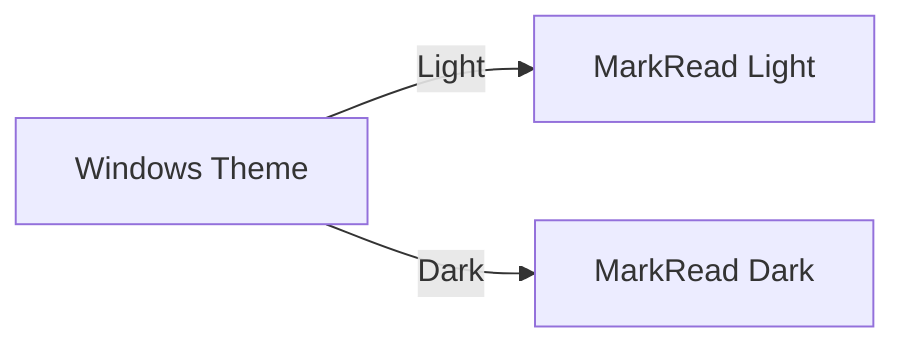

# Themes and Customization

> 📍 **Navigation**: [Home](../../README.md) → [Documentation](../README.md) → [User Guide](.) → Themes and Customization

Make MarkRead your own with themes, fonts, and visual customization options.

## Themes

### Available Themes

MarkRead includes three theme options:

**System (Default)**

- Automatically matches your Windows theme
- Changes when Windows theme changes
- Best for users who switch between modes

**Light Mode**
- Bright, clean interface
- High contrast text on white
- Best for daytime use or bright environments

**Dark Mode**
- Dark gray/black interface
- Reduced eye strain in low light
- Best for nighttime use or dark rooms

### Switching Themes

**Quick Toggle**
- Click the theme button (🌓) in header
- Cycles through: System → Light → Dark → System

**From Settings**
1. Click settings (⚙️) or press `Ctrl+,`
2. Appearance → Theme
3. Select: System / Light / Dark
4. Change applies immediately

**Keyboard Shortcut** (Future Feature)
```
Ctrl+Shift+T - Toggle theme
```

### Theme Preview

**Light Theme**
```
┌─────────────────────────────────────┐ ← White header
│  ☰  MarkRead    ← →    🔍  ⚙️  🌙  │
├─────────────────────────────────────┤
│ Tab 1 │ Tab 2 │ Tab 3            × │ ← Light gray tabs
├─────────────────────────────────────┤
│ #FFFFFF Background                  │ ← White content
│ #000000 Text                        │ ← Black text
│                                     │
│ Code blocks: #F6F8FA background     │
│ Links: #0969DA blue                 │
└─────────────────────────────────────┘
```

**Dark Theme**
```
┌─────────────────────────────────────┐ ← Dark gray header
│  ☰  MarkRead    ← →    🔍  ⚙️  ☀️  │
├─────────────────────────────────────┤
│ Tab 1 │ Tab 2 │ Tab 3            × │ ← Darker gray tabs
├─────────────────────────────────────┤
│ #0D1117 Background                  │ ← Very dark content
│ #C9D1D9 Text                        │ ← Light gray text
│                                     │
│ Code blocks: #161B22 background     │
│ Links: #58A6FF blue                 │
└─────────────────────────────────────┘
```

### Theme Components

Each theme includes:

**UI Colors**
- Header background and text
- Sidebar background and text
- Tab active/inactive states
- Button hover states
- Border and separator colors

**Content Colors**
- Document background
- Body text color
- Heading colors (h1-h6)
- Link colors (normal, visited, hover)
- Code block backgrounds
- Syntax highlighting colors

**Accent Colors**
- Primary accent (blue)
- Success (green)
- Warning (yellow)
- Error (red)
- Info (cyan)

## Font Customization

### Content Fonts

**Font Family**

Settings → Appearance → Content Font

Options:
- **System Default** - Uses your Windows font settings
- **Segoe UI** - Modern Windows font
- **Calibri** - Microsoft's readable font
- **Georgia** - Serif font for long reading
- **Custom** - Enter any installed font name

**Font Size**

```
Ctrl++  - Increase font size
Ctrl+-  - Decrease font size  
Ctrl+0  - Reset to default
```

Or Settings → Appearance → Font Size (8-24 pt)

**Line Height**

Settings → Appearance → Line Height
- Compact: 1.4
- Normal: 1.6 (default)
- Relaxed: 1.8
- Loose: 2.0

**Example**:
```markdown
Line height 1.4 (compact):
This is a paragraph with compact spacing.
Good for dense technical docs.

Line height 1.8 (relaxed):

This is a paragraph with relaxed spacing.

Better for long-form reading.
```

### Code Fonts

**Font Family**

Settings → Appearance → Code Font

Monospace options:
- **Consolas** - Default, excellent readability
- **Cascadia Code** - Modern with ligatures
- **Fira Code** - Programming ligatures
- **JetBrains Mono** - Designed for developers
- **Custom** - Any monospace font

**Font Size**

Settings → Appearance → Code Font Size (8-20 pt)
- Usually 1-2pt smaller than body text
- Default: 90% of body font size

**Example**:
```python
# Cascadia Code with ligatures
def hello() -> str:
    return "Hello" != "World"  # != becomes ≠

# Consolas (no ligatures)
def hello() -> str:
    return "Hello" != "World"  # != stays as !=
```

### UI Fonts

**Interface Font**

Settings → Appearance → UI Font
- Controls sidebar, tabs, buttons
- Usually same as content or slightly smaller
- Default: Segoe UI (Windows standard)

## Layout Customization

### Sidebar Width

**Resize Manually**
- Hover over sidebar edge → cursor changes
- Click and drag to resize
- Width saved per session

**Fixed Widths**

Settings → Appearance → Sidebar Width
- Narrow: 200px
- Normal: 250px (default)
- Wide: 300px
- Extra Wide: 400px

### Content Width

**Maximum Width**

Settings → Appearance → Max Content Width

Options:
- **Full Width** - Uses all available space
- **Comfortable** - 800px max (default)
- **Narrow** - 600px max (for reading)
- **Custom** - Specify in pixels

**Why Limit Width?**
- Improves readability
- Optimal line length: 50-75 characters
- Reduces eye movement

### Content Margins

Settings → Appearance → Content Padding
- None: 0px (edge-to-edge)
- Small: 20px
- Normal: 40px (default)
- Large: 60px

## Syntax Highlighting Themes

### Code Block Themes

Settings → Appearance → Syntax Theme

**Light Mode Themes**:
- GitHub Light (default)
- VS Code Light
- Solarized Light
- Atom One Light

**Dark Mode Themes**:
- GitHub Dark (default)
- VS Code Dark
- Dracula
- Monokai
- Nord
- One Dark

**Preview**:

GitHub Light:
```python
def calculate(x: int, y: int) -> int:
    # This is a comment
    result = x + y
    return result * 2
```

Dracula:
```python
def calculate(x: int, y: int) -> int:
    # This is a comment
    result = x + y
    return result * 2
```

### Language-Specific Colors

Most themes provide specific colors for:
- Keywords (`def`, `class`, `if`)
- Strings (`"hello"`)
- Numbers (`42`, `3.14`)
- Comments (`# comment`)
- Functions (`calculate()`)
- Types (`int`, `str`)

## Advanced Customization

### Custom CSS (Power Users)

Settings → Advanced → Enable Custom CSS

Create `custom.css` in settings folder:

```css
/* Custom content styles */
.markdown-body {
    font-family: 'Georgia', serif;
    line-height: 1.8;
}

/* Custom heading colors */
h1 { color: #2563eb; }
h2 { color: #7c3aed; }

/* Custom link style */
a {
    color: #0891b2;
    text-decoration: underline;
}

/* Code block styling */
pre {
    border-left: 3px solid #3b82f6;
    padding-left: 1em;
}
```

**Note**: Requires restart to apply changes.

### Custom Theme Creation

Create `themes/my-theme.json`:

```json
{
  "name": "My Custom Theme",
  "type": "dark",
  "colors": {
    "background": "#1a1a2e",
    "foreground": "#eee",
    "primary": "#0f3460",
    "accent": "#16213e",
    "link": "#e94560"
  },
  "syntax": {
    "keyword": "#c678dd",
    "string": "#98c379",
    "comment": "#5c6370",
    "function": "#61afef"
  }
}
```

See [Theme Schema Reference](../reference/theme-schema.md) for details.

## Accessibility

### High Contrast Mode

Settings → Accessibility → High Contrast

- Increases color contrast ratios
- Meets WCAG AAA standards
- Thicker borders and outlines
- Enhanced focus indicators

### Font Scaling

Settings → Accessibility → System Font Scaling

- Respects Windows text size settings
- Scales UI and content together
- Maintains proportions

### Reduced Motion

Settings → Accessibility → Reduce Motion

- Disables animations
- Instant transitions
- Better for motion sensitivity
- Improves performance

## Presets

### Reading Mode

Optimized for long-form reading:
- Serif font (Georgia)
- Larger text (16pt)
- Narrow content width (600px)
- Increased line height (1.8)
- Generous margins

### Code Review Mode

Optimized for code-heavy docs:
- Monospace UI font
- Larger code font (14pt)
- Full-width content
- Compact line height (1.4)
- Side-by-side layout

### Presentation Mode

For showing docs to others:
- Extra large fonts (20pt)
- High contrast
- Full-width content
- Minimal UI chrome

**Apply Preset**:
Settings → Presets → Select preset → Apply

## Export Visual Settings

Share your theme settings with team:

```powershell
# Export settings
Settings → Advanced → Export Settings → my-settings.json

# Import on another machine
Settings → Advanced → Import Settings → Select file
```

## Quick Customization Shortcuts

| Action | Shortcut |
|--------|----------|
| Zoom in | `Ctrl++` |
| Zoom out | `Ctrl+-` |
| Reset zoom | `Ctrl+0` |
| Toggle theme | Click 🌓 button |
| Settings | `Ctrl+,` |
| Toggle sidebar | `Ctrl+B` |

## Tips for Customization

💡 **Match Your Editor** - Use same fonts as your code editor for consistency

💡 **Test Both Themes** - Configure light and dark independently for best results

💡 **Readability First** - Don't sacrifice readability for aesthetics

💡 **Save Presets** - Export settings when you find a combination you love

💡 **Accessibility Matters** - Consider contrast and font size for all users

## Next Steps

- **[Settings](settings.md)** - All configuration options
- **[Advanced Features](advanced-features.md)** - Power user features
- **[Theme Schema](../reference/theme-schema.md)** - Create custom themes
- **[Keyboard Shortcuts](keyboard-shortcuts.md)** - Work more efficiently

---

**Configure everything** → [Settings and Preferences](settings.md)
