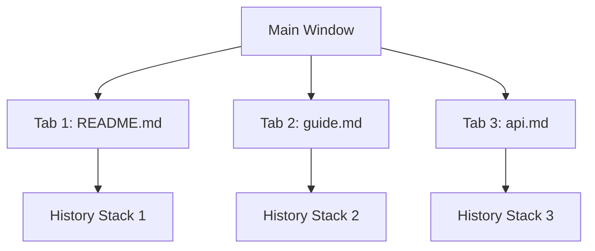
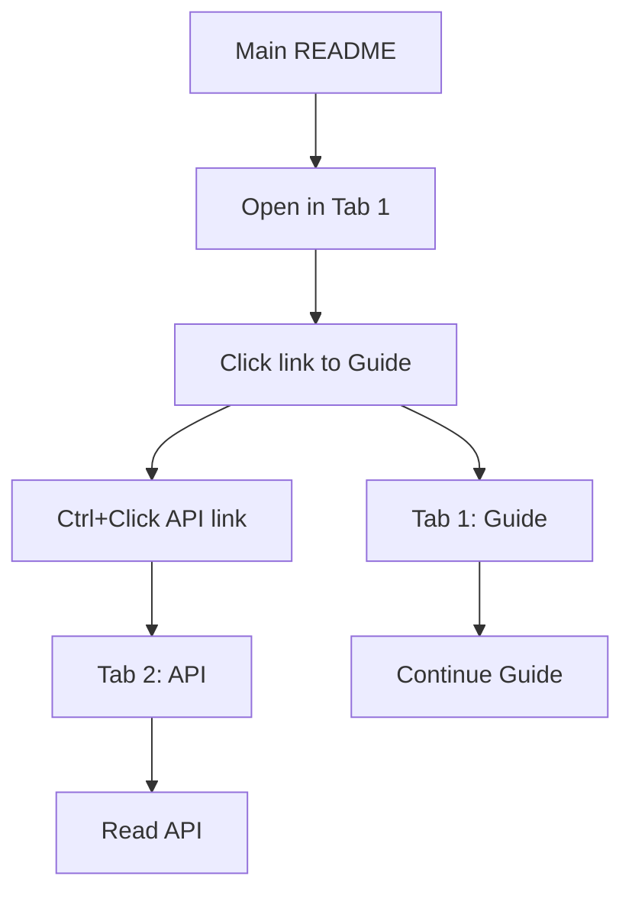

# Working with Tabs

> 📍 **Navigation**: [Home](../../README.md) → [Documentation](../README.md) → [User Guide](.) → Working with Tabs

MarkRead's tabbed interface allows you to work with multiple documents simultaneously. This guide covers everything about managing and using tabs effectively.

## Understanding Tabs

Tabs in MarkRead work similarly to web browser tabs:

- Each tab displays one document
- Each tab has independent navigation history
- Each tab maintains its own scroll position
- Tabs persist across sessions (optional)



## Opening Tabs

### Creating a New Tab

**Keyboard Shortcut**
```
Ctrl+T - Opens new empty tab
```

**From Links**
```
Ctrl+Click on any link - Opens in new tab
```

**From Sidebar**
```
Ctrl+Click on file - Opens in new tab
```

**From Menu**
- Click menu (☰) → "New Tab"

### What Appears in New Tabs?

When you create a new tab with `Ctrl+T`:

1. **If README.md exists** - Shows README.md
2. **If no README** - Shows folder overview with quick file access
3. **Cursor focus** - Automatically moves to new tab

## Navigating Between Tabs

### Switching Tabs

Multiple ways to switch between open tabs:

**Mouse**
- Click any tab header to activate

**Keyboard**
```
Ctrl+Tab        - Next tab (right)
Ctrl+Shift+Tab  - Previous tab (left)
Ctrl+1...9      - Jump to tab by number (1-9)
```

**Visual Indicators**
- Active tab has highlighted border
- Active tab text is brighter
- Inactive tabs are slightly dimmed

### Tab Scrolling

When you have many tabs open:

```
┌─────────────────────────────────────────┐
│ ◀ │ Tab1│Tab2│Tab3│Tab4│Tab5│Ta... │ ▶ │
└─────────────────────────────────────────┘
```

- **Left/Right arrows** appear when tabs overflow
- Click arrows to scroll tab list
- Scroll with mouse wheel while hovering over tabs
- Active tab auto-scrolls into view

## Closing Tabs

### Close Single Tab

**Keyboard**
```
Ctrl+W - Close active tab
```

**Mouse**
- Hover over tab → Click × button
- Middle-click on tab header

### Close Multiple Tabs

**Close All But Current**
- Right-click tab → "Close Other Tabs"

**Close All to Right**
- Right-click tab → "Close Tabs to the Right"

**Close All**
- `Ctrl+Shift+W` - Closes all tabs (closes window if last tab)

### Preventing Accidental Closure

**Pin Important Tabs** (Future Feature)
- Right-click tab → "Pin Tab"
- Pinned tabs cannot be closed with `Ctrl+W`

**Confirmation on Close All**
- Settings → "Confirm when closing multiple tabs"

## Tab Features

### Tab Context Menu

Right-click any tab to see options:

| Option | Description |
|--------|-------------|
| Close | Close this tab |
| Close Others | Close all except this tab |
| Close to Right | Close all tabs to the right |
| Reopen Closed | Reopen recently closed tab |
| Copy Path | Copy file path to clipboard |
| Reveal in Sidebar | Highlight file in sidebar |
| Open in Explorer | Open file location in Windows Explorer |

### Tab States and Indicators

Tabs show different visual states:

**Normal Tab**
```
│ README.md │
```

**Active Tab**
```
│ README.md │  ← Highlighted
```

**Modified File** (when file changes on disk)
```
│ README.md • │  ← Dot indicator
```

**Loading**
```
│ README.md ⟳ │  ← Spinner
```

### Tab Management Patterns

**Pattern 1: Branching Navigation**


Keep main doc in one tab, branch out to references in others.

**Pattern 2: Comparison View**
```
Tab 1: Old version (v1.0 docs)
Tab 2: New version (v2.0 docs)
Tab 3: Migration guide
```

**Pattern 3: Context Switching**
```
Tab 1: Work in progress
Tab 2: Reference documentation
Tab 3: API specification
Tab 4: Examples
```

## Advanced Tab Usage

### Reopen Closed Tabs

Accidentally closed a tab?

```
Ctrl+Shift+T - Reopen last closed tab
```

MarkRead remembers:
- Last 10 closed tabs
- File path and scroll position
- Navigation history

### Tab Ordering

**Rearrange Tabs**
- Drag and drop tabs to reorder
- Your preference is remembered per session

**Auto-Sort Options** (Settings)
- Alphabetical by filename
- By last accessed time
- Manual order (default)

### Tab Session Management

**Save Session**
- Settings → "Restore tabs on startup" → Enabled
- All open tabs saved when closing
- Restored on next launch

**Session Includes**
- ✅ Open files
- ✅ Active tab
- ✅ Scroll positions
- ✅ Navigation history per tab
- ❌ Search state

**Clear Session**
- Close all tabs before exiting
- Or Settings → "Start with empty session"

## Performance Considerations

### How Many Tabs?

MarkRead handles many tabs efficiently:

- **Recommended**: Up to 20 tabs for best performance
- **Tested**: 50+ tabs work smoothly on modern hardware
- **Memory**: ~5-10 MB per simple document
- **Complex docs**: Diagrams and images use more memory

### Memory Management

MarkRead automatically:
- Unloads inactive tabs after 30 minutes
- Reloads when you switch back
- Prioritizes active tab rendering
- Caches recently viewed documents

**Manual Memory Management**
```
Settings → "Aggressive memory saving" → Enabled
```
- Unloads inactive tabs after 5 minutes
- Reduces memory usage by ~70%
- Slightly slower tab switching

## Keyboard Shortcuts Summary

| Action | Shortcut |
|--------|----------|
| New tab | `Ctrl+T` |
| Close tab | `Ctrl+W` |
| Close all tabs | `Ctrl+Shift+W` |
| Next tab | `Ctrl+Tab` |
| Previous tab | `Ctrl+Shift+Tab` |
| Jump to tab 1-9 | `Ctrl+1` through `Ctrl+9` |
| Reopen closed | `Ctrl+Shift+T` |
| Duplicate tab | `Ctrl+Shift+D` |

See [Keyboard Shortcuts](keyboard-shortcuts.md) for complete list.

## Troubleshooting Tabs

### Issue: Tabs Not Saving Between Sessions

**Solution:**
- Settings → Enable "Restore tabs on startup"
- Ensure MarkRead closes normally (not force-closed)

### Issue: Too Many Tabs, Performance Slow

**Solution:**
- Close unused tabs
- Enable "Aggressive memory saving"
- Consider splitting into multiple MarkRead windows

### Issue: Can't Find Recently Viewed Tab

**Solution:**
- Use Recent Files: `Ctrl+Shift+E`
- Or use Global Search: `Ctrl+Shift+F`

## Tips and Best Practices

💡 **Use Ctrl+Click Liberally** - Open references in background tabs while reading

💡 **Close Tabs Regularly** - Keep 5-10 active tabs for best experience

💡 **Use Tab Numbering** - `Ctrl+1` for main doc, `Ctrl+2` for reference, etc.

💡 **Pin Important Tabs** - Keep frequently-referenced docs always open

💡 **Learn to Reopen** - `Ctrl+Shift+T` is your safety net for closed tabs

## Next Steps

- **[File Navigation](file-navigation.md)** - Navigate efficiently through documents
- **[Search Features](search-features.md)** - Find content across tabs
- **[Keyboard Shortcuts](keyboard-shortcuts.md)** - Master all shortcuts
- **[Settings](settings.md)** - Configure tab behavior

---

**Master navigation** → [File Navigation](file-navigation.md)
