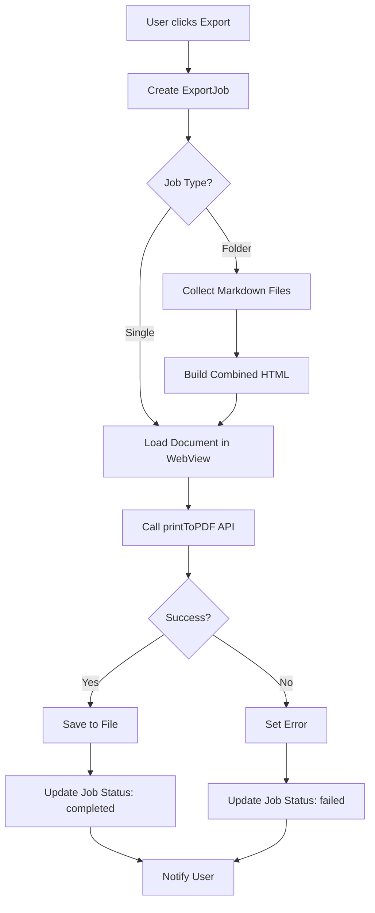
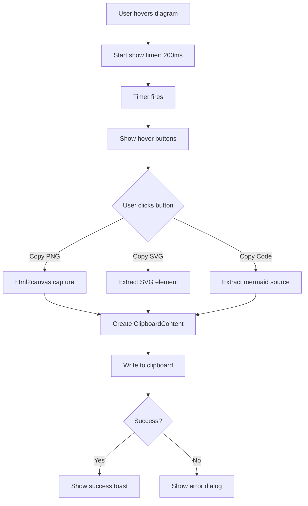
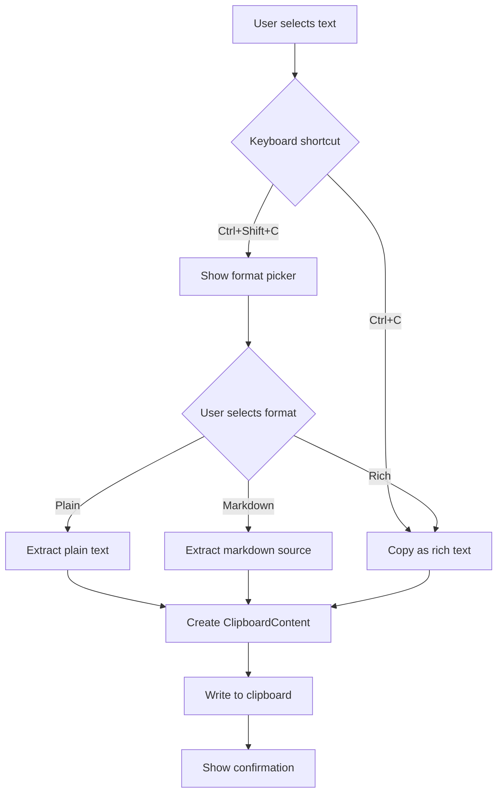

# Data Model: Export and Copy Features

**Feature**: Export and Copy Features  
**Date**: 2026-01-22  
**Phase**: 1 (Design)

## Overview

This document defines the data structures and relationships for export and copy operations in MarkRead.

## Core Entities

### 1. ExportJob

Represents an ongoing or completed export operation.

```typescript
interface ExportJob {
  id: string;                    // Unique identifier (UUID)
  type: 'single-pdf' | 'folder-pdf';
  status: 'pending' | 'in-progress' | 'completed' | 'failed' | 'cancelled';
  source: string;                // File path or folder path
  destination: string;           // Output PDF file path
  options: ExportOptions;
  progress: ExportProgress;
  createdAt: Date;
  startedAt?: Date;
  completedAt?: Date;
  error?: ExportError;
}

interface ExportOptions {
  pageSize: 'A4' | 'Letter';
  margins: { top: number; bottom: number; left: number; right: number };
  printBackground: boolean;
  includeSubfolders: boolean;    // For folder exports
  generateTOC: boolean;          // For folder exports
}

interface ExportProgress {
  currentFile?: string;          // Currently processing file
  filesProcessed: number;
  totalFiles: number;
  percentComplete: number;       // 0-100
}

interface ExportError {
  code: string;                  // Error code for programmatic handling
  message: string;               // User-friendly message
  details?: string;              // Technical details for logs
  retryable: boolean;            // Whether retry is possible
}
```

**Validation Rules**:
- `id` must be unique UUID v4
- `source` must be valid file path that exists
- `destination` must be writable location
- `margins` must be non-negative numbers
- `percentComplete` must be 0-100

**State Transitions**:
```
pending → in-progress → completed
pending → in-progress → failed
pending → in-progress → cancelled
```

### 2. ClipboardContent

Represents content to be copied to the system clipboard.

```typescript
interface ClipboardContent {
  formats: ClipboardFormat[];
  sourceElement?: HTMLElement;   // Original DOM element
  timestamp: Date;
}

interface ClipboardFormat {
  mimeType: string;              // 'text/plain' | 'text/html' | 'text/markdown' | 'image/png' | 'image/svg+xml'
  data: Blob;                    // Binary data for clipboard
}

// Specialized clipboard content types
interface TextClipboardContent extends ClipboardContent {
  plainText: string;
  markdownText?: string;
  htmlText?: string;
}

interface ImageClipboardContent extends ClipboardContent {
  imageBlob: Blob;
  format: 'png' | 'svg';
  dimensions?: { width: number; height: number };
}
```

**Validation Rules**:
- At least one format must be present
- `mimeType` must be one of supported types
- `data` blob must not be empty
- `timestamp` must not be in future

### 3. DiagramAction

Represents an action available for a mermaid diagram.

```typescript
interface DiagramAction {
  id: string;
  type: 'copy-png' | 'copy-svg' | 'copy-code' | 'download' | 'open-tab';
  label: string;
  icon: string;                  // Icon identifier
  handler: (diagram: HTMLElement) => Promise<void>;
  enabled: boolean;              // Whether action is currently available
}

interface DiagramActionResult {
  success: boolean;
  action: DiagramAction;
  error?: Error;
  executionTime: number;         // Milliseconds
}
```

**Action Definitions**:
- `copy-png`: Capture diagram as PNG and copy to clipboard
- `copy-svg`: Extract SVG and copy to clipboard
- `copy-code`: Extract mermaid source code and copy as plain text
- `download`: Save diagram as SVG file with save dialog
- `open-tab`: Open diagram in dedicated view tab

### 4. FolderExport

Represents a folder being exported as PDF with table of contents.

```typescript
interface FolderExport {
  folderPath: string;
  files: MarkdownFile[];
  coverPage: CoverPage;
  tableOfContents: TOCEntry[];
  exportOptions: ExportOptions;
}

interface MarkdownFile {
  path: string;                  // Absolute file path
  relativePath: string;          // Relative to folder root
  title: string;                 // Extracted from file or filename
  content: string;               // Raw markdown content
  renderedHtml?: string;         // Rendered HTML (cached)
  order: number;                 // Order in export (based on hierarchy)
}

interface CoverPage {
  title: string;                 // Folder name or custom title
  subtitle?: string;
  date: Date;
  author?: string;
  logo?: string;                 // Base64 encoded image or path
}

interface TOCEntry {
  title: string;
  level: number;                 // Nesting level (1-6)
  pageNumber?: number;           // Assigned after PDF generation
  anchor: string;                // HTML anchor for linking
  children: TOCEntry[];          // Nested entries
}
```

**Validation Rules**:
- `folderPath` must exist and be readable
- `files` must contain at least one markdown file
- `files[].order` must be unique and sequential
- `tableOfContents` hierarchy must match document structure

**Relationships**:
- FolderExport has many MarkdownFiles (composition)
- FolderExport has one CoverPage (composition)
- FolderExport has one or more TOCEntries (composition)
- TOCEntry has zero or more child TOCEntries (recursive)

### 5. ExportSettings

User preferences for export operations (persisted via electron-store).

```typescript
interface ExportSettings {
  defaultPageSize: 'A4' | 'Letter';
  defaultMargins: { top: number; bottom: number; left: number; right: number };
  printBackground: boolean;
  defaultOutputDirectory?: string;
  includeSubfoldersDefault: boolean;
  recentExports: RecentExport[];
}

interface RecentExport {
  source: string;
  destination: string;
  timestamp: Date;
  type: 'single-pdf' | 'folder-pdf';
}
```

**Validation Rules**:
- `recentExports` limited to 10 most recent
- `defaultOutputDirectory` must be valid writable path if set
- Settings must survive app restarts

### 6. DiagramHoverState

UI state for diagram hover buttons.

```typescript
interface DiagramHoverState {
  diagramId: string;             // Unique identifier for diagram element
  isHovering: boolean;
  isVisible: boolean;            // Buttons currently visible
  showTimeout?: NodeJS.Timeout;  // Timeout for delayed show
  hideTimeout?: NodeJS.Timeout;  // Timeout for delayed hide
  position: { x: number; y: number };  // Button container position
}
```

**Lifecycle**:
1. Mouse enters diagram → set `isHovering: true`, start `showTimeout` (200ms)
2. Timeout fires → set `isVisible: true`, render buttons
3. Mouse leaves diagram → set `isHovering: false`, start `hideTimeout` (500ms)
4. Timeout fires → set `isVisible: false`, hide buttons
5. If mouse re-enters during hide delay, clear `hideTimeout`

## Data Flow Diagrams

### PDF Export Flow



### Diagram Copy Flow



### Text Copy Flow



## Persistence

### electron-store Schema

```typescript
// Stored in: %APPDATA%/markread/config.json
{
  "export": {
    "settings": ExportSettings,
    "recentExports": RecentExport[]
  }
}
```

### Export Logs

```typescript
// Stored in: %APPDATA%/markread/logs/export.jsonl
// Format: JSON Lines (one JSON object per line)
{
  "timestamp": "2026-01-22T10:30:00.000Z",
  "jobId": "uuid",
  "type": "single-pdf",
  "source": "C:/Documents/README.md",
  "destination": "C:/Exports/README.pdf",
  "status": "completed",
  "duration": 2345,
  "filesProcessed": 1,
  "error": null
}
```

## API Surface

### IPC Channels (Main ↔ Renderer)

```typescript
// Exposed via preload script
interface ExportAPI {
  // PDF Export
  exportToPdf(source: string, destination: string, options: ExportOptions): Promise<ExportJob>;
  exportFolderToPdf(folderPath: string, destination: string, options: ExportOptions): Promise<ExportJob>;
  cancelExport(jobId: string): Promise<void>;
  
  // Progress updates (main → renderer)
  onExportProgress(callback: (job: ExportJob) => void): () => void;
  
  // Settings
  getExportSettings(): Promise<ExportSettings>;
  updateExportSettings(settings: Partial<ExportSettings>): Promise<void>;
  
  // Logs
  getExportLogs(limit: number): Promise<ExportLogEntry[]>;
  openLogsFolder(): Promise<void>;
}
```

### Renderer Services

```typescript
// ClipboardService (renderer)
class ClipboardService {
  async copyText(content: TextClipboardContent): Promise<void>;
  async copyImage(content: ImageClipboardContent): Promise<void>;
  async copyMultiFormat(formats: ClipboardFormat[]): Promise<void>;
  canCopy(): boolean;  // Check clipboard API availability
}

// DiagramCaptureService (renderer)
class DiagramCaptureService {
  async captureAsPNG(element: HTMLElement, options: CaptureOptions): Promise<Blob>;
  async captureAsSVG(element: HTMLElement): Promise<string>;
  extractMermaidCode(element: HTMLElement): string;
}
```

## Error Codes

```typescript
enum ExportErrorCode {
  PERMISSION_DENIED = 'EXPORT_PERMISSION_DENIED',
  FILE_NOT_FOUND = 'EXPORT_FILE_NOT_FOUND',
  DISK_FULL = 'EXPORT_DISK_FULL',
  MEMORY_EXCEEDED = 'EXPORT_MEMORY_EXCEEDED',
  RENDER_FAILED = 'EXPORT_RENDER_FAILED',
  INVALID_OPTIONS = 'EXPORT_INVALID_OPTIONS',
  CANCELLED = 'EXPORT_CANCELLED',
  UNKNOWN = 'EXPORT_UNKNOWN'
}

enum ClipboardErrorCode {
  PERMISSION_DENIED = 'CLIPBOARD_PERMISSION_DENIED',
  NOT_SUPPORTED = 'CLIPBOARD_NOT_SUPPORTED',
  CAPTURE_FAILED = 'CLIPBOARD_CAPTURE_FAILED',
  WRITE_FAILED = 'CLIPBOARD_WRITE_FAILED'
}
```

## Summary

All data structures defined with validation rules and relationships. Ready for contract generation and implementation.
