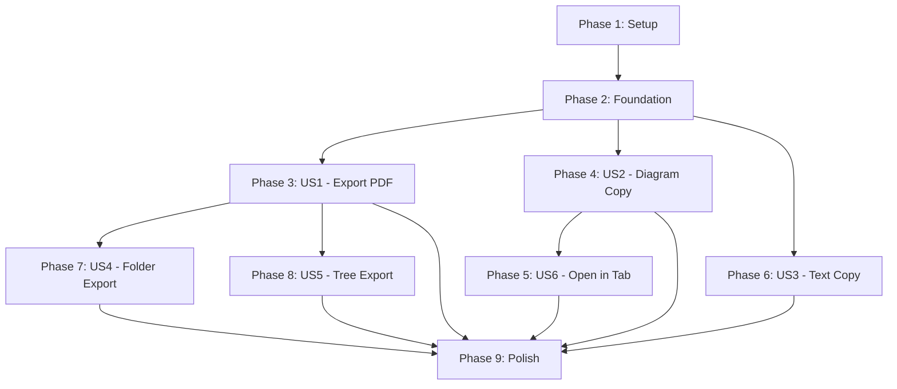

# Implementation Tasks: Export and Copy Features

**Branch**: `001-export-copy-features`  
**Feature**: Export and Copy Features  
**Created**: 2026-01-22

## Overview

This document breaks down the implementation into executable tasks organized by user story priority. Each user story phase is independently testable, enabling incremental delivery.

## Implementation Strategy

**MVP Scope**: User Story 1 (P1) - Export Current Page to PDF  
**Delivery Approach**: Incremental - complete and test each user story before moving to the next  
**Testing**: Manual testing per acceptance criteria (no automated tests specified in requirements)

## Phase 1: Setup & Infrastructure

Core setup tasks that enable all user stories.

### Tasks

- [ ] T001 Install html2canvas dependency: `npm install html2canvas --save`
- [ ] T002 Install html2canvas types: `npm install @types/html2canvas --save-dev`
- [ ] T003 [P] Create shared TypeScript types in src/shared/types/export.ts
- [ ] T004 [P] Create shared TypeScript types in src/shared/types/clipboard.ts
- [ ] T005 [P] Create ExportLogger service in src/main/services/export/ExportLogger.ts
- [ ] T006 Create electron-store integration for export settings in src/main/services/export/ExportSettingsStore.ts

**Deliverable**: Dependencies installed, type definitions created, logging infrastructure ready.

---

## Phase 2: Foundational Services

Core services needed by multiple user stories.

### Tasks

- [ ] T007 [P] Create ClipboardService interface in src/renderer/services/ClipboardService.ts
- [ ] T008 [P] Create DiagramCaptureService in src/renderer/services/DiagramCaptureService.ts
- [ ] T009 [P] Create base ErrorDialog component in src/renderer/components/ErrorDialog.tsx
- [ ] T010 Create exportStore with Zustand in src/renderer/stores/exportStore.ts

**Deliverable**: Core services available for use in user stories.

---

## Phase 3: User Story 1 - Export Current Page to PDF (P1) 🎯 MVP

**Goal**: Enable users to export the currently viewed markdown document to PDF.

**Independent Test**: Open any markdown file, click "Export to PDF", verify PDF matches rendered content with formatting, images, and diagrams intact.

**Story Label**: [US1]

### Tasks

- [ ] T011 [US1] Create PdfExportService in src/main/services/export/PdfExportService.ts
- [ ] T012 [US1] Implement printToPDF wrapper with options handling in PdfExportService
- [ ] T013 [US1] Add progress event emission in PdfExportService
- [ ] T014 [US1] Create IPC handler for 'export:pdf:single' in src/main/services/ipc/exportHandlers.ts
- [ ] T015 [US1] Create preload API bridge in src/preload/exportApi.ts
- [ ] T016 [US1] Register export IPC handlers in main process entry (src/main/index.ts)
- [ ] T017 [P] [US1] Create ExportProgressDialog component in src/renderer/components/ExportProgressDialog.tsx
- [ ] T018 [P] [US1] Create useExport hook in src/renderer/hooks/useExport.ts
- [ ] T019 [US1] Add "Export to PDF" menu item to application menu
- [ ] T020 [US1] Wire export menu action to useExport hook with file save dialog
- [ ] T021 [US1] Add print CSS styles for page breaks in renderer styles
- [ ] T022 [US1] Handle export errors with ErrorDialog and retry button

**Acceptance Testing**:
1. ✅ Export button/menu item visible when viewing document
2. ✅ Save dialog appears with default filename
3. ✅ Progress indicator shows during export
4. ✅ Generated PDF matches screen rendering
5. ✅ PDF includes formatted text, code blocks, images
6. ✅ Mermaid diagrams render as images in PDF
7. ✅ Error dialog with retry for failed exports

**Deliverable**: Working PDF export for single documents with progress and error handling.

---

## Phase 4: User Story 2 - Copy Mermaid Diagram as Image (P2)

**Goal**: Enable users to copy mermaid diagrams to clipboard via hover buttons.

**Independent Test**: Hover over any mermaid diagram, verify buttons appear, click copy PNG/SVG, paste into external application.

**Story Label**: [US2]

### Tasks

- [ ] T023 [US2] Implement PNG capture method in DiagramCaptureService using html2canvas
- [ ] T024 [US2] Implement SVG extraction method in DiagramCaptureService
- [ ] T025 [US2] Implement mermaid code extraction in DiagramCaptureService
- [ ] T026 [US2] Implement copyImage method in ClipboardService
- [ ] T027 [US2] Implement copyText method in ClipboardService for code
- [ ] T028 [P] [US2] Create DiagramHoverButtons component in src/renderer/components/DiagramHoverButtons.tsx
- [ ] T029 [P] [US2] Implement hover timing logic (200ms show delay, 500ms hide delay) in DiagramHoverButtons
- [ ] T030 [P] [US2] Create useDiagramActions hook in src/renderer/hooks/useDiagramActions.ts
- [ ] T031 [US2] Add CSS styles for hover button positioning and animations
- [ ] T032 [US2] Integrate DiagramHoverButtons into markdown renderer for mermaid blocks
- [ ] T033 [US2] Implement "Copy as PNG" button action
- [ ] T034 [US2] Implement "Copy as SVG" button action
- [ ] T035 [US2] Implement "Copy Code" button action
- [ ] T036 [US2] Implement "Download" button action with save dialog
- [ ] T037 [US2] Add success toast notifications for copy operations
- [ ] T038 [US2] Add error handling for clipboard permission denied

**Acceptance Testing**:
1. ✅ Hover buttons appear after 200ms hover on diagram
2. ✅ Buttons remain visible 500ms after mouse leaves
3. ✅ Copy PNG pastes as image in Word/PowerPoint
4. ✅ Copy SVG works (where supported)
5. ✅ Copy Code pastes mermaid source as text
6. ✅ Download saves SVG file with proper filename
7. ✅ Success notification shows after successful copy
8. ✅ Error message shows on clipboard failure

**Deliverable**: Functional hover buttons on all mermaid diagrams with copy/download actions.

---

## Phase 5: User Story 6 - Open Mermaid Diagram in New Tab (P6)

**Goal**: Enable users to open diagrams in dedicated full-size view.

**Independent Test**: Click "Open in Tab" button on diagram, verify it opens in new tab with zoom/pan controls.

**Story Label**: [US6]

**Note**: Implemented before US3 as it shares hover button infrastructure with US2.

### Tasks

- [ ] T039 [P] [US6] Create DiagramTabView component in src/renderer/components/DiagramTabView.tsx
- [ ] T040 [P] [US6] Add zoom controls to DiagramTabView
- [ ] T041 [P] [US6] Add pan controls to DiagramTabView
- [ ] T042 [US6] Implement "Open in New Tab" button action in DiagramHoverButtons
- [ ] T043 [US6] Add tab management to application state (open, close, switch)
- [ ] T044 [US6] Style DiagramTabView for full-size display

**Acceptance Testing**:
1. ✅ "Open in New Tab" button available in hover buttons
2. ✅ Diagram opens in dedicated tab
3. ✅ Tab shows diagram title/identifier
4. ✅ Zoom controls work (in/out/reset)
5. ✅ Pan/drag to move diagram works
6. ✅ Tab can be closed
7. ✅ Diagram renders at larger size than inline

**Deliverable**: Diagram tab view with zoom and pan capabilities.

---

## Phase 6: User Story 3 - Copy Selected Text in Multiple Formats (P3)

**Goal**: Enable multi-format text copying with keyboard shortcuts and context menu.

**Independent Test**: Select text, use Ctrl+C / Ctrl+Shift+C / right-click menu, paste into various applications (Word, Teams, VSCode).

**Story Label**: [US3]

### Tasks

- [ ] T045 [US3] Implement copyText method with multi-format support in ClipboardService
- [ ] T046 [US3] Create TextSelectionService in src/renderer/services/TextSelectionService.ts
- [ ] T047 [US3] Implement plain text extraction from selection
- [ ] T048 [US3] Implement markdown extraction from selection (preserve syntax)
- [ ] T049 [US3] Implement rich text/HTML extraction from selection
- [ ] T050 [P] [US3] Create CopyFormatPicker component in src/renderer/components/CopyFormatPicker.tsx
- [ ] T051 [P] [US3] Create useCopyShortcuts hook in src/renderer/hooks/useCopyShortcuts.ts
- [ ] T052 [US3] Implement Ctrl+C handler (copy as rich text default)
- [ ] T053 [US3] Implement Ctrl+Shift+C handler (show format picker)
- [ ] T054 [US3] Create context menu for text selection with format options
- [ ] T055 [US3] Integrate useCopyShortcuts hook into document view
- [ ] T056 [US3] Add format picker modal styling and positioning
- [ ] T057 [US3] Test rich text paste in Microsoft Word
- [ ] T058 [US3] Test rich text paste in Microsoft Teams
- [ ] T059 [US3] Test markdown paste in VSCode
- [ ] T060 [US3] Add clipboard error handling with user-friendly messages

**Acceptance Testing**:
1. ✅ Ctrl+C copies as rich text
2. ✅ Ctrl+Shift+C shows format picker
3. ✅ Right-click shows copy format options
4. ✅ Plain text paste works in all apps
5. ✅ Markdown paste preserves syntax
6. ✅ Rich text paste preserves formatting in Word/Teams
7. ✅ Format picker closes after selection
8. ✅ Error message shows on clipboard failure

**Deliverable**: Multi-format text copying with keyboard shortcuts and context menu.

---

## Phase 7: User Story 4 - Export Folder to PDF with Index (P4)

**Goal**: Enable export of entire folder with cover page and table of contents.

**Independent Test**: Right-click folder in tree, select "Export Folder to PDF", verify output contains all docs with TOC and cover page.

**Story Label**: [US4]

### Tasks

- [ ] T061 [US4] Create FolderExportService in src/main/services/export/FolderExportService.ts
- [ ] T062 [US4] Implement markdown file collection (recursive folder traversal)
- [ ] T063 [US4] Implement file ordering by hierarchy
- [ ] T064 [US4] Implement cover page HTML generation
- [ ] T065 [US4] Implement table of contents generation with links
- [ ] T066 [US4] Implement combined HTML document builder
- [ ] T067 [US4] Add page break CSS between documents
- [ ] T068 [US4] Add IPC handler for 'export:pdf:folder' in exportHandlers.ts
- [ ] T069 [US4] Update preload API with exportFolderToPdf method
- [ ] T070 [US4] Update exportStore with folder export state
- [ ] T071 [US4] Add progress reporting per-file during folder export
- [ ] T072 [US4] Add "Export Folder to PDF" to folder context menu
- [ ] T073 [US4] Implement folder export dialog with options (include subfolders, custom title)
- [ ] T074 [US4] Handle non-markdown files (skip with optional logging)
- [ ] T075 [US4] Add file count limit enforcement (max 50 documents)
- [ ] T076 [US4] Test with folder containing 10+ documents

**Acceptance Testing**:
1. ✅ "Export Folder to PDF" appears in folder context menu
2. ✅ Cover page includes folder name and date
3. ✅ Table of contents lists all documents with page links
4. ✅ TOC links navigate to correct pages
5. ✅ All markdown files included in output
6. ✅ Documents separated by page breaks
7. ✅ Subfolder hierarchy reflected in TOC
8. ✅ Non-markdown files skipped gracefully
9. ✅ Progress shown for large folders

**Deliverable**: Folder export with cover page and navigable table of contents.

---

## Phase 8: User Story 5 - Export File from File Tree (P5)

**Goal**: Enable PDF export directly from file tree without opening file.

**Independent Test**: Right-click markdown file in tree, select "Export to PDF", verify PDF created without file opening.

**Story Label**: [US5]

### Tasks

- [ ] T077 [US5] Add "Export to PDF" to file context menu in tree view
- [ ] T078 [US5] Implement background file rendering (load in hidden window)
- [ ] T079 [US5] Wire context menu action to export service
- [ ] T080 [US5] Show export progress notification (non-blocking)
- [ ] T081 [US5] Handle export completion notification
- [ ] T082 [US5] Handle export errors with error notification

**Acceptance Testing**:
1. ✅ "Export to PDF" visible in file context menu
2. ✅ Export starts without opening file
3. ✅ Progress notification shows
4. ✅ PDF generated matches file content
5. ✅ Success notification shows on completion
6. ✅ Error notification shows on failure
7. ✅ User can continue working during export

**Deliverable**: Context menu export from file tree without disrupting current view.

---

## Phase 9: Polish & Cross-Cutting Concerns

Final refinements and cross-story features.

### Tasks

- [ ] T083 [P] Implement export settings persistence (default page size, margins, output directory)
- [ ] T084 [P] Create settings UI for export preferences
- [ ] T085 [P] Implement export logs viewer with "Open Logs" button in error dialogs
- [ ] T086 [P] Add IPC handlers for settings get/update (export:settings:get, export:settings:update)
- [ ] T087 [P] Add IPC handlers for logs (export:logs:get, export:logs:open-folder)
- [ ] T088 [P] Implement recent exports tracking (store last 10 exports)
- [ ] T089 Add keyboard shortcut documentation to help/about dialog
- [ ] T090 Add export feature to application help documentation
- [ ] T091 Performance optimization: Cache rendered HTML for repeated exports
- [ ] T092 Performance optimization: Limit concurrent export jobs (max 3)
- [ ] T093 Accessibility: Add aria-labels to all export buttons and dialogs
- [ ] T094 Accessibility: Ensure keyboard navigation for all export features
- [ ] T095 Add memory monitoring for large document exports
- [ ] T096 Implement export cancellation (cancel button in progress dialog)
- [ ] T097 Add telemetry for export feature usage (anonymous, opt-in)
- [ ] T098 Final manual testing across all user stories
- [ ] T099 Update CHANGELOG.md with export features
- [ ] T100 Update README.md with export feature documentation

**Deliverable**: Complete, polished export and copy feature set ready for release.

---

## Dependencies & Execution Order

### User Story Dependencies

### Critical Path

Setup → Foundation → US1 (PDF Export) → Polish

All other stories can be developed in parallel after Foundation.

### Parallel Execution Opportunities

**After Phase 2 (Foundation)**:
- US1 and US2 can be developed in parallel (different services)
- US3 can be developed in parallel with US1 and US2

**After Phase 3 (US1 Complete)**:
- US4 and US5 both depend on US1, but can be done in parallel
- US2 and US3 can continue in parallel

**After Phase 4 (US2 Complete)**:
- US6 depends on US2 (uses hover buttons)

### Recommended Execution Strategy

1. **Week 1**: Complete Setup + Foundation + US1 (MVP ready)
2. **Week 2**: Complete US2 + US3 in parallel
3. **Week 3**: Complete US6, US4, US5 in sequence or parallel
4. **Week 4**: Polish, testing, documentation

---

## Task Summary

**Total Tasks**: 100  
**MVP Tasks** (US1): 22 tasks (T001-T022)  
**Parallelizable Tasks**: 28 tasks (marked with [P])  

### Tasks by User Story

| Story | Priority | Tasks | Description |
|-------|----------|-------|-------------|
| Setup | - | 6 | Dependencies, types, infrastructure |
| Foundation | - | 4 | Core services used across stories |
| US1 | P1 | 12 | Export current page to PDF (MVP) |
| US2 | P2 | 16 | Copy mermaid diagrams |
| US6 | P6 | 6 | Open diagram in tab |
| US3 | P3 | 16 | Multi-format text copy |
| US4 | P4 | 16 | Folder export with TOC |
| US5 | P5 | 6 | Export from file tree |
| Polish | - | 18 | Settings, logs, docs, optimization |

### Independent Test Criteria Summary

Each user story has clear acceptance criteria:
- **US1**: Export PDF matches screen rendering with all content types
- **US2**: Hover buttons work, copy to clipboard succeeds, paste in external apps
- **US3**: Keyboard shortcuts work, format picker appears, paste preserves formatting
- **US4**: Folder PDF includes cover, TOC with links, all documents
- **US5**: Context menu export works without opening file
- **US6**: Diagram opens in tab with zoom/pan controls

---

## Format Validation

✅ All tasks follow checklist format: `- [ ] [TaskID] [P?] [Story?] Description with file path`  
✅ All user story phase tasks include story label ([US1], [US2], etc.)  
✅ Setup and Foundation phases have no story labels  
✅ Polish phase has no story labels  
✅ Task IDs are sequential (T001-T100)  
✅ Parallelizable tasks marked with [P]  
✅ File paths included where applicable  

---

## Notes

- No automated tests specified in requirements; manual testing per acceptance criteria
- Tasks are sized for ~1-4 hours each for experienced developer
- Each user story phase is independently deployable and testable
- MVP (US1) delivers core value with 22 tasks
- Dependencies clearly marked; most stories can be developed in parallel
- All tasks reference specific file paths from implementation plan
