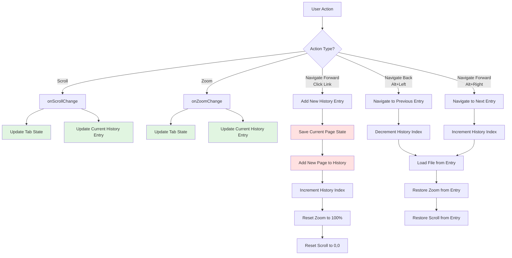
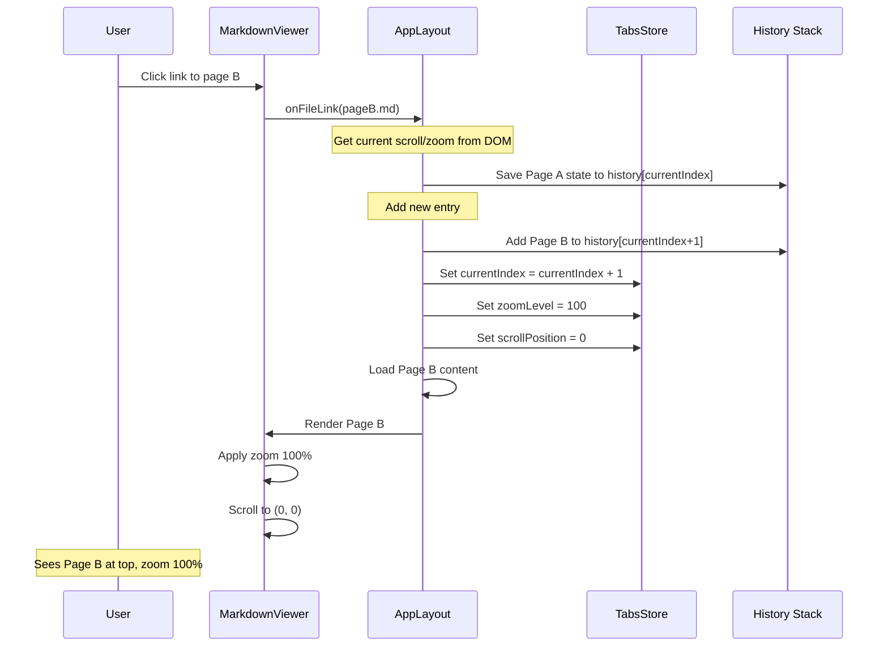
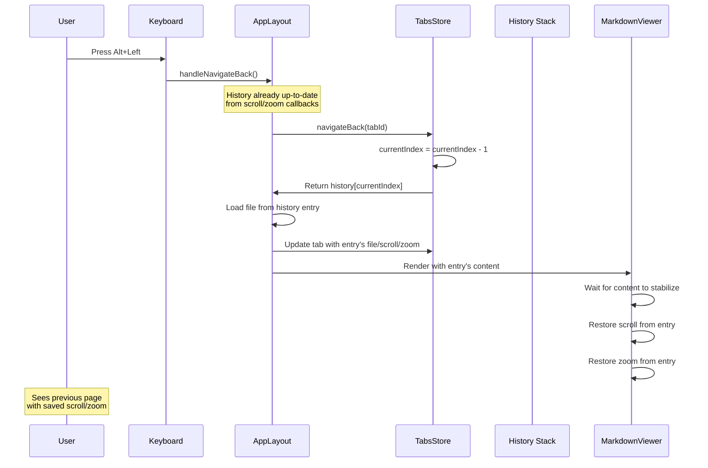
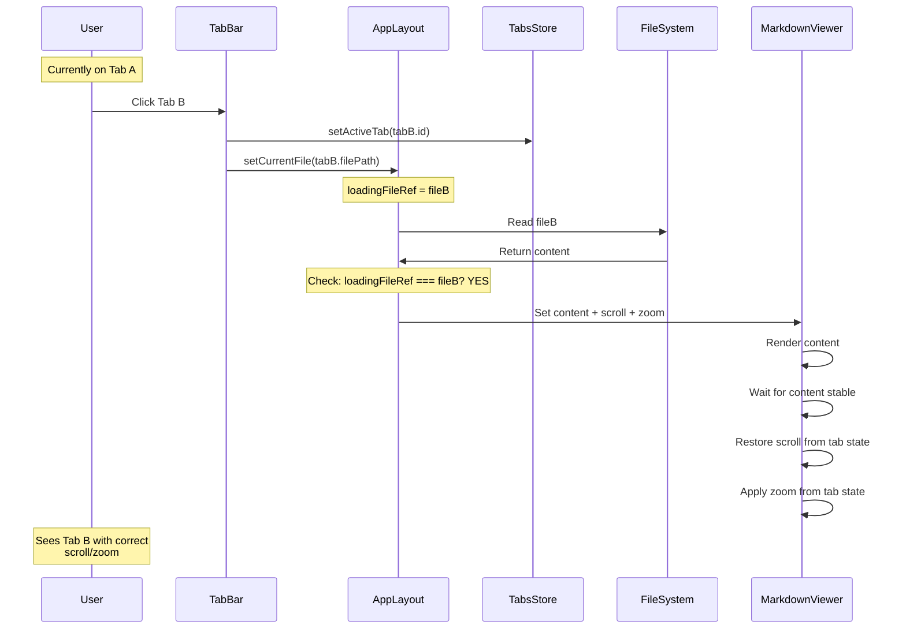
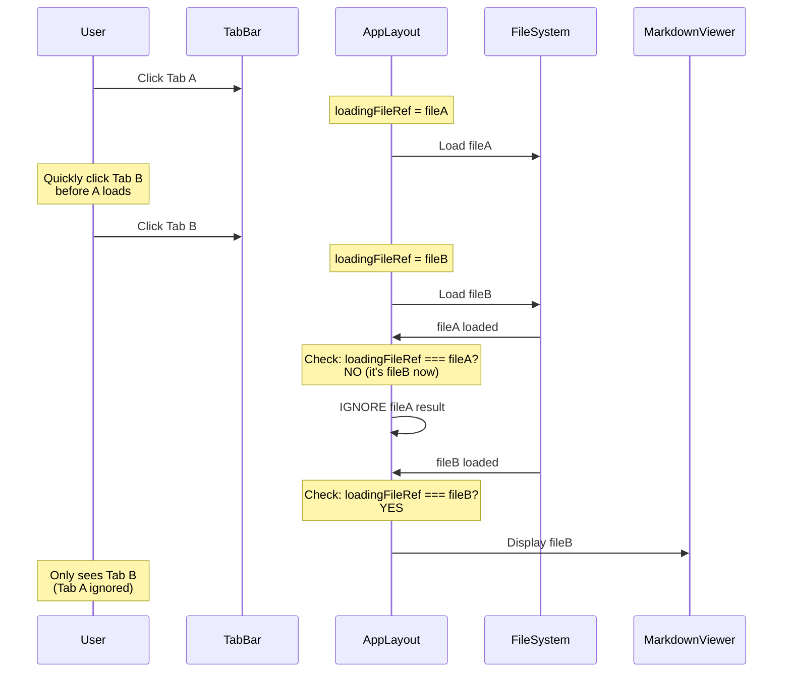
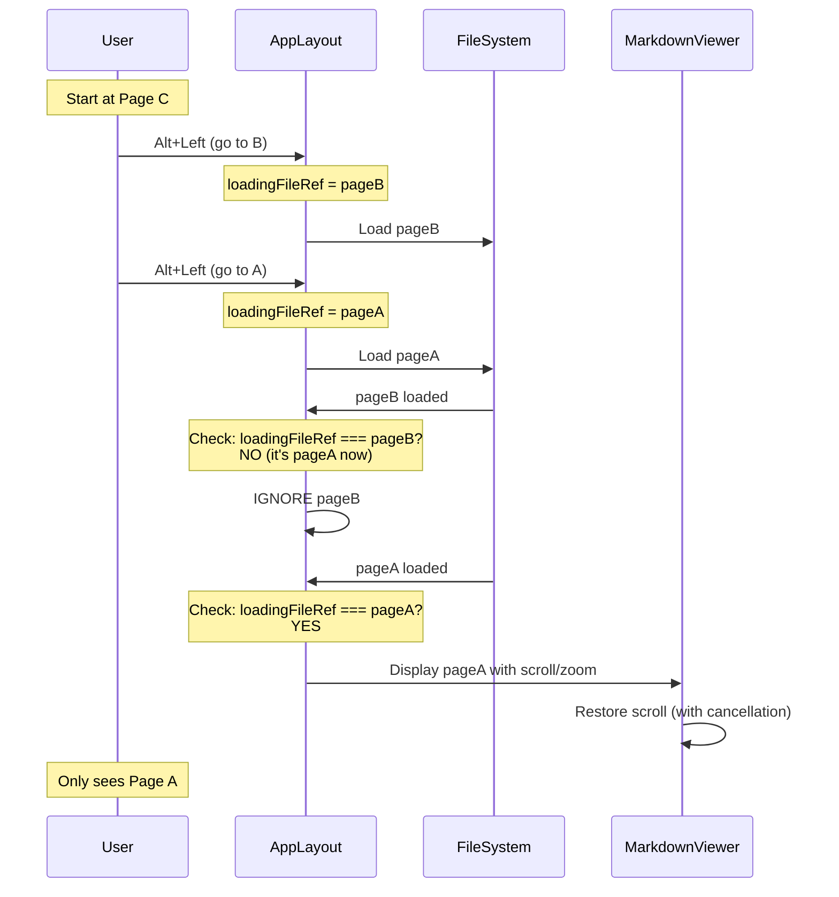
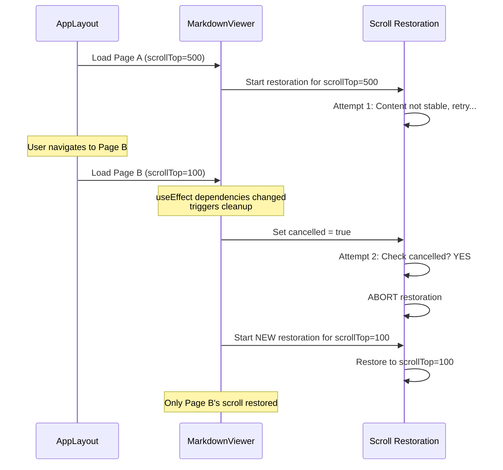
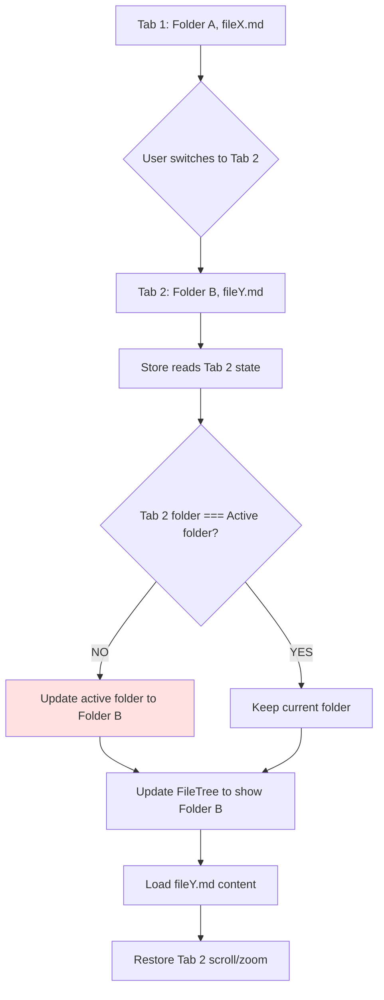
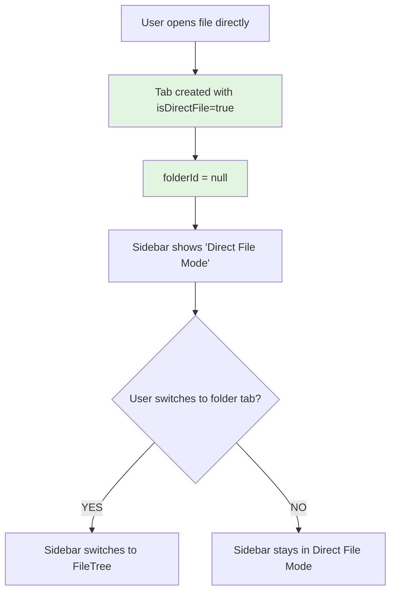
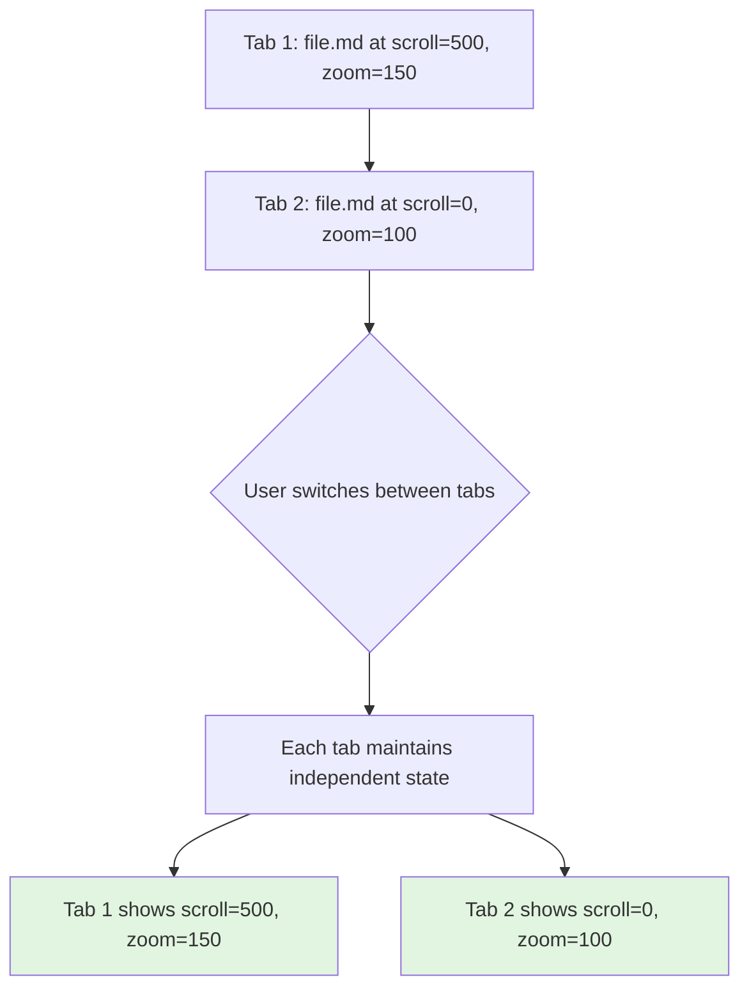

# Tabs and History Architecture Design

## Overview

MarkRead uses a **tab-based navigation system** with **per-tab navigation history**. Each tab maintains its own history stack, zoom level, and scroll position. This document explains the architecture, data flow, and behavior in various scenarios.

---

## Data Structures

### Tab Object

```typescript
interface Tab {
  id: string;                          // Unique tab identifier
  filePath: string;                     // Current file path
  title: string;                        // Display title
  scrollPosition: number;               // Vertical scroll (current)
  scrollLeft?: number;                  // Horizontal scroll (current)
  zoomLevel: number;                    // Zoom percentage (10-2000)

  // Navigation History
  navigationHistory: HistoryEntry[];    // Stack of visited pages
  currentHistoryIndex: number;          // Current position in stack

  // Other state
  folderId?: string;                    // Associated folder (if any)
  isDirectFile: boolean;                // True if opened directly
  createdAt: number;                    // Timestamp
}
```

### History Entry Object

```typescript
interface HistoryEntry {
  filePath: string;         // File path for this entry
  scrollPosition: number;   // Vertical scroll for this page
  scrollLeft?: number;      // Horizontal scroll for this page
  zoomLevel?: number;       // Zoom level for this page
  timestamp: number;        // When this entry was created
}
```

---

## State Management: When is What Stored/Updated?



### Storage Locations

| Data | Tab State | Current History Entry | Notes |
|------|-----------|----------------------|-------|
| **Current scroll** | ✓ Always | ✓ Immediately on scroll | Both updated in real-time |
| **Current zoom** | ✓ Always | ✓ Immediately on zoom | Both updated in real-time |
| **File path** | ✓ Always | ✓ Always | Matches current history entry |
| **History stack** | ✓ Array | N/A | Stack of all visited pages |
| **History index** | ✓ Number | N/A | Pointer to current position |

---

## Navigation Flow

### Forward Navigation (Clicking Links)



### Backward Navigation (Alt+Left)



---

## Tab Switching Flow

### Slow Tab Switch (Content Loads Fully)



### Rapid Tab Switch (Race Condition Prevented)



---

## Rapid History Navigation

### Sequential Navigation (Alt+Left spam)



### Scroll Restoration Cancellation



---

## Edge Cases

### Case 1: Switching Between Folders



**Behavior:**
- Each tab stores its `folderId`
- FileTree updates to show the tab's associated folder
- Scroll/zoom are per-tab, not per-folder
- History is per-tab, not per-folder

### Case 2: Direct File (No Folder)



**Behavior:**
- Direct file tabs have `isDirectFile: true`, `folderId: null`
- No FileTree shown in sidebar (shows list of direct files instead)
- Full tab functionality (history, scroll, zoom) still works
- Can convert to folder tab via "Open Folder for This File" button

### Case 3: Same File in Multiple Tabs



**Behavior:**
- Same file can be open in multiple tabs
- Each tab has **independent** scroll/zoom/history
- No state sharing between tabs
- File content is loaded separately for each tab

---

## Critical Implementation Details

### 1. Double State Updates (Scroll/Zoom)

**Why both tab state AND history entry?**

```typescript
onScrollChange={(scrollTop, scrollLeft) => {
  // Update Tab State (for immediate display)
  updateTabScrollPosition(tabId, scrollTop);

  // Update Current History Entry (for future restoration)
  history[currentIndex] = {
    ...history[currentIndex],
    scrollPosition: scrollTop,
    scrollLeft: scrollLeft
  };
}
```

**Reason:**
- **Tab state** = current display state (what you see now)
- **History entry** = saved state (what to restore when navigating back)
- Both updated immediately to avoid timing windows

### 2. Race Condition Prevention

**Three checks before updating UI:**

```typescript
// 1. Track which file we're loading
loadingFileRef.current = fileToLoad;

// 2. Load the file
const result = await loadFile(fileToLoad);

// 3. Only update if STILL the current file
if (loadingFileRef.current === fileToLoad && currentFile === fileToLoad) {
  setCurrentContent(result); // ✓ Safe
}
```

**Applied to:**
- Tab switching (useEffect)
- History navigation (handleNavigateToHistory)
- Directory listings (handleNavigateToHistory)

### 3. Scroll Restoration Cancellation

**Cleanup function prevents stale restorations:**

```typescript
useEffect(() => {
  let cancelled = false;

  const attemptRestore = () => {
    if (cancelled) return; // Abort if dependencies changed
    // ... restoration logic
  };

  return () => {
    cancelled = true; // Cancel on unmount or deps change
  };
}, [scrollTop, scrollLeft, filePath, zoomLevel]);
```

**Result:** Old scroll restorations abort when navigating to new page

---

## State Consistency Rules

| Scenario | Tab State | Current History Entry | Other History Entries |
|----------|-----------|----------------------|----------------------|
| **Scrolling** | ✓ Updated | ✓ Updated | ✗ Unchanged |
| **Zooming** | ✓ Updated | ✓ Updated | ✗ Unchanged |
| **Navigate Forward** | ✓ New state | ✓ New entry added | ✓ Previous updated first |
| **Navigate Back** | ✓ Restored from entry | ✗ Read-only | ✗ Unchanged |
| **Switch Tab** | ✓ Switch to new tab | ✗ N/A (different tab) | ✗ N/A |

### Invariants (Always True)

1. **Tab state matches current history entry**
   - `tab.scrollPosition === history[currentIndex].scrollPosition`
   - `tab.zoomLevel === history[currentIndex].zoomLevel`
   - `tab.filePath === history[currentIndex].filePath`

2. **History index is valid**
   - `0 <= currentIndex < history.length`

3. **Race condition protection**
   - `loadingFileRef` always points to most recent request
   - Older results are ignored

4. **Per-tab independence**
   - Tabs don't share state
   - Switching tabs doesn't affect other tabs' history

---

## Performance Considerations

### Memory Management

**History Limit:** 50 entries per tab

```typescript
if (history.length > 50) {
  history.shift();           // Remove oldest
  currentIndex = max(0, currentIndex - 1); // Adjust index
}
```

**Why:** Prevent unbounded memory growth with long navigation sessions

### Scroll Restoration Timing

**Retry with stability check:**

```typescript
// Wait for content height to stabilize (2 consecutive same values)
if (currentHeight === lastHeight && stableCount >= 2) {
  restoreScroll(); // Content is stable, safe to restore
}
```

**Why:**
- Syntax highlighting takes time
- Mermaid diagrams render asynchronously
- Images load progressively
- Restoring too early = wrong position

### Update Throttling

**Scroll events are debounced by browser:**
- `onScroll` fires ~60fps max
- Each event updates both tab state and history
- No additional throttling needed (state updates are cheap)

---

## Debugging Tips

### Console Logs

Key log messages to watch:

```
[MarkdownViewer] Restored scrollTop to: 500 (after 3 attempts, scrollHeight: 2000)
[MarkdownViewer] Scroll restoration cancelled
[handleNavigateToHistory] Content loaded for: file.md
[handleNavigateToHistory] Ignoring stale load for: oldfile.md (current: newfile.md)
```

### Common Issues

| Symptom | Likely Cause | Solution |
|---------|-------------|----------|
| Wrong file displays briefly | Race condition not prevented | Check `loadingFileRef` usage |
| Scroll position wrong | Restored before content stable | Check stability retry logic |
| Scroll not saved | History not updated on scroll | Check `onScrollChange` callback |
| Tabs show same scroll | Active tab not updated | Check `setActiveTab` called before `setCurrentFile` |

---

## Future Improvements

1. **Persist history to disk** - Restore navigation on app restart
2. **Infinite scroll restoration** - Handle documents that grow dynamically
3. **Thumbnail previews** - Show preview when hovering over back/forward buttons
4. **History search** - Find pages in history by content/title
5. **Cross-tab navigation** - Jump to same file in different tab

---

## Related Documents

- [Zoom and Pan Design](./zoom-pan-design.md) - Content zoom and panning
- [Tab Management](./tasks.md) - Task list for tab features
- [File Watching](./tasks.md) - Auto-reload on file changes
