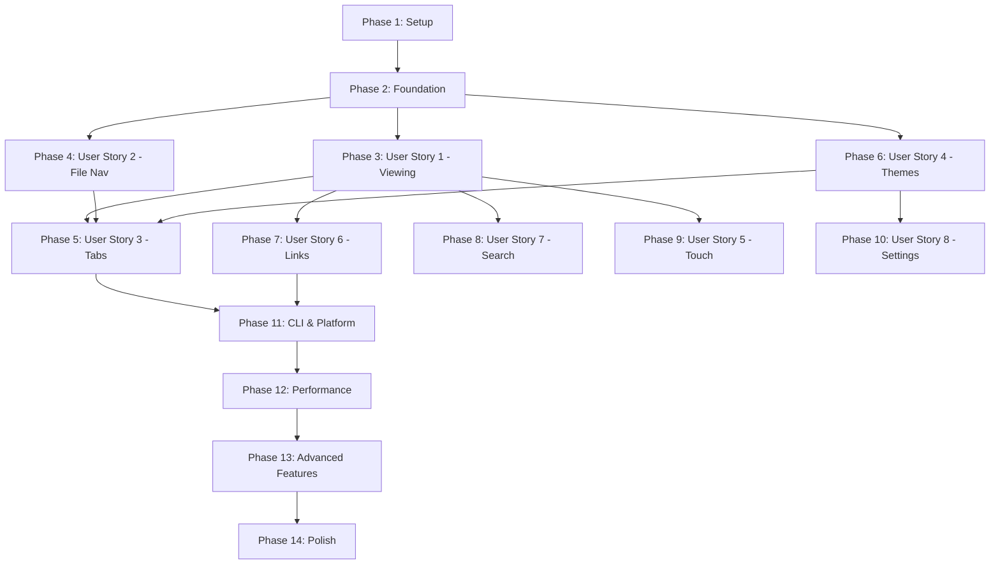

# Tasks: Migrate MarkRead to .NET MAUI

**Input**: Design documents from `/specs/006-maui-migration/`
**Prerequisites**: plan.md (required), spec.md (required), research.md (available)

**Tests**: This implementation follows a pragmatic testing approach - unit tests for services, integration tests for critical paths, UI tests for key user scenarios.

**Organization**: Tasks are grouped by user story to enable independent implementation and testing of each story.

## Format: `[ID] [P?] [Story] Description`

- **[P]**: Can run in parallel (different files, no dependencies)
- **[Story]**: Which user story this task belongs to (e.g., US1, US2, US3)
- Include exact file paths in descriptions

## Path Conventions 

All paths relative to repository root:
- **Application**: `src/` (new MAUI app)
- **Tests**: `tests/unit/`, `tests/integration/`, `tests/ui/`
- **Reference**: `src.old/` (renamed WPF app for functional reference)

---

## Phase 1: Setup & Project Initialization

**Purpose**: Create MAUI project structure and initialize development environment

- [ ] T001 Rename existing `src/` folder to `src.old/` for functional reference
- [ ] T002 Create new .NET MAUI 10 project in `src/` with MarkRead.csproj
- [ ] T003 [P] Configure project properties in src/MarkRead.csproj (net10.0-windows, WinExe, MAUI workload)
- [ ] T004 [P] Add NuGet packages: Markdig 0.44.0, CommunityToolkit.Mvvm, CommunityToolkit.Maui
- [ ] T005 [P] Create project folder structure (Views/, ViewModels/, Services/, Models/, Rendering/, Resources/)
- [ ] T006 [P] Setup test projects: tests/unit/MarkRead.Tests.Unit.csproj with xUnit
- [ ] T007 [P] Setup test projects: tests/integration/MarkRead.Tests.Integration.csproj with xUnit
- [ ] T008 [P] Configure MauiProgram.cs with dependency injection container and service registration structure
- [ ] T009 [P] Create AppShell.xaml and AppShell.xaml.cs for MAUI Shell navigation
- [ ] T010 [P] Create Resources/Styles/Colors.xaml with Fluent Design color palette (light/dark theme bases)
- [ ] T011 [P] Create Resources/Styles/Styles.xaml with base MAUI control styles
- [ ] T012 [P] Create Resources/Styles/Animations.xaml for reusable animation definitions

**Checkpoint**: Basic MAUI project structure ready for implementation

---

## Phase 2: Foundational Infrastructure (Blocking Prerequisites)

**Purpose**: Core services and infrastructure that ALL user stories depend on

**⚠️ CRITICAL**: No user story work can begin until this phase is complete

### Core Models (Required by all stories)

- [ ] T013 [P] Create Document model in src/Models/Document.cs (FilePath, Content, Title, RenderState, ScrollPosition)
- [ ] T014 [P] Create FileTreeNode model in src/Models/FileTreeNode.cs (Path, Name, Type, Children, IsExpanded)
- [ ] T015 [P] Create Tab model in src/Models/Tab.cs (Id, Title, DocumentPath, IsActive, IsPinned)
- [ ] T016 [P] Create Theme model in src/Models/Theme.cs (ThemeType enum, ColorScheme, Typography settings)
- [ ] T017 [P] Create Settings model in src/Models/Settings.cs (ThemePreference, WindowState, SidebarVisible, etc.)

### Core Services (Required by all stories)

- [ ] T018 Create IMarkdownService interface in src/Services/IMarkdownService.cs (RenderToHtml method)
- [ ] T019 Implement MarkdownService in src/Services/MarkdownService.cs using Markdig 0.44.0 pipeline
- [ ] T020 [P] Create IFileSystemService interface in src/Services/IFileSystemService.cs (ReadFile, WatchFile, LoadDirectory)
- [ ] T021 Implement FileSystemService in src/Services/FileSystemService.cs with FileSystemWatcher integration
- [ ] T022 [P] Create ISettingsService interface in src/Services/ISettingsService.cs (Load/Save settings to JSON)
- [ ] T023 Implement SettingsService in src/Services/SettingsService.cs using System.Text.Json
- [ ] T024 [P] Create IThemeService interface in src/Services/IThemeService.cs (GetTheme, SetTheme, ThemeChanged event)
- [ ] T025 Implement ThemeService in src/Services/ThemeService.cs with MAUI AppThemeBinding support
- [ ] T026 [P] Create ILoggingService interface in src/Services/ILoggingService.cs (LogError, LogWarning, LogInfo)
- [ ] T027 Implement LoggingService in src/Services/LoggingService.cs with file-based logging and rotation (10MB max, 5 files)

### Rendering Infrastructure (Required by US1, US2, US4, US6)

- [ ] T028 Create HtmlTemplateService in src/Rendering/HtmlTemplateService.cs for HTML generation
- [ ] T029 Create markdown.html template in src/Rendering/templates/markdown.html with token system
- [ ] T030 [P] Add web assets to src/Rendering/assets/: highlight.js (latest stable)
- [ ] T031 [P] Add web assets to src/Rendering/assets/: mermaid.js (v11.12.2)
- [ ] T032 [P] Create styles.css in src/Rendering/assets/ with base markdown styles
- [ ] T033 [P] Create theme-light.css in src/Rendering/assets/ with light theme CSS variables
- [ ] T034 [P] Create theme-dark.css in src/Rendering/assets/ with dark theme CSS variables

### Dependency Injection Setup

- [ ] T035 Register all foundational services in MauiProgram.cs (Markdown, FileSystem, Settings, Theme, Logging)
- [ ] T036 Configure CommunityToolkit.Mvvm in MauiProgram.cs for ViewModel source generation
- [ ] T037 Setup logging pipeline in App.xaml.cs with ILoggingService initialization

### Foundational Tests

- [ ] T038 [P] Create MarkdownServiceTests.cs in tests/unit/Services/ (test Markdig rendering)
- [ ] T039 [P] Create SettingsServiceTests.cs in tests/unit/Services/ (test JSON persistence)
- [ ] T040 [P] Create ThemeServiceTests.cs in tests/unit/Services/ (test theme switching logic)

**Checkpoint**: Foundation complete - user story implementation can begin in parallel

---

## Phase 3: User Story 1 - Core Document Viewing (Priority: P1) 🎯 MVP

**Goal**: Users can open and view markdown files with smooth rendering, modern typography, and 60+ FPS scrolling

**Independent Test**: Open any markdown file and verify smooth rendering, scrolling performance, and window resizing

### Models & ViewModels for US1

- [ ] T041 [P] [US1] Create DocumentViewModel in src/ViewModels/DocumentViewModel.cs (Content, Title, ScrollPosition, LoadDocument command)
- [ ] T042 [P] [US1] Implement INotifyPropertyChanged via ObservableObject for DocumentViewModel

### Views for US1

- [ ] T043 [US1] Create MarkdownView.xaml in src/Views/ with HybridWebView control
- [ ] T044 [US1] Implement MarkdownView.xaml.cs with DocumentViewModel data binding
- [ ] T045 [US1] Setup HybridWebView initialization in MarkdownView (HybridRoot="Rendering/templates")
- [ ] T046 [US1] Implement JavaScript-C# bridge in MarkdownView for link clicks and scroll events

### Rendering Implementation for US1

- [ ] T047 [US1] Implement HTML generation in HtmlTemplateService.RenderDocument (markdown → HTML with tokens)
- [ ] T048 [US1] Add theme style injection to prevent white flash on load
- [ ] T049 [US1] Implement scroll position persistence in DocumentViewModel
- [ ] T050 [US1] Add error handling for malformed markdown (graceful degradation)

### Integration for US1

- [ ] T051 [US1] Connect MarkdownService to DocumentViewModel for rendering
- [ ] T052 [US1] Implement window resize handling with smooth content reflow
- [ ] T053 [US1] Add syntax highlighting initialization in markdown.html template
- [ ] T054 [US1] Configure Mermaid.js initialization for diagram rendering

### Performance Optimization for US1

- [ ] T055 [US1] Implement HTML caching to avoid re-rendering unchanged content
- [ ] T056 [US1] Add performance monitoring for scroll FPS (log if < 60 FPS)
- [ ] T057 [US1] Optimize large file handling (10MB+) with progressive rendering warnings

### Testing for US1

- [ ] T058 [P] [US1] Create DocumentViewModelTests.cs in tests/unit/ViewModels/ (test load, scroll persistence)
- [ ] T059 [P] [US1] Create RenderingTests.cs in tests/integration/ (test end-to-end markdown → HTML)
- [ ] T060 [US1] Create ScrollPerformanceTests.cs in tests/integration/ (verify 60+ FPS on sample documents)

**Checkpoint US1**: Core viewing functionality complete and independently testable

---

## Phase 4: User Story 2 - Modern File Navigation (Priority: P1) 🎯 MVP

**Goal**: Users browse markdown files via responsive file tree with smooth animations and instant search

**Independent Test**: Open folder with nested markdown files, verify tree navigation, expand/collapse animations, and type-ahead search

### Models for US2

- [x] T061 [P] [US2] Add NavigationHistory model in src/Models/NavigationHistory.cs (stack-based history)
- [x] T062 [P] [US2] Add FolderExclusion model in src/Models/FolderExclusion.cs (patterns, rules)

### Services for US2

- [x] T063 [US2] Create INavigationService interface in src/Services/INavigationService.cs (Navigate, Back, Forward, CanGoBack)
- [x] T064 [US2] Implement NavigationService in src/Services/NavigationService.cs with per-tab history
- [x] T065 [US2] Add folder exclusion logic to FileSystemService (filter .git, node_modules, bin, obj, .vscode, .env, venv)

### ViewModels for US2

- [x] T066 [US2] Create FileTreeViewModel in src/ViewModels/FileTreeViewModel.cs (RootPath, Nodes, ExpandNode, LoadFolder commands)
- [x] T067 [US2] Implement tree node expansion/collapse with animation state tracking
- [x] T068 [US2] Add type-ahead search with 2-second auto-clear in FileTreeViewModel
- [x] T069 [US2] Implement file/folder selection and OpenFile command

### Views for US2

- [x] T070 [US2] Create FileTreeView.xaml in src/Views/ with CollectionView for virtualization
- [x] T071 [US2] Implement FileTreeView.xaml.cs with FileTreeViewModel binding
- [x] T072 [US2] Add expand/collapse animations in FileTreeView (200-300ms with easing)
- [x] T073 [US2] Create file type icons for FileTreeView (folder, markdown, image icons)
- [x] T074 [US2] Implement hover effects for tree items with smooth transitions

### Sidebar Integration for US2

- [x] T075 [US2] Add sidebar toggle functionality to MainPage (Ctrl+B shortcut)
- [x] T076 [US2] Implement smooth sidebar show/hide animations
- [x] T077 [US2] Add resizable splitter between sidebar and content area
- [x] T078 [US2] Persist sidebar width and visibility state via SettingsService

### Keyboard Navigation for US2

- [x] T079 [US2] Create TreeViewKeyboardBehavior in src/Behaviors/TreeViewKeyboardBehavior.cs
- [x] T080 [US2] Implement Up/Down/Left/Right/Enter keyboard navigation
- [x] T081 [US2] Add Ctrl+Enter handler to open file in new tab
- [x] T082 [US2] Implement F5/Ctrl+R for tree refresh

### Testing for US2

- [x] T083 [P] [US2] Create FileTreeViewModelTests.cs in tests/unit/ViewModels/ (test tree loading, filtering, expansion)
- [x] T084 [P] [US2] Create NavigationServiceTests.cs in tests/unit/Services/ (test history stack)
- [x] T085 [US2] Create FileTreeNavigationTests.cs in tests/integration/ (test end-to-end folder loading and navigation)

**Checkpoint US2**: File navigation complete and independently testable

---

## Phase 5: User Story 3 - Fluid Tab Management (Priority: P2)

**Goal**: Users work with multiple documents via modern tab interface with smooth transitions and drag-to-reorder

**Independent Test**: Open multiple files in tabs, verify tab switching, drag-drop reordering, and close animations

### Models for US2 (continued from foundation)

- [x] T086 [P] [US3] Create SessionState model in src/Models/SessionState.cs (OpenTabs, ActiveTabId, WindowState)

### Services for US3

- [x] T087 [US3] Create ITabService interface in src/Services/ITabService.cs (OpenTab, CloseTab, SwitchTab, ReorderTabs)
- [x] T088 [US3] Implement TabService in src/Services/TabService.cs with tab lifecycle management
- [x] T089 [US3] Create ISessionService interface in src/Services/ISessionService.cs (SaveSession, RestoreSession)
- [x] T090 [US3] Implement SessionService in src/Services/SessionService.cs with JSON persistence and crash detection

### ViewModels for US3

- [x] T091 [US3] Create TabViewModel in src/ViewModels/TabViewModel.cs (Tab data, CloseCommand, ActivateCommand)
- [x] T092 [US3] Create MainViewModel in src/ViewModels/MainViewModel.cs (Tabs collection, ActiveTab, NewTab, CloseTab commands)
- [x] T093 [US3] Implement tab overflow warning logic (warn at 20+ tabs, allow continuation)

### Views for US3

- [x] T094 [US3] Create TabBar.xaml in src/Views/ with HorizontalScrollView for tab overflow
- [x] T095 [US3] Implement TabBar.xaml.cs with tab switching and close button handlers
- [x] T096 [US3] Add tab close animations (smooth fade-out)
- [x] T097 [US3] Add tab activation highlighting with smooth transitions

### Drag-to-Reorder for US3

- [x] T098 [US3] Create TabDragBehavior in src/Behaviors/TabDragBehavior.cs
- [x] T099 [US3] Implement drag gesture recognition for tabs
- [x] T100 [US3] Add smooth reordering animations during drag
- [x] T101 [US3] Persist tab order via SessionService

### Multi-Folder Workspace Support (Enhancement)

- [x] E001 [US3] Create WorkspaceFolder model for multiple root folders
- [x] E002 [US3] Add WorkspaceFolder property to DocumentTab
- [x] E003 [US3] Update SessionState to track workspace folders
- [x] E004 [US3] Create IWorkspaceService + WorkspaceService
- [x] E005 [US3] Update ITabService.OpenTab to accept workspace folder parameter
- [x] E006 [US3] Register WorkspaceService in DI container

### Tab Switching & Navigation for US3

- [x] T102 [US3] Implement Ctrl+Tab / Ctrl+Shift+Tab shortcuts for tab navigation
- [x] T103 [US3] Implement Ctrl+1-9 shortcuts for direct tab switching
- [x] T104 [US3] Add smooth content fade-in on tab switch (prevent white flash)
- [x] T105 [US3] Implement Ctrl+W for tab close and Ctrl+Shift+T for reopen

### Session Recovery for US3

- [ ] T106 [US3] Implement continuous session state persistence during normal operation
- [ ] T107 [US3] Add abnormal termination detection on app startup
- [ ] T108 [US3] Create restore session dialog with "Restore" and "Start Fresh" options

### Testing for US3

- [ ] T109 [P] [US3] Create TabServiceTests.cs in tests/unit/Services/ (test tab lifecycle)
- [ ] T110 [P] [US3] Create SessionServiceTests.cs in tests/unit/Services/ (test session persistence and recovery)
- [ ] T111 [P] [US3] Create MainViewModelTests.cs in tests/unit/ViewModels/ (test tab management logic)
- [ ] T112 [US3] Create TabManagementTests.cs in tests/ui/ (test drag-drop, switching, overflow warning)

**Checkpoint US3**: Tab management complete and independently testable

---

## Phase 6: User Story 4 - Modern Theme System (Priority: P2)

**Goal**: Users switch themes (Light/Dark/System) with instant, flicker-free transitions and WCAG AA compliance

**Independent Test**: Toggle themes and verify instant transitions, proper contrast, and consistent design across UI

### Theme Resources for US4

- [ ] T113 [P] [US4] Expand Colors.xaml with complete Fluent Design color palette (all theme colors)
- [ ] T114 [P] [US4] Add dark theme color definitions to Colors.xaml
- [ ] T115 [P] [US4] Add system theme detection support via MAUI AppThemeBinding

### Accessibility Validation for US4

- [ ] T116 [US4] Create AccessibilityValidator in src/Services/AccessibilityValidator.cs (WCAG contrast validation)
- [ ] T117 [US4] Implement contrast ratio calculation (4.5:1 text, 3.0:1 large text, 3.0:1 UI components)
- [ ] T118 [US4] Add theme validation before applying (ensure WCAG AA compliance)

### Theme Service Enhancement for US4

- [ ] T119 [US4] Add system theme change listener to ThemeService
- [ ] T120 [US4] Implement theme persistence via SettingsService
- [ ] T121 [US4] Add theme injection to WebView to prevent white flash

### ViewModels for US4

- [ ] T122 [US4] Create SettingsViewModel in src/ViewModels/SettingsViewModel.cs (ThemePreference, SaveSettings command)
- [ ] T123 [US4] Add theme preview functionality in SettingsViewModel

### Views for US4

- [ ] T124 [US4] Create SettingsPage.xaml in src/Views/ with theme selection controls
- [ ] T125 [US4] Implement SettingsPage.xaml.cs with SettingsViewModel binding
- [ ] T126 [US4] Add theme toggle button with cycle animation (Light → Dark → System)
- [ ] T127 [US4] Implement instant theme switching without flicker

### CSS Theme Integration for US4

- [ ] T128 [US4] Update theme-light.css with complete light theme CSS variables
- [ ] T129 [US4] Update theme-dark.css with complete dark theme CSS variables
- [ ] T130 [US4] Add theme-specific syntax highlighting color schemes
- [ ] T131 [US4] Implement dynamic CSS injection based on active theme

### Testing for US4

- [ ] T132 [P] [US4] Create AccessibilityValidatorTests.cs in tests/unit/Services/ (test WCAG contrast calculations)
- [ ] T133 [P] [US4] Create SettingsViewModelTests.cs in tests/unit/ViewModels/ (test theme preferences)
- [ ] T134 [US4] Create ThemeSwitchingTests.cs in tests/integration/ (verify instant switching, no flicker)

**Checkpoint US4**: Theme system complete and independently testable

---

## Phase 7: User Story 6 - Smooth Link Navigation (Priority: P2)

**Goal**: Users click links with instant, smooth navigation, loading states, and back/forward transitions

**Independent Test**: Click internal/external links, verify smooth transitions, loading indicators, and history navigation

### Security & Link Resolution for US6

- [ ] T135 [US6] Create LinkResolver in src/Services/LinkResolver.cs (resolve relative, absolute, root-relative, anchor links)
- [ ] T136 [US6] Add security validation to LinkResolver (block links outside active root, validate schemes)
- [ ] T137 [US6] Implement HTML sanitization service using Ganss.Xss or alternative (.NET 10 compatible)
- [ ] T138 [US6] Add allowed tags/attributes whitelist for HTML sanitization

### Navigation Integration for US6

- [ ] T139 [US6] Connect NavigationService to DocumentViewModel for link navigation
- [ ] T140 [US6] Implement back/forward keyboard shortcuts (Alt+Left, Alt+Right)
- [ ] T141 [US6] Add smooth slide transitions for back/forward navigation
- [ ] T142 [US6] Implement Ctrl+Home / Ctrl+End for scroll to top/bottom

### Link Handling for US6

- [ ] T143 [US6] Implement link click handler in MarkdownView JavaScript bridge
- [ ] T144 [US6] Add external link confirmation dialog before opening in browser
- [ ] T145 [US6] Implement link hover tooltips with smooth fade-in showing target path
- [ ] T146 [US6] Add modern loading indicator for slow-loading documents (spinner or skeleton)

### Testing for US6

- [ ] T147 [P] [US6] Create LinkResolverTests.cs in tests/unit/Services/ (test link resolution and security)
- [ ] T148 [P] [US6] Create HtmlSanitizerTests.cs in tests/unit/Services/ (test sanitization rules)
- [ ] T149 [US6] Create NavigationTests.cs in tests/integration/ (test link clicks, back/forward, external links)

**Checkpoint US6**: Link navigation complete and independently testable

---

## Phase 8: User Story 7 - Modern Search Experience (Priority: P3)

**Goal**: Users search within documents with inline UI, highlighted results, and keyboard navigation

**Independent Test**: Open search (Ctrl+F), verify modern UI, result highlighting, and keyboard navigation

### Models for US7

- [ ] T150 [P] [US7] Create SearchState model in src/Models/SearchState.cs (Query, Results, CurrentIndex, HighlightPositions)

### Services for US7

- [ ] T151 [US7] Create ISearchService interface in src/Services/ISearchService.cs (Search, NextMatch, PreviousMatch, ClearSearch)
- [ ] T152 [US7] Implement SearchService in src/Services/SearchService.cs with real-time search

### ViewModels for US7

- [ ] T153 [US7] Create SearchViewModel in src/ViewModels/SearchViewModel.cs (Query, MatchCount, CurrentMatch, Search commands)
- [ ] T154 [US7] Implement real-time search with debouncing (update as user types without lag)

### Views for US7

- [ ] T155 [US7] Create SearchBar.xaml in src/Views/ with modern inline design
- [ ] T156 [US7] Implement SearchBar.xaml.cs with SearchViewModel binding
- [ ] T157 [US7] Add smooth slide-down animation for search bar appearance
- [ ] T158 [US7] Add smooth slide-up animation on Escape key

### Search Integration for US7

- [ ] T159 [US7] Implement Ctrl+F shortcut to show search bar
- [ ] T160 [US7] Implement F3 / Shift+F3 shortcuts for next/previous match
- [ ] T161 [US7] Add result highlighting in WebView with smooth transitions
- [ ] T162 [US7] Implement smooth scrolling to highlighted results
- [ ] T163 [US7] Add match counter display (e.g., "3 of 15 matches")

### Testing for US7

- [ ] T164 [P] [US7] Create SearchServiceTests.cs in tests/unit/Services/ (test search logic)
- [ ] T165 [P] [US7] Create SearchViewModelTests.cs in tests/unit/ViewModels/ (test search state)
- [ ] T166 [US7] Create SearchTests.cs in tests/ui/ (test search UI, highlighting, keyboard navigation)

**Checkpoint US7**: Search functionality complete and independently testable

---

## Phase 9: User Story 5 - Responsive Touch & Gestures (Priority: P3)

**Goal**: Users on touch devices interact naturally with pinch-to-zoom, swipe, and proper touch targets

**Independent Test**: Test on touch-enabled device - verify pinch-to-zoom, swipes, and 44x44px touch targets

### Touch Gesture Support for US5

- [ ] T167 [P] [US5] Implement pinch-to-zoom gesture in MarkdownView for content scaling
- [ ] T168 [P] [US5] Add smooth zoom animation with natural inertia
- [ ] T169 [P] [US5] Implement swipe gestures for tab navigation (left/right swipes switch tabs)
- [ ] T170 [P] [US5] Add swipe gestures for document navigation (back/forward)

### Touch Target Optimization for US5

- [ ] T171 [US5] Audit all interactive elements for minimum 44x44px touch targets
- [ ] T172 [US5] Update button sizes in TabBar for touch devices
- [ ] T173 [US5] Update sidebar splitter handle for touch-friendly dragging
- [ ] T174 [US5] Ensure file tree items have adequate touch target spacing

### Touch Scrolling for US5

- [ ] T175 [US5] Implement momentum scrolling for file tree on touch
- [ ] T176 [US5] Add edge bounce effects for touch scrolling
- [ ] T177 [US5] Implement two-finger swipe from edge to toggle sidebar

### Testing for US5

- [ ] T178 [US5] Create TouchGestureTests.cs in tests/ui/ (test pinch-zoom, swipes on touch device or simulator)

**Checkpoint US5**: Touch support complete and independently testable

---

## Phase 10: User Story 8 - Settings & Preferences UI (Priority: P3)

**Goal**: Users access settings via modern, native interface with clear organization and instant feedback

**Independent Test**: Open settings, verify modern UI, clear sections, and instant preview of changes

### Settings UI for US8

- [ ] T179 [US8] Expand SettingsPage.xaml with sections (Appearance, Behavior, Advanced)
- [ ] T180 [US8] Add folder exclusion management UI to SettingsPage
- [ ] T181 [US8] Implement settings sections with smooth navigation transitions
- [ ] T182 [US8] Add instant preview for settings changes (e.g., theme preview)

### Additional Settings for US8

- [ ] T183 [P] [US8] Add default zoom level setting with validation
- [ ] T184 [P] [US8] Add startup behavior setting (restore session, start fresh, ask)
- [ ] T185 [P] [US8] Add file tree exclusion pattern management (built-in + custom)
- [ ] T186 [US8] Implement settings save/cancel with unsaved changes prompt

### Settings Shortcut for US8

- [ ] T187 [US8] Implement Ctrl+, shortcut to open settings
- [ ] T188 [US8] Implement F1 shortcut to show keyboard shortcuts help dialog

### Testing for US8

- [ ] T189 [P] [US8] Expand SettingsViewModelTests.cs to cover all settings (zoom, exclusions, startup)
- [ ] T190 [US8] Create SettingsUITests.cs in tests/ui/ (test settings navigation, preview, save/cancel)

**Checkpoint US8**: Settings UI complete and independently testable

---

## Phase 11: CLI Arguments & Platform Integration

**Purpose**: Platform-specific features and command-line argument handling

### CLI Arguments (P1 - Critical for MVP)

- [ ] T191 Create StartupArguments parser for Windows in src/Platforms/Windows/ (parse file/folder paths, environment variables)
- [ ] T192 Integrate StartupArguments with App.xaml.cs startup sequence
- [ ] T193 Implement "open file" behavior on startup (if file argument provided)
- [ ] T194 Implement "open folder" behavior on startup (if folder argument provided)

### Platform-Specific Features

- [ ] T195 [P] Configure Windows app manifest in src/Platforms/Windows/Package.appxmanifest
- [ ] T196 [P] Add Windows-specific file associations for .md files
- [ ] T197 [P] Setup Windows notification integration for file watch alerts

### Testing

- [ ] T198 [P] Create StartupArgumentsTests.cs in tests/unit/ (test argument parsing)
- [ ] T199 Create StartupTests.cs in tests/integration/ (test app launch with file/folder args)

**Checkpoint**: Platform integration complete

---

## Phase 12: Performance Optimization & Profiling

**Purpose**: Ensure performance targets are met (60+ FPS, <100ms response, <1s startup)

### Performance Monitoring

- [ ] T200 Create PerformanceMonitor service in src/Services/PerformanceMonitor.cs (track FPS, response times)
- [ ] T201 Add frame rate tracking for scrolling and animations
- [ ] T202 Add interaction response time tracking (log if > 100ms)
- [ ] T203 Implement startup time measurement and logging

### Optimization Tasks

- [ ] T204 Profile markdown rendering performance with 10MB+ files
- [ ] T205 Implement virtualization for file tree with 1000+ files
- [ ] T206 Optimize WebView initialization for faster startup
- [ ] T207 Add HTML caching optimization to reduce re-renders
- [ ] T208 Profile memory usage with 100+ tab open/close cycles

### Performance Testing

- [ ] T209 Create PerformanceTests.cs in tests/integration/ (verify 60+ FPS scrolling)
- [ ] T210 Create StartupPerformanceTests.cs in tests/integration/ (verify <1s startup)
- [ ] T211 Create MemoryLeakTests.cs in tests/integration/ (verify stable memory with tab cycling)

**Checkpoint**: Performance targets validated

---

## Phase 13: Advanced Keyboard Shortcuts & Accessibility

**Purpose**: Implement advanced shortcuts (P2) and accessibility features

### Advanced Shortcuts

- [ ] T212 [P] Implement Ctrl+T for new tab
- [ ] T213 [P] Implement Ctrl+Shift+W for close all tabs
- [ ] T214 [P] Implement Ctrl+P for pin/unpin tab
- [ ] T215 [P] Implement Ctrl+K Ctrl+W for close other tabs
- [ ] T216 [P] Implement F11 for fullscreen toggle
- [ ] T217 [P] Implement Ctrl+Shift+C for copy file path
- [ ] T218 [P] Implement Ctrl+Shift+H for copy as HTML
- [ ] T219 [P] Implement Ctrl+G for go to heading dialog
- [ ] T220 [P] Implement Ctrl+Shift+P for command palette

### Accessibility Features

- [ ] T221 Implement screen reader support for file tree navigation
- [ ] T222 Add keyboard focus indicators throughout application
- [ ] T223 Implement high contrast mode support
- [ ] T224 Add Alt+Shift+T shortcut for screen reader title announcement
- [ ] T225 Ensure all UI text has proper semantic structure for screen readers

### Help & Discoverability

- [ ] T226 Create keyboard shortcuts help dialog (F1)
- [ ] T227 Add tooltips with shortcuts to all buttons/menu items
- [ ] T228 Create welcome screen with keyboard shortcut overview

**Checkpoint**: Advanced features and accessibility complete

---

## Phase 14: Polish & Cross-Cutting Concerns

**Purpose**: Final polish, edge case handling, and user experience refinement

### Error Handling & Edge Cases

- [ ] T229 [P] Implement permission error handling for file tree (inline warning icons with tooltips)
- [ ] T230 [P] Add graceful degradation for malformed markdown
- [ ] T231 [P] Implement debouncing for rapid file system changes (100+ files)
- [ ] T232 [P] Add minimum window size constraints to prevent UI breakage
- [ ] T233 [P] Implement high-DPI display support validation

### User Experience Polish

- [ ] T234 Add smooth loading transitions for all views
- [ ] T235 Implement modern error dialogs with helpful messages
- [ ] T236 Add confirmation dialogs for destructive actions (close all tabs)
- [ ] T237 Polish all animations for consistent timing and easing curves
- [ ] T238 Implement visual feedback for all loading states

### Documentation

- [ ] T239 Update README.md with MAUI architecture overview
- [ ] T240 Create QUICKSTART.md for developers with build/run instructions
- [ ] T241 Document all keyboard shortcuts in documentation/reference/keyboard-shortcuts.md
- [ ] T242 Create migration notes documenting lessons learned from WPF to MAUI

### Final Integration & Validation

- [ ] T243 Run full test suite and fix any failures
- [ ] T244 Perform manual testing of all user stories
- [ ] T245 Validate all performance targets (60+ FPS, <100ms, <1s startup)
- [ ] T246 Validate WCAG 2.1 AA accessibility compliance
- [ ] T247 Test with various markdown files (small, large, complex)
- [ ] T248 Test with various folder structures (deep, wide, 1000+ files)

**Checkpoint**: Application polish complete, ready for release

---

## Dependencies & Execution Strategy

### Story Dependencies (Completion Order)

**Critical Path**: Setup → Foundation → US1 → US3 → CLI → Perf → Polish

**Parallel Opportunities**:
- After Foundation: US1, US2, US4 can be implemented in parallel
- After US1: US5, US6, US7 can be implemented in parallel
- Phase 13 tasks can largely be done in parallel
- Phase 14 polish tasks can be done in parallel

### MVP Scope (Minimal Viable Product)

**MVP = User Story 1 + User Story 2 + CLI Arguments**

For fastest delivery, implement in this order:
1. Phase 1: Setup
2. Phase 2: Foundation
3. Phase 3: User Story 1 (Core Viewing)
4. Phase 4: User Story 2 (File Navigation)
5. Phase 11: CLI Arguments (T191-T194 only)
6. Basic performance validation (T209, T210)

This gives users:
- ✅ View markdown files with smooth rendering
- ✅ Browse files via file tree
- ✅ Open files/folders from command line
- ✅ 60+ FPS scrolling
- ✅ Modern UI with basic theming

Then incrementally add User Stories 3-8 based on priority.

---

## Summary

**Total Tasks**: 248 tasks organized across 14 phases

**Tasks by Priority**:
- P1 (MVP): ~120 tasks (Phases 1-4, 11, 12)
- P2 (Post-MVP): ~80 tasks (Phases 5-7)
- P3 (Polish): ~48 tasks (Phases 8-10, 13-14)

**Tasks by User Story**:
- Setup & Foundation: 40 tasks
- US1 (Core Viewing): 20 tasks
- US2 (File Navigation): 25 tasks
- US3 (Tab Management): 27 tasks
- US4 (Theme System): 22 tasks
- US5 (Touch Support): 12 tasks
- US6 (Link Navigation): 15 tasks
- US7 (Search): 17 tasks
- US8 (Settings UI): 12 tasks
- CLI & Platform: 9 tasks
- Performance: 12 tasks
- Advanced Features: 17 tasks
- Polish: 20 tasks

**Parallel Execution**:
- 95 tasks marked with [P] can run in parallel
- Phases 3, 4, 6 can run concurrently after Foundation
- Significant parallelization opportunities in Phase 13 and 14

**Independent Testing**:
- Each user story phase includes specific test scenarios
- Total of ~35 test tasks across unit, integration, and UI tests
- Each story can be tested independently before integration

**Suggested MVP Timeline** (2 developers, 4 weeks):
- Week 1: Phases 1-2 (Setup + Foundation)
- Week 2: Phase 3 (User Story 1) + CLI basics
- Week 3: Phase 4 (User Story 2) + Performance validation
- Week 4: Integration testing, bug fixes, documentation

**Post-MVP Iterations**:
- Iteration 1: Add User Stories 3-4 (Tabs + Themes)
- Iteration 2: Add User Stories 6-7 (Links + Search)
- Iteration 3: Add User Stories 5, 8 + Advanced Features + Polish
