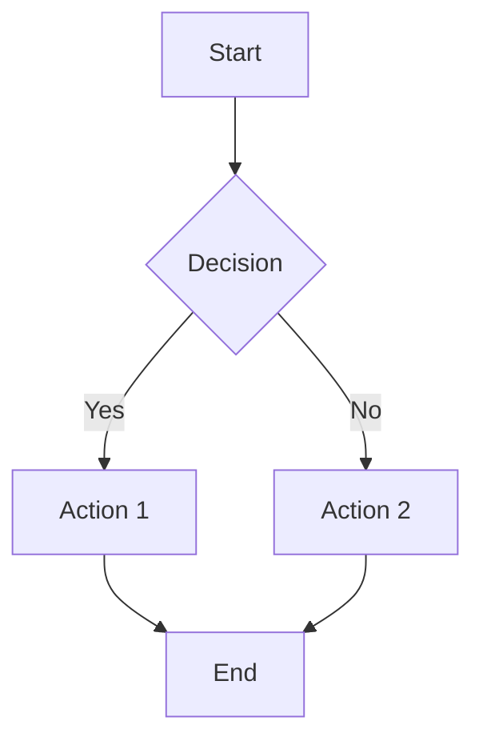
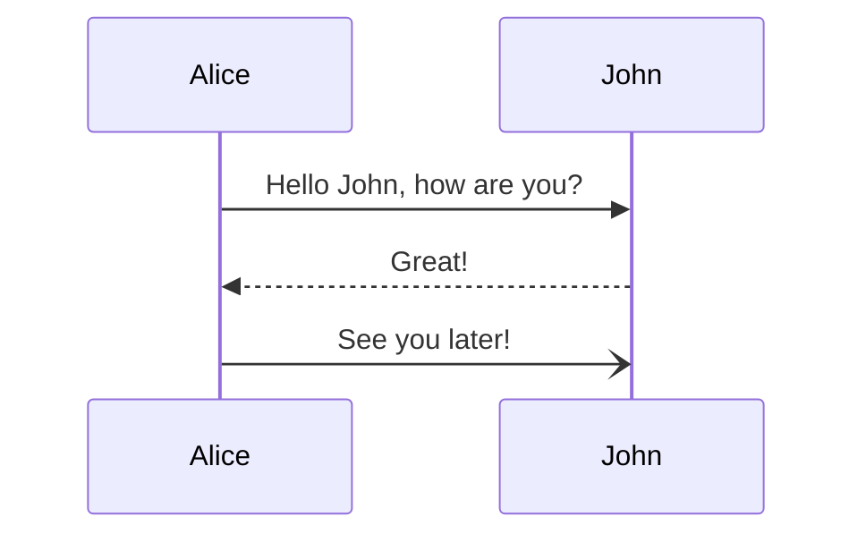

# Complex Performance Test Document

# Test Document

## GitHub Flavored Markdown

### Task Lists
- [x] Completed task
- [ ] Pending task
- [ ] Another pending task

### Tables
| Feature | Status | Priority |
|---------|--------|----------|
| Tables | ✓ | P1 |
| Task Lists | ✓ | P1 |
| Code Blocks | ✓ | P1 |

### Links and Images
[External Link](https://example.com)
[Internal Link](#test-document)


# Syntax Highlighting Test

## JavaScript
```javascript
function fibonacci(n) {
  if (n <= 1) return n;
  return fibonacci(n - 1) + fibonacci(n - 2);
}
console.log(fibonacci(10));
```

## Python
```python
def quicksort(arr):
    if len(arr) <= 1:
        return arr
    pivot = arr[len(arr) // 2]
    left = [x for x in arr if x < pivot]
    middle = [x for x in arr if x == pivot]
    right = [x for x in arr if x > pivot]
    return quicksort(left) + middle + quicksort(right)
```

## TypeScript
```typescript
interface User {
  id: number;
  name: string;
  email: string;
}

const users: User[] = [
  { id: 1, name: 'Alice', email: 'alice@example.com' }
];
```

## Rust
```rust
fn main() {
    let mut vec = vec![1, 2, 3];
    vec.push(4);
    println!("Vector: {:?}", vec);
}
```

## Go
```go
package main

import "fmt"

func main() {
    fmt.Println("Hello, World!")
}
```


# Mermaid Diagram Test

## Flowchart


## Sequence Diagram



## Additional Code Blocks

```java
public class HelloWorld {
    public static void main(String[] args) {
        System.out.println("Hello, World!");
    }
}
```

```cpp
#include <iostream>
using namespace std;

int main() {
    cout << "Hello, World!" << endl;
    return 0;
}
```

```bash
#!/bin/bash
echo "Hello, World!"
for i in {1..5}; do
    echo "Number: $i"
done
```

## Images and More Content


Lorem ipsum dolor sit amet, consectetur adipiscing elit. Sed do eiusmod tempor incididunt ut labore et dolore magna aliqua.
